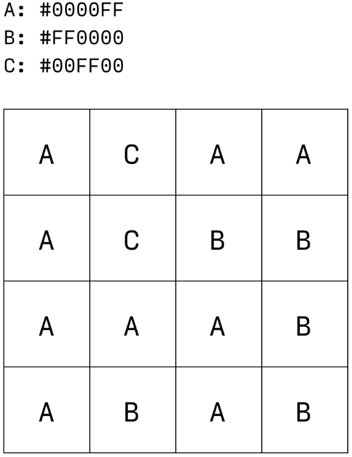
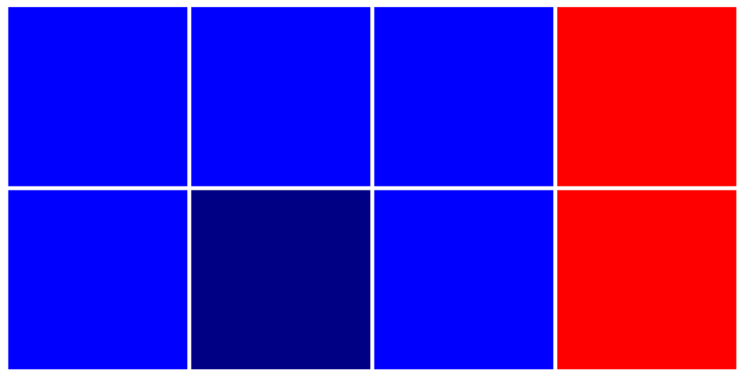
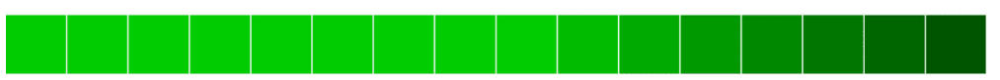
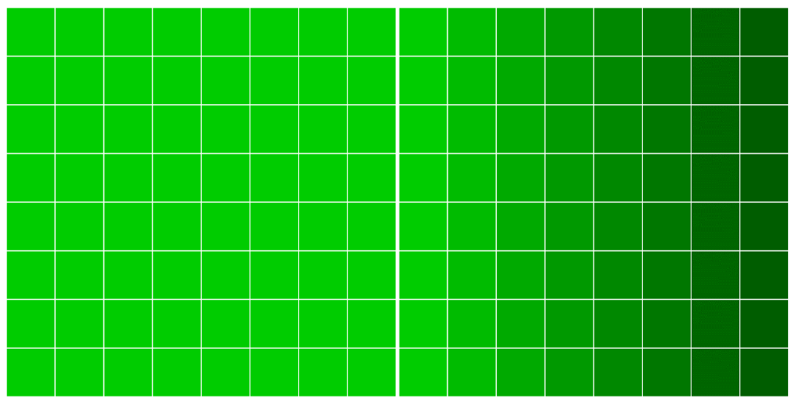

[https://web.dev/learn/images](https://web.dev/learn/images)

[https://developer.mozilla.org/zh-CN/docs/Web/HTML/Reference/Elements/img](https://developer.mozilla.org/zh-CN/docs/Web/HTML/Reference/Elements/img)

# Raster images
光栅图像（Raster images）：一组用于渲染二维网格的逐像素指令。包括 GIF (.gif)、JPEG (.jpg/.jpge)、PNG (.png) 和 WebP (.webp)。每种图片格式的压缩和编码方式各不相同，这导致文件大小差异巨大：JPEG 的照片图片可能只有几百 KB，而 PNG 的相同图片可能有几MB，对最终用户来说没有明显的质量差异。

超出固有尺寸缩放的光栅图像来源会出现失真、块状或模糊。


将光栅图像分解成不同的编码时，我们实际上讨论的是用于描述其内容的方法，以及我们应用的压缩方法（或缺少压缩方法）。

服务器不是通过网络将图像发送到浏览器，而是发送描述构成图像的像素网格的字节流，以供客户端重组。

为了更好地直观呈现将像素网格编码为字节流数据的过程，用我们都能理解的语言传达图片来源的相关信息：

```plain
从左上角开始。第 1 行和第 1 列显示为蓝色。第 1 行和第 2 列显示为蓝色。第 1 行和第 3 列显示为蓝色。第 1 行、第 4 列显示为红色。
```


有了这些文字信息，就能重现图片。

图片格式的差异以及它们被编码为数据的方式可以大致视为这些信息的格式。 例如，我发送给的信息也可以是：

```plain
从左上角开始。第 1 行第 1 列到第 3 列显示为蓝色。第 1 行、第 4 列显示为红色。
```

第二种描述设法用更少的字符数描述同一张图片。这是一种**无损压缩**图片数据的方法，不会降低视觉保真度，但通过网络从我传输到您时的字节数更少。


反向**有损压缩**听起来像是非入门级压缩，为什么会存在有损压缩（难道会希望自己的图片看起来更差？）。 不过，情况并非绝对，人的眼睛也没有完美的保真度。

为图片压缩选择正确的格式和设置，就是要在人能够感知的视觉细节程度和发送到浏览器的数据量之间取得平衡。

GIF
目前在现代 Web 上用处不大，但 GIF（图形交换格式）可以深入介绍图片编码的核心概念。


GIF 可以看作是图片数据的封装容器。它有一个称为“逻辑屏幕”的视口，用于绘制图像数据的各个帧。

这就是 GIF 如何支持其类似翻页动画的动画：将单个帧绘制到逻辑屏幕，然后替换为另一个帧，接着是另一个帧。


GIF 使用无损数据压缩方法，即“[Lempel-Ziv-Welch](https://en.wikipedia.org/wiki/Lempel%E2%80%93Ziv%E2%80%93Welch)”算法的变体。概括来讲：将重复的字符字符串会保存到某种内部字典中，以便可以在每次出现时引用，而不是重复。



当然，算法并不像按数字绘制那样简单。它会再次逐步检查生成的颜色代码表，以查找重复的像素颜色序列，并创建第二个可引用代码表。不过，图像数据绝不会丢失，只需以易于读取的方式进行排序和重新组织，而不必从根本上对其进行更改。


但它存在一个严重的局限：GIF 逻辑屏幕绘制的<u>每个帧最多可包含 256 种颜色</u>。GIF 还支持“索引透明度”，即透明像素会引用颜色表中透明“颜色”的索引，这会严重影响图片的质量。

将图片另存为 GIF 会导致保真度降低，除非图片只使用了 256 种或更少的颜色。

将一系列值缩减为较小、近似的输出值的做法称为“量化”，这个术语在学习图像编码时会经常用到。这种**调色板**量化的结果通常很明显。




如果不进行任何压缩，可将此网格描述为：

```plain
第 1 行、第 1 列是 #0000FF。第 1 行、第 2 列的内容为 #0000FF。第 1 行、第 3 列是 #0000FF。第 1 行、第 4 列是 #FF0000。
第二行，第一列是 #0000FF。第二行第 2 列的值是 #000085。第 2 行、第 3 列的内容为 #0000FF。第 2 行，第 4 列是 #FF0000。
```

使用类似于 GIF 的无损数据压缩和颜色索引的方法：

```plain
A：#0000FF，B：#FF0000，C：#000085。
第 1 行第 1 列到第 3 列为 A。第 1 行、第 4 列是 B。第 2 行，第 1 列是 A。第 2 行，第 2 列是 C。第 2 行，第 3 列是 A。第 2 行，第 4 列是 B。
```

这种方法成功在几个位置将每个像素的说明精简到几个位置（“1-3 列是...”），并通过预先在分类字典中定义重复颜色来节省一些字符。视觉保真度没有变化。信息已经过压缩，没有丢失。


单个深蓝色像素对编码大小的影响最大，如果限定为使用量化**调色板**，可以进一步减少数量：

```plain
A: #0000FF，B：#FF0000。
第 1 行第 1 列到第 3 列为 A。第 1 行、第 4 列是 B。第 2 行第 1 列到第 3 列的内容为 A。第 2 行，第 4 列是 B。
```

在这个示例中，将三种颜色减少到两种，可以明显改善品质。在尺寸较大且细节更清晰的图片上，这种效果可能不太明显，但仍然清晰可见。


实践中，无损压缩和调色板量化相结合意味着 GIF 在现代 Web 开发中不是很有用。无损压缩不足以缩减文件大小，而且调色板减少意味着画质明显降低。

归根结底，GIF 只是一种有效的编码格式，用于对已经使用有限的调色板、硬边缘（而非抗锯齿）以及纯色而非渐变的简单图片进行编码。


在其他用例中，这些用例会比其他格式更好。对于光栅图像，尺寸较小且功能更丰富的 PNG 通常是更好的选择，但在文件大小和视觉保真度方面，对于图标或艺术线条这类用例，两者都远不如 SVG，其中矢量更明显。

# PNG
它旨在替代 GIF，在很多方面与 GIF 类似。PNG 使用**无损压缩**，图片的<u>调色板</u>可以进行量化，即“编入索引的颜色”，其中 PNG 利用的调色板仅限于 256 种颜色，就像 GIF 一样。但更常见的<u>“truecolor”PNG</u> 可以包含许多更多颜色，最多 1600 万种。

PNG 和 GIF 都支持透明度，但有很大区别。GIF 将透明度视为：一个像素要么是不透明，要么完全透明。PNG 支持“alpha 通道”透明度，这意味着每个像素都可以设置为 0（完全透明）到 255（完全不透明）之间的透明度。

但与更现代的 Web 友好型编码相比，这几乎总是会<u>导致文件过大</u>。


过去几年，PNG 大多因单一用例更为普遍，因为是唯一支持半透明的光栅编码。 如今，仅应考虑将 PNG 用于需要半透明的简单图形（如包含阴影的公司徽标），并且应仔细将其与支持半透明度的更现代格式（例如 WebP）进行比较。


实际上，PNG 是一种非常理想的选择，用于维护大小可管理的源映像的“规范”版本，该版本保存在本地开发环境中或提交到项目代码库，以便在需要以替代格式修改或重新保存该映像的未来版本时使用。</font>

但值得注意的是，尽管编码是标准化的，但不同的修改工具执行该编码的方法不同，其中一些方法的效率要高得多。在任何上下文中传输 PNG 之前，请务必通过 [Squoosh](https://squoosh.app/) 或 [ImageOptim](https://imageoptim.com/) 等工具运行文件。

# JPGE
JPEG 是网络上使用最普遍的图片类型，文件扩展名为 .jpg 或 .jpeg，但后者在当今时代很少见。


无损压缩会尽可能地以最佳方式被动压缩图片数据，而 JPEG 的**有损压缩**会设法通过对图片数据进行细微且通常察觉不到的更改来提高压缩效率。JPEG 将图片数据编码为 8x8 像素块，并采用算法描述这些块，而不是描述这些块中的各个像素。


“GIF 使用由像素组成的网格，而 JPEG 使用由较小的像素网格组成的网格。” 实际上，这种使用块而非像素的方式意味着 JPEG 非常适合更常见的图像用例：构成真实世界照片的那种微妙的、分层的渐变。




GIF 样式编码来描述非常简单的单像素渐变，也会极其冗长:</font>

```plain
第 1 行，第 1 至第 9 列为 #00CC00。第 1 行、第 10 列是 #00BB00。第 1 行、第 11 列是 #00AA00。第 1 行、第 12 列是 #009900。
第 1 行第 13 列是 #008800。第 1 行第 14 列是 #007700。第 1 行第 15 列是 #006600。第 1 行、第 16 列是 #005500。
```

使用 JPEG 样式编码描述渐变的效率要高得多：

```plain
第 1 块是 #00CC00。第 2 块是从 #00CC00 到 #005500 的渐变色。
```



JPEG 真正的优势在于可以量化图片中的“高频”细节，而这些细节通常很难察觉。

将图片另存为 JPEG 格式通常意味着以可衡量的方式降低图片质量，肉眼不一定可见。


JPEG 的有损压缩尝试量化图片源，方式与我们自己的心理视觉系统量化周围世界的方式大体一致。

人类的心理视觉系统会大量地“压缩”你不断采集的图像。当我看向外面的小花园时，可以立即处理大量信息，例如，每朵色彩鲜艳的花朵都格外醒目。我立刻发现，土壤是灰尘弥漫的灰色，叶子下面垂落——我的植物需要水。

我看到但未完全处理，具体形状、大小、角度和绿色阴影为一片掉落的叶子。当然，我可以主动寻找这种程度的细节，但被动接受的信息过多，没有真正的好处。因此，我的心理视觉系统会对其自身进行一些量化，将这些信息提炼为“叶子下垂”。


例如，JPEG 利用了我们最大的心理视觉缺陷之一：我们的眼睛对亮度差异比对色相差异更敏感。在应用任何压缩之前，JPEG 使用“离散余弦转换”过程将图片拆分为多个单独的频率“层”，以表示亮度（亮度）和色度，或表示“亮度”和“色度”。

亮度层经过最低限度压缩，仅舍弃了人眼可能无法发现的小细节。


色度层明显减小。JPEG 可以执行一个名为“下采样”的过程，其中色度层以较低的分辨率存储，而不是简单地量化 GIF 等色度层的调色板。当通过在亮度层上有效拉伸低分辨率色度层进行重组时，通常几乎察觉不到差异。如果我们将原始图片来源与 JPEG 并排比较，但只有在我们确切知道要查找什么的情况下，色调上的细微差异可能会很明显。


不过，过度压缩图片数据意味着细节级别会进一步降低。


## 渐进式 JPEG
渐进式 JPEG (PJPEG) 可有效地对渲染 JPEG 的过程进行重新排序。“基准”JPEG 会随着传输的推进从上到下呈现，而渐进式 JPEG 会将渲染分解成一组完整尺寸的“扫描”（同样从上到下完成），每次扫描都会提高图像质量。整张图片会立即显示，但会比较模糊，并随着转移的继续而变得更清晰。


这在纸上看似存在严格技术差异，但却有巨大的感知优势：通过立即向最终用户提供完整尺寸的图片版本（而不是空白区域），PJPEG 给最终用户带来的体验比基准 JPEG 更快。此外，除了最小的图片之外，将图片编码为 PJPEG 几乎总是意味着与基准 JPEG 相比，文件大小要小一些，但每个字节都会有所帮助。

不过，在客户端解码 PJPEG 会更复杂，这意味着在渲染期间会给浏览器和设备硬件带来更大的负担。这种渲染开销很难确切地量化，但它微乎其微，除了性能非常低的设备之外，不太可能注意到。这种取舍方式是值得的。总之，在将图片编码为 JPEG 时，渐进式是合理的默认方法。


目前为止，对于这些JPEG的编码方式，会让人感到有点不知所措。不过，对于JPEG 压缩的技术性细节被抽象化，而是以单个“质量”设置（即 0 到 100 的整数）的形式公开。0 提供的文件大小可能最小，会呈现最差的视觉质量。从 0 到 100，质量和文件大小都会增加。当然，此设置具有主观性 - 并非所有工具都会以相同的方式解读“75”这个值，并且感知质量始终会根据图片内容而有所不同。当然100也不代表无损压缩，仍然是有损的。


# WebP
Google 最初开发了 WebP 作为一种有损图像格式来取代 JPEG，后者能够生成小于 以 JPEG 格式编码的同等画质图片文件。后来对该格式的更新引入了无损压缩选项， 类似 PNG 的 Alpha 通道透明度和类似 GIF 的动画 - 所有这些都可以与 JPEG 风格的有损压缩搭配使用。

WebP 的有损压缩算法基于 [VP8 视频编解码器](https://datatracker.ietf.org/doc/html/draft-bankoski-vp8-bitstream-01#page-7) 用于压缩视频中的主帧。概括来讲，它类似于 JPEG 编码：WebP 按照“块”进行操作而不是单个像素在亮度和色度之间具有类似的分界。WebP 的亮度块为 16x16，色度块为 8x8，是 因此可进一步细分为 4x4 的子块。

WebP 与 JPEG 的根本区别在于两个特征：“块预测”和“自适应块量化”

块预测
分块预测是根据这些值预测每个色度和亮度块内容的过程 （尤其是当前砌块上方和左侧的砌块）。简单地说：“如果当前代码块上方有蓝色，左边有蓝色 则假设此块为蓝色。”

事实上，PNG 和 JPEG 都能在某种程度上实现这种预测。不过，WebP 的独特之处在于，它会对块的然后尝试通过几种不同的“预测模式”填充当前块，从而有效地尝试“绘制” 图片缺少部分。然后，系统会将每种预测模式提供的结果与真实图片数据进行比较， 预测性匹配。

自适应块量化
JPEG 压缩是一项通用操作，会对图片中的每个块应用相同级别的量化。但现实世界的照片并不比周围环境更加一致。 实际上，这意味着我们的 JPEG 压缩设置并非由高频细节决定，其中 JPEG 但最容易出现压缩伪像的部分是图片中最容易出现压缩伪影的部分。

# 自适应图片
网页上的文本会在屏幕边缘自动换行，以免超出边界。图片具有固有大小。如果图片宽度大于屏幕宽度，则图片会溢出，用户必须水平滚动才能查看全部图片。

知道图片的尺寸，请务必添加 `width` 和 `height` 属性。浏览器知道宽高比，并可以预留适当的空间。可以防止其他内容在图片加载时跳动。


+ 显示图片

```css
/* 声明图片的宽度绝不能大于其包含元素的宽度。 */
img {
  /*
    根据元素的书写模式定义了元素区块的横向或纵向最大尺寸
    纵向书写模式，则 max-inline-size 的值对应于元素的最大高度；否则对应于元素的最大宽度。
  */
  max-inline-size: 100%; /* 或使用 max-width, max-height */

  /* 
    根据元素的书写模式定义了元素块的横向或纵向尺寸
    纵向书写模式，则 block-size 的值对应于元素的宽度；否则对应于元素的高度。
  */
  block-size: auto; /*浏览器会在调整图片大小时保留图片的宽高比。*/
}
```

```css

img {
  max-inline-size: 100%;
  block-size: auto;

  /*
    为盒子设定横/纵比例
    如果图片是正方形，那么图片内容会被拉伸
  */
  aspect-ratio: 2/1;

  /*
    为防止图片内容会被拉伸
   contain 让浏览器保留图片的宽高比，并在需要拉伸时在图片周围留出空白。
  */
  object-fit: contain;


  /* cover 告知浏览器不要拉伸，并根据需要剪裁图片。 */
  object-fit: cover;

  /* 如何裁剪，裁剪那个位置 */
  object-position: top center;
}
```

## loading
使用 loading 属性告知浏览器是否应延迟加载图片，直到图片位于视口内或附近。浏览器才会加载延迟加载的图片。如果用户从不滚动，图片将永远不会加载。

```html

  loading="lazy"

  <!-- 浏览器立即以高优先级提取图片，而不是等到浏览器完成布局并正常提取图片。 -->
  fetchpriority="high"
>
```

