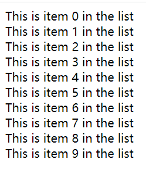
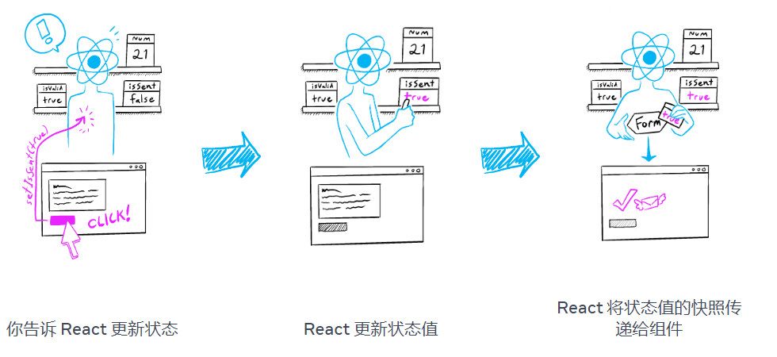
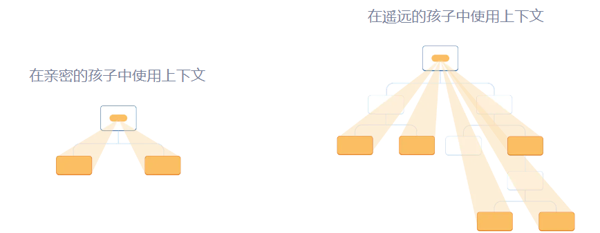
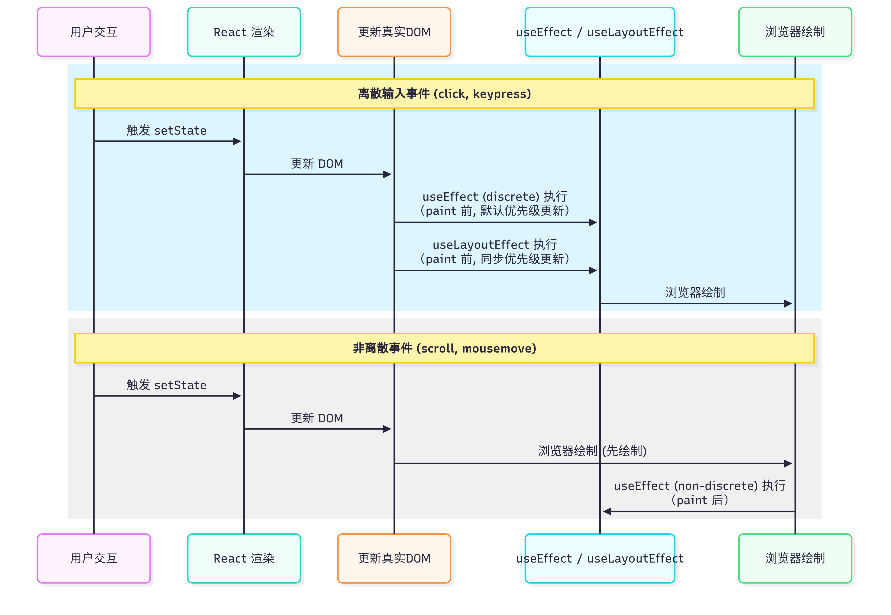
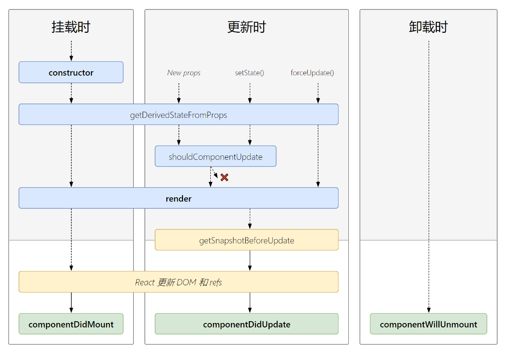

# 创建React 项目方式

- Next.js [https://nextjs.org/docs/app/getting-started/installation](https://nextjs.org/docs/app/getting-started/installation)
- Vite 
  - [https://github.com/laststance/create-react-app-vite](https://github.com/laststance/create-react-app-vite)
  - https://react.dev/learn/build-a-react-app-from-scratch#vite

# CSS模块
创建`App.module.css`

```css
.p1 {
    size: 12px;
}
```

```tsx
import classes from './App.module.css';
export const App = () => {
    // 最终页面中显示的是随机类名，如<p class="App_p1_2k3fd3">text</p>
    return <p className={classes.p1}>Hello</p>
}
```

# 内置组件
## Fragment
简写`<>hello</>` ，需要使用`Key`时用全称`<Fragment key={id}>hello</Fragment>`

## Suspense
+ **只有启用了 Suspense 的数据源才会激活 Suspense 组件。**如：
  - 使用[Relay](https://relay.dev/docs/guided-tour/rendering/loading-states/)和[Next.js](https://nextjs.org/docs/app/building-your-application/routing/loading-ui-and-streaming#streaming-with-suspense)等支持 Suspense 的框架进行数据获取
  - 使用延迟加载组件代码[`lazy`](https://react.dev/reference/react/lazy)
  - 使用以下方式读取缓存的 Promise 的值[`use`](https://react.dev/reference/react/use)

```jsx
<Suspense fallback={<Loading />}>
  <SomeComponent />
</Suspense>
```

fallback在实际UI没有完成加载时用来渲染。当child挂起时，会自动切换到fallback，当数据准备好时，Suspense会自动切换到child。

+ [内容加载时显示loading](https://codesandbox.io/s/005whu?file=/ArtistPage.js&utm_medium=sandpack)
    - 当有多个子组件中，有一个没有加载完成时就会已知显示callback。
    - Suspense可嵌套使用，当一个组件挂起时，最近的父Suspense组件显示回退。
+ [在数据加载完毕前，将暂时显示过时的结果](https://codesandbox.io/s/rcglfc?file=/App.js&utm_medium=sandpack)。

# 列表与key
```tsx
const todoItems = todos.map((todo, index) =>
  // Only do this if items have no stable IDs
  <li key={index}>
    {todo.text}
  </li>
);
```

如果列表项目的顺序可能会变化，不建议使用索引来用作 key 值。这样做会导致性能变差，还可能引起组件状态的问题。如果选择不指定 key 值，默认使用索引用作为 key 值。

Keys 告诉 React 每个组件对应于哪个数组项，以便稍后匹配它们。如果您的数组项可以移动（例如由于排序）、插入或删除，这就变得很重要。一个精心挑选的key帮助 React 推断到底发生了什么，并对 DOM 树进行正确的更新。

键在兄弟姐妹中必须是唯一的。但是，可以为不同数组中的 JSX 节点使用相同的键。

# 组件包含关系
以**非自闭合元素**的方式使用父组件，再父组件插入其他标签或其他组件，父组件通过props.children使用传入的组件

```tsx
const ReactDemo = () => {
  return (
    <WelcomeDialog/>
  )
}

const WelcomeDialog = () => {
  return (
    <FancyBorder color="pink">
      <h1 className="Dialog-title">
        Welcome
      </h1>
      <p className="Dialog-message">
        Thank you for visiting our spacecraft!
      </p>
    </FancyBorder>

  );
}

const FancyBorder = (props) => {
  return (
    <>
      <div style={{backgroundColor: props.color}} className="FancyBorder">
        {props.children}
      </div>
    </>
  );
};

export default ReactDemo;
```

+ 使用props传递组件
    - <Contacts /> 和 <Chat /> 之类的 React 元素本质就是对象（object），所以你可以把它们当作 props，像其他数据一样传递。

```tsx

const ReactDemo = () => {
  return (
   <SplitPane
      left={
        <Contacts />
      }
      right={
        <Chat />
      } />
  )
}

function SplitPane(props) {
  return (
    <div className="SplitPane">
      <div className="SplitPane-left">
        {props.left}
      </div>
      <div className="SplitPane-right">
        {props.right}
      </div>
    </div>
  );
}

function Contacts() {
  return (
    <h1>Contacts</h1>
  );
}
function Chat() {
  return (
    <h1>HELLO</h1>
  );
}

export default ReactDemo;
```

## 嵌套和组织组件
组件可以呈现其他组件，但绝不能**嵌套它们的定义**：

```javascript
export default function Gallery() {
  // 永远不要在另一个组件中定义一个组件!
  function Profile() {
    // ...
  }
  // ...
}
```

# 深入 JSX
JSX 是 `React.createElement(component, props, ...children)` 函数的语法糖：

```tsx
// 大写字母开头的 JSX 标签意味着它们是 React 组件。这些标签会被编译为对命名变量的直接引用，
<MyButton color="blue" shadowSize={2}>
  Click Me
</MyButton>
```

```javascript
// 编译后
React.createElement(
  MyButton,
  {color: 'blue', shadowSize: 2},
  'Click Me'
)
```

## 在 JSX 类型中使用`.`语法
```tsx
import React from 'react';

const MyComponents = {
  DatePicker: function DatePicker(props) {
    return <div>Imagine a {props.color} datepicker here.</div>;
  }
}

function BlueDatePicker() {
  return <MyComponents.DatePicker color="blue" />;
}
```

## 在运行时选择类型
```tsx
import React from 'react';
import { PhotoStory, VideoStory } from './stories';

const components = {
  photo: PhotoStory,
  video: VideoStory
};

function Story(props) {
  // ✔！JSX 类型可以是大写字母开头的变量。
  const SpecificStory = components[props.storyType];
  return <SpecificStory story={props.story} />;
}
```

## 属性展开
```tsx
function App1() {
  return <Greeting firstName="Ben" lastName="Hector" />;
}

function App2() {
  const props = {firstName: 'Ben', lastName: 'Hector'};
  return <Greeting {...props} />;
}
```

```tsx
const Button = props => {
  const { kind, ...other } = props;
  const className = kind === "primary" ? "PrimaryButton" : "SecondaryButton";
  return <button className={className} {...other} />;
};

const App = () => {
  return (
    <div>
      <Button kind="primary" onClick={() => console.log("clicked!")}>
        Hello World!
      </Button>
    </div>
  );
};
```

## JSX 中的子元素
```tsx
<MyComponent>Hello world!</MyComponent>
// 此时 MyComponent 的 props.children 就只是该字符串
// JSX 会移除行首尾的空格以及空行。与标签相邻的空行均会被删除，文本字符串之间的新行会被压缩为一个空格
```

```tsx
render() {
  // 不需要用额外的元素包裹列表元素！
  return [
    // 不要忘记设置 key
    <li key="A">First item</li>,
    <li key="B">Second item</li>,
    <li key="C">Third item</li>,
  ];
}
```

```tsx
function Item(props) {
  return <li>{props.message}</li>;
}

function TodoList() {
  const todos = ['finish doc', 'submit pr', 'nag dan to review'];
  return (
    <ul>
      {todos.map((message) => <Item key={message} message={message} />)}
    </ul>
  );
}
```

```tsx
// 调用子元素回调 numTimes 次，来重复生成组件
function Repeat(props) {
  let items = [];
  for (let i = 0; i < props.numTimes; i++) {
    items.push(props.children(i));
  }
  return <div>{items}</div>;
}

function ListOfTenThings() {
  return (
    <Repeat numTimes={10}>
      {(index) => <div key={index}>This is item {index} in the list</div>}
    </Repeat>
  );
}
```



## Boolean, Null, Undefined 会忽略
```tsx
<div />

<div></div>

<div>{false}</div>

<div>{null}</div>

<div>{undefined}</div>

<div>{true}</div>
```

值得注意的是有一些 [“falsy” 值](https://developer.mozilla.org/en-US/docs/Glossary/Falsy)，如数字 0，仍然会被 React 渲染：

```tsx
<div>
  {props.messages.length &&
    <MessageList messages={props.messages} />
  }
</div>


// 应写为
<div>
  {!!props.messages.length &&
    <MessageList messages={props.messages} />
  }
</div>
```

# 状态快照
```tsx
import { useState } from 'react';

export default function Form() {
  const [isSent, setIsSent] = useState(false);
  const [message, setMessage] = useState('Hi!');
  if (isSent) {
    return <h1>Your message is on its way!</h1>
  }
  return (
    <form onSubmit={(e) => {
      e.preventDefault();
      setIsSent(true);
      sendMessage(message);
    }}>
      <textarea
        placeholder="Message"
        value={message}
        onChange={e => setMessage(e.target.value)}
      />
      <button type="submit">Send</button>
    </form>
  );
}

function sendMessage(message) {
  // ...
}
```

单击按钮时会发生以下情况：

+ 事件onSubmit处理程序执行。
+ setIsSent(true)设置isSent并true排队新的渲染。
+ isSentReact 根据新值重新渲染组件。

## 渲染及时拍快照
当 React 重新渲染一个组件时：

+ React 再次调用你的函数。
+ 函数返回一个新的 JSX 快照。
+ React 然后更新屏幕以匹配您返回的快照。


作为组件的内存，state 不像常规变量，在的函数返回后就消失了。**State 实际上“存在于”React 本身——就像在架子上一样！——在函数之外。**当 React 调用组件时，它会为您提供该特定渲染的状态快照。您的组件在其 JSX 中返回 UI 的快照，其中包含一组新的道具和事件处理程序，所有这些都是使用该渲染中的状态值计算的！




```tsx
import { useState } from 'react';

export default function Counter() {
  const [number, setNumber] = useState(0);

  return (
    <>
      <h1>{number}</h1>
      <button onClick={() => {
        setNumber(number + 5);
        setTimeout(() => {
          alert(number); // 0
        }, 3000);
      }}>+5</button>
    </>
  )
}
```

alert 运行时存储在 React 中的状态可能已经改变，但它是使用用户与之交互时的状态快照来安排的！

**状态变量的值在渲染中永远不会改变，**即使它的事件处理程序的代码是异步的。在那个 render 的onClick内部， 当 React 通过调用您的组件“获取 UI 的快照”时，它的值是“固定的”。

# 排队一系列状态更新
```tsx
<button onClick={() => {
  setNumber(number + 1);
  setNumber(number + 1);
  setNumber(number + 1);
}}>+3</button>
```

在处理状态更新之前， React 会等到事件处理程序中的所有代码都已运行。这就是为什么重新渲染只发生在所有这些setNumber()调用之后。

更新多个状态变量——甚至来自多个组件——而不会触发太多重新渲染。*但这也意味着在*事件处理程序及其中的任何代码完成之前，UI 不会更新。这称为**批处理。**

React 不会对多个有意的事件进行批处理，例如点击——每个点击都是单独处理的。React 仅在通常安全的情况下才进行批处理。

## 在下一次渲染之前多次更新同一个状态变量
```tsx
<button onClick={() => {
  setNumber(n => n + 1);
  setNumber(n => n + 1);
  setNumber(n => n + 1);
}}>+3</button>
```

1. 在事件处理程序中的所有其他代码运行之后，React 将此函数排队等待处理。
2. 在下一次渲染期间，React 遍历队列并为您提供最终的更新状态。

React 在执行事件处理程序时如何处理这些代码行：

1. setNumber(n => n + 1):n => n + 1是一个函数。React 将其添加到队列中。
2. setNumber(n => n + 1):n => n + 1是一个函数。React 将其添加到队列中。
3. setNumber(n => n + 1):n => n + 1是一个函数。React 将其添加到队列中。

当您useState在下一次渲染期间调用时，React 会遍历队列。之前的number状态是0，所以这就是 React 传递给第一个更新函数的n参数。

```tsx
<button onClick={() => {
  setNumber(number + 5);
  setNumber(n => n + 1);
  setNumber(42);
}}>Increase the number</button> // 42
```

+ 以下是 React 在执行此事件处理程序时如何处理这些代码行：
  1. setNumber(number + 5): number是0，所以setNumber(0 + 5)。React 将*“替换为**5**”*添加到它的队列中。
  2. setNumber(n => n + 1): n => n + 1是一个更新函数。React*将该函数*添加到它的队列中。
  3. setNumber(42): React 将*“替换为**42**”*添加到它的队列中。
+ **更新程序功能**（例如n => n + 1）被添加到队列中。
+ **任何其他值**（例如 number 5）将“替换为5”添加到队列中，忽略已经排队的内容。

## 保存和重置状态
+ 只要你在<u>同一个位置</u>渲染同一个组件，React 就会一直保持状态。如果它被移除，或<u>不同的组件（如 <Counter /> 和 <Box />就是不同的组件）</u>在同一位置被渲染，React 会丢弃它的状态。

```jsx
// div 有2个节点
return (
    <div>
      {isPlayerA ? (
        <Counter person="Taylor" />
      ) : (
        <Counter person="Sarah" />
      )}
      <button onClick={() => {
        setIsPlayerA(!isPlayerA);
      }}>
        Next player!
      </button>
    </div>
  );

// div 下永远有3个节点
return (
    <div>
      {isPlayerA && <Counter person="Taylor" /> } {/* 这个节点为 fasle 或 Counter */}
      {!isPlayerA && <Counter person="Sarah" /> } {/* 这个节点也为 fasle 或 Counter */}
      <button onClick={() => {
        setIsPlayerA(!isPlayerA);
      }}>
        Next player!
      </button>
    </div>
  );
```

```jsx
import { useState } from "react";

export default function App() {
  const [showB, setShowB] = useState(true);
  if (showB) {
    return (
      <div>
        <Counter name="A" /> {/* 勾选时，将这个计数器置为 1 */}
        <Counter name="B" />  {/* 勾选时，将这个计数器置为 2 */}
        <label>
          <input
            type="checkbox"
            checked={showB}
            onChange={(e) => {
              setShowB(e.target.checked);
            }}
          />
          Render the second counter
        </label>
      </div>
    );
  }

  return (
    <div>
      <Counter name="C" /> {/* 取消勾选后，将这个计数器还是为 1, React顺序比较div的子元素时，发现 第一个元素还在 */}
      {/* 取消勾选后，第二个 Counter 被销毁*/}
      <label> {/* 取消勾选后，第三个label元素还在 */}
        <input
          type="checkbox"
          checked={showB}
          onChange={(e) => {
            setShowB(e.target.checked);
          }}
        />
        Render the second counter
      </label>
    </div>
  );
}

function Counter({ name }) {
  const [score, setScore] = useState(0);
  const [hover, setHover] = useState(false);

  let className = "counter";
  if (hover) {
    className += " hover";
  }

  return (
    <div
      className={className}
      onPointerEnter={() => setHover(true)}
      onPointerLeave={() => setHover(false)}
    >
      <h1>{score}</h1>
      <button onClick={() => setScore(score + 1)}>Add one {name}</button>
    </div>
  );
}

```

+ React 允许您覆盖默认行为，并通过向组件传递不同的key 来强制组件重置其状态。

[重置](https://codesandbox.io/s/lb9f5y?file=%2FApp.js&utm_medium=sandpack)功能

```tsx
import { useState } from 'react';

export default function App() {
  const [version, setVersion] = useState(0);

  function handleReset() {
    setVersion(version + 1);
  }

  return (
    <>
      <button onClick={handleReset}>Reset</button>
      <Form key={version} />
    </>
  );
}

function Form() {
  const [name, setName] = useState('Taylor');

  return (
    <>
      <input
        value={name}
        onChange={e => setName(e.target.value)}
      />
      <p>Hello, {name}.</p>
    </>
  );
}

```

## 避免深度嵌套状态
[Choosing the State Structure](https://beta.reactjs.org/learn/choosing-the-state-structure#avoid-deeply-nested-state)

```javascript
export const initialTravelPlan = {
  id: 0,
  title: '(Root)',
  childPlaces: [{
    id: 1,
    title: 'Earth',
    childPlaces: [{
      id: 2,
      title: 'Africa',
      childPlaces: [{
        id: 3,
        title: 'Botswana',
        childPlaces: []
      }, {
        id: 4,
        title: 'Egypt',
        childPlaces: []
      }, {
        id: 5,
        title: 'Kenya',
        childPlaces: []
      }, {
        id: 6,
        title: 'Madagascar',
        childPlaces: []
      }, {...


// 扁平化，规范化
export const initialTravelPlan = {
  0: {
    id: 0,
    title: '(Root)',
    childIds: [1, 43, 47],
  },
  1: {
    id: 1,
    title: 'Earth',
    childIds: [2, 10, 19, 27, 35]
  },
  2: {
    id: 2,
    title: 'Africa',
    childIds: [3, 4, 5, 6 , 7, 8, 9]
  }, 
  3: {
    id: 3,
    title: 'Botswana',
    childIds: []
      .....
```

```tsx

function PlaceTree({ id, placesById }) {
  const place = placesById[id];
  const childIds = place.childIds;
  return (
    <li>
      {place.title}
      {childIds.length > 0 && (
        <ol>
          {childIds.map(childId => (
            <PlaceTree
              key={childId}
              id={childId}
              placesById={placesById}
            />
          ))}
        </ol>
      )}
    </li>
  );
}
```

### [用 Immer 编写简洁的更新逻辑](https://beta.reactjs.org/learn/updating-objects-in-state#write-concise-update-logic-with-immer)
# 将状态逻辑提取到 Reducer 中
随着的组件变得越来越复杂，一目了然地了解组件状态更新的所有不同方式会变得越来越困难。例如，TaskApp的组件包含一个状态数组，tasks并使用三个不同的事件处理程序来添加、删除和编辑任务。它的每个事件处理程序都会调用setTasks以更新状态。随着这个组件的增长，散布在其中的状态逻辑的数量也会增加。为了降低这种复杂性并将所有逻辑放在一个易于访问的地方，您可以将该状态逻辑移动到组件外部的单个函数中，**称为“reducer”。**

```tsx
import {useReducer} from 'react';
import AddTask from './AddTask.js';
import TaskList from './TaskList.js';

export default function TaskApp() {
  const [tasks, dispatch] = useReducer(tasksReducer, initialTasks);

  function handleAddTask(text) {
    dispatch({
      type: 'added',
      id: nextId++,
      text: text,
    });
  }

  function handleChangeTask(task) {
    dispatch({
      type: 'changed',
      task: task,
    });
  }

  function handleDeleteTask(taskId) {
    dispatch({
      type: 'deleted',
      id: taskId,
    });
  }

  return (
    <>
      <h1>Prague itinerary</h1>
      <AddTask onAddTask={handleAddTask} />
      <TaskList
        tasks={tasks}
        onChangeTask={handleChangeTask}
        onDeleteTask={handleDeleteTask}
      />
    </>
  );
}

function tasksReducer(tasks, action) {
  switch (action.type) {
    case 'added': {
      return [
        ...tasks,
        {
          id: action.id,
          text: action.text,
          done: false,
        },
      ];
    }
    case 'changed': {
      return tasks.map((t) => {
        if (t.id === action.task.id) {
          return action.task;
        } else {
          return t;
        }
      });
    }
    case 'deleted': {
      return tasks.filter((t) => t.id !== action.id);
    }
    default: {
      throw Error('Unknown action: ' + action.type);
    }
  }
}

let nextId = 3;
const initialTasks = [
  {id: 0, text: 'Visit Kafka Museum', done: true},
  {id: 1, text: 'Watch a puppet show', done: false},
  {id: 2, text: 'Lennon Wall pic', done: false},
];

```

# createContext
+ Context 提供了一个无需为每层组件手动添加 props，就能在组件树间进行数据传递的方法。
+ Context 设计目的是为了共享那些对于一个组件树而言是“全局”的数据，例如当前认证的用户、主题或首选语言。

```tsx
import { createContext, useContext, useState } from 'react';

const ThemeContext = createContext(null);
const CurrentUserContext = createContext(null);

export default function MyApp() {
  const [theme, setTheme] = useState('light');
  const [currentUser, setCurrentUser] = useState(null);
  return (
    <ThemeContext.Provider value={theme}>
      <CurrentUserContext.Provider
        value={{
          currentUser,
          setCurrentUser
        }}
      >
        <WelcomePanel />
      </CurrentUserContext.Provider>
    </ThemeContext.Provider>
  )
}

function WelcomePanel({ children }) {
  const {currentUser} = useContext(CurrentUserContext);
  return (
    <Panel title="Welcome">
        <LoginForm />
    </Panel>
  );
}

function LoginForm() {
  return (
    <>
      </Button>
    </>
  );
}

function Button({ children, disabled, onClick }) {
  const theme = useContext(ThemeContext);
  const className = 'button-' + theme;
  return (
    <button
      className={className}
      disabled={disabled}
      onClick={onClick}
    >
      {children}
    </button>
  );
}
```

Context 主要应用场景在于很多不同层级的组件需要访问同样一些的数据。请谨慎使用，因为这会使得组件的复用性变差。

如果你只是想避免层层传递一些属性，组件组合（component composition）有时候是一个比 context 更好的解决方案。

## 使用 Context 之前的考虑
如果你只是想避免层层传递一些属性，组件组合（component composition）有时候是一个比 context 更好的解决方案。



## 使用上下文之前
**通过十几个组件向下传递一打道具并不罕见**。它可能感觉像一个 slog，但它非常清楚哪些组件使用哪些数据！

提取组件并将JSX 传递children给它们。如果您通过许多不使用该数据的中间组件层传递某些数据（并且仅将其进一步向下传递），这通常意味着您忘记沿途提取某些组件。例如，也许您将数据道具传递posts给不直接使用它们的可视化组件，例如<Layout posts={posts} />. 相反，将Layout take **children**作为道具，然后渲染<Layout><Posts posts={posts} /></Layout>. 这减少了指定数据的组件和需要数据的组件之间的层数。

# lazy
`const SomeComponent = lazy(load)`推迟加载组件的代码，直到第一次呈现它

```tsx
import { lazy } from 'react';
// import MarkdownPreview from './MarkdownPreview.js'; // 静态import声明导入组件
const MarkdownPreview = lazy(() => import('./MarkdownPreview.js'));


export default function MyApp() {
    const [theme, setTheme] = useState('light');
    return (
        <>
            {showPreview && ( // 直到showPreview，直到尝试呈现MarkdownPreview时，才加载./MarkdownPreview.js
            <Suspense fallback={<Loading />}>
                <h2>Preview</h2>
                <MarkdownPreview markdown={markdown} />
            </Suspense>)}
        </>)
}

```

# memo
`const MemoizedComponent = memo(SomeComponent, arePropsEqual?)`

包装一个组件memo以获得该组件的记忆版本。<u>只要组件的 props 没有改变，当的父组件被重新渲染时，组件通常不会被重新渲染</u>。

+ SomeComponent：要记忆的组件。
+ arePropsEqual：一个接受两个参数的函数：组件的先前 props 和它的新 props。如果新旧 props 相等，返回：true，组件不刷新。

**注意**

+ 记忆只与从父组件传递给组件的 props 有关。
+ 当需要将函数传递给已记忆的组件时，要么在组件外部声明它以使其永不更改，要么useCallback在重新渲染之间缓存其定义。

```tsx
const Chart = memo(function Chart({ dataPoints }) {
  // ...
}, arePropsEqual);

function arePropsEqual(oldProps, newProps) {
  return (
    oldProps.dataPoints.length === newProps.dataPoints.length &&
    oldProps.dataPoints.every((oldPoint, index) => {
      const newPoint = newProps.dataPoints[index];
      return oldPoint.x === newPoint.x && oldPoint.y === newPoint.y;
    })
  );
}
```

# Hook
Hook 是一些可以让你在函数组件里“钩入” React state 及生命周期等特性的函数。Hook 不能在 class 组件中使用

+ useState 就是一个 Hook。通过在函数组件里调用它来给组件添加一些内部 state。React 会在重复渲染时保留这个 state。useState 会返回一对值：当前状态和一个让你更新它的函数，你可以在事件处理函数中或其他一些地方调用这个函数。它类似 class 组件的 this.setState，但是它不会把新的 state 和旧的 state 进行合并。
+ useEffect 就是一个 Effect Hook，给函数组件增加了操作副作用的能力。它跟 class 组件中的 componentDidMount、componentDidUpdate 和 componentWillUnmount 具有相同的用途，只不过被合并成了一个 API。
+ Hook 就是 JavaScript 函数，以use开头，只能在组件的顶层或你自己的钩子上调用。不能在条件、循环或其他嵌套函数中调用 Hooks。

## useActionState


## useState
[useState](https://beta.reactjs.org/reference/react/useState)Hook 提供了两件事：

+ 用于保留渲染之间数据的状态变量。
+ 提供状态设置函数，用于更新变量并触发 React 再次渲染组件。

```tsx
import React, { useState } from 'react';
 
function Example() {
  // 解构赋值，第一个值是当前的 state，第二个值是更新 state 的函数。
   const [count, setCount] = useState(0);

   return (
     <div>
       <p>You clicked {count} times</p>
       <button onClick={() => setCount(count + 1)}>
       Click me
      </button>
    </div>
  );
}
// 更新函数返回值与当前 state 完全相同，则随后的重渲染会被完全跳过
```

### useState(func)
```tsx
import React, { useState } from 'react';
 
function Example() {
   const [count, setCount] = useState(0);

  // 点击一次 + 2, 在func中多次连续调用也能拿到最新的值。
  const onClick = () => {
    setCount((prev) => {
      console.log(prev) // 0
      return prev + 1;
    });

    setCount((prev) => {
      console.log(prev) // 1
      return prev + 1;
    })
  };

   return (
     <div>
       <p>You clicked {count} times</p>
       <button onClick={onClick}>
       Click me
      </button>
    </div>
  );
}
// 更新函数返回值与当前 state 完全相同，则随后的重渲染会被完全跳过
```

### 检查数据是否要被设为 state
+ 该数据是否是由父组件通过 props 传递而来的？是，那它不是 state。
+ 该数据是否随时间的推移而保持不变？是，那它不是 state。
+ 你能否根据其他 state 或 props 计算出该数据的值？是，那它也不是 state。
+ 是否要监测该数据的实时变化，还是只要最终结果？只要最终结果，那它也不是 state。

### 惰性初始 state
initialState 参数只会在组件的初始渲染中起作用，后续渲染时会被忽略。如果初始 state 需要通过复杂计算获得，则可以传入一个函数，在函数中计算并返回初始的 state，此函数只在初始渲染时被调用：

```tsx
const [state, setState] = useState(() => {
  const initialState = someExpensiveComputation(props);
  return initialState;
});
```

初始化函数。它应该是纯的，不带任何参数，并且应该返回任何类型的值。React 在初始化组件时会调用你的初始化函数，并将其返回值存储为初始状态。

### 避免重新创建初始状态
```jsx
function TodoList() {
  const [todos, setTodos] = useState(createInitialTodos());
  // ...
```

尽管 的结果createInitialTodos()仅用于初始渲染，但您仍会在每次渲染时调用此函数。如果要创建大型数组或执行昂贵的计算，这可能会造成浪费。

要解决这个问题，您可以将其作为初始化函数传递给useState：

```jsx
function TodoList() {
  const [todos, setTodos] = useState(createInitialTodos);
  // ...
```

## useEffect
`useEffect(setup, dependencies?)`

+ 默认Effect将在<u>每次渲染</u>**<u>后</u>**<u>运行</u>。 ---- 不指定依赖项。
+ 效果会在<u>初始渲染后运行</u>，并在使用<u>更改的依赖项重新渲染</u>**<u>后</u>**<u>运行</u>。 ---- 传递依赖数组。
+ 如果 Effect 不使用任何值，它<u>只会在初始渲染</u>**<u>后</u>**<u>运行</u>。----- 传递依赖空数组。 
+ 返回清理函数。<u>当您的组件首次添加到 DOM 时，React 将运行您的设置函数。在每次使用更改的依赖项重新渲染后，React 将首先使用旧值运行清理函数（如果提供了它），然后使用新值运行你的设置函数。在你的组件从 DOM 中移除后，React 将最后一次运行你的清理函数。</u>

```tsx
useEffect(() => {
  document.title = `You clicked ${count} times`;
}, [count]); // 仅在 count 更改时更新
```

### 使用 Effects 获取数据
+ 直接在 Effects 中编写数据获取会变得重复，并且很难在以后添加缓存和服务器渲染等优化。使用自定义 Hook 更容易——无论是自定义的还是的还是由社区维护的。

```jsx
import { useState, useEffect } from 'react';
import { fetchBio } from './api.js';

export default function Page() {
  const [person, setPerson] = useState('Alice');
  const [bio, setBio] = useState(null);

  useEffect(() => {
    // ignore初始化false，清理时置为true。确保不受到“竞争条件”影响：网络响应到达的顺序可能与发送它们的顺序不同。
    let ignore = false; 
    setBio(null);
    fetchBio(person).then(result => {
      if (!ignore) {
        setBio(result);
      }
    });
    return () => {
      ignore = true;
    };
  }, [person]);
```

### 不必要的effect
#### 当道具改变时调整一些状态
```jsx
function List({ items }) {
  const [isReverse, setIsReverse] = useState(false);
  const [selection, setSelection] = useState(null);

  // 避免：在 Effect 中，当 prop 发生变化时调整状态。
  useEffect(() => {
    setSelection(null);
  }, [items]);
  // ...
}
```

每次items更改时，List及其子组件将selection首先使用陈旧值进行渲染。然后 React 将更新 DOM 并运行 Effects。最后，该setSelection(null)调用将导致再次重新渲染List及其子组件，再次重新启动整个过程。

```tsx
function List({ items }) {
  const [isReverse, setIsReverse] = useState(false);
  const [selection, setSelection] = useState(null);

  // 更好：在渲染过程中调整状态
  const [prevItems, setPrevItems] = useState(items);
  if (items !== prevItems) {
    setPrevItems(items);
    setSelection(null);
  }
  
  return (
    // ...
  )
}
```

**当render过程中更新组件时，React会丢弃返回的JSX，并立即重新尝试呈现。为了避免非常缓慢的级联重试，**React只允许你在渲染期间更新同一个组件的状态。如果在呈现期间更新了另一个组件的状态，则会看到一个错误。像items !== prevItems这样的条件是避免循环所必需的。您可以像这样调整状态，但任何其他副作用(如更改DOM或设置超时)都应该保留在事件处理程序或effects中，以保持组件的可预测性。 这种模式可能难以理解，最好避免。但它比在Effect中更新状态要好。

### 不能“选择”的依赖项
不能“选择”您的效果器的依赖项。Effect 代码使用的每个反应值都必须声明为依赖项。Effect 的依赖项列表由周围的代码决定

+ 避免依赖对象和函数作为依赖项。如果在渲染期间创建对象和函数，然后从Effect中读取它们，它们在每次渲染时都是不同的。这将导致你的效果每次都重新同步。

### 你在读一些状态来计算下一个状态吗？
该messages变量创建一个以所有现有消息开头的新数组，并在末尾添加新消息。但是，由于messages是 Effect 读取的反应值，因此它必须是依赖项。

但是，每次收到消息时，都会使组件使用包含收到消息setMessages()的新数组重新呈现。messages但是，由于此 Effect 现在依赖于messages，因此这也会重新同步 Effect。所以每条新消息都会使聊天重新连接。

```tsx
function ChatRoom({ roomId }) {
  const [messages, setMessages] = useState([]);
  
  useEffect(() => {
    const connection = createConnection();
    connection.connect();
    connection.on('message', (receivedMessage) => {
      setMessages([...messages, receivedMessage]);
    });
    return () => connection.disconnect();
  }, [roomId, messages]); // ✅ All dependencies declared

  // ...
}
```

```tsx
function ChatRoom({ roomId }) {
  const [messages, setMessages] = useState([]);
  useEffect(() => {
    const connection = createConnection();
    connection.connect();
    connection.on('message', (receivedMessage) => {
      setMessages(msgs => [...msgs, receivedMessage]);
    });
    return () => connection.disconnect();
  }, [roomId]); // ✅ All dependencies declared
  // ...
```

### 不是Effect, 正在初始化应用程序
一些逻辑应该只在应用程序启动时运行一次。你可以把它放在你的组件之外

```jsx
if (typeof window !== 'undefined') { // Check if we're running in the browser.
  checkAuthToken();
  loadDataFromLocalStorage();
}

function App() {
  // ...
}
```

## useLayoutEffect
**useEffect**

+ 异步执行，在浏览器完成绘制（paint）**之后**才执行。
+ 不会阻塞浏览器渲染。
+ 更适合处理 不影响页面布局的副作用，比如：数据请求，订阅事件，日志打印，定时器

****

**useLayoutEffect**

+ 同步执行，在 React 更新 DOM 并且浏览器绘制**之前**执行。
+ 会阻塞浏览器渲染，直到里面的逻辑完成。
+ 适合处理需要在浏览器绘制前计算/修改 DOM 的场景，比如：读取 DOM 元素的大小、位置（getBoundingClientRect 等），强制同步布局调整，需要避免用户看到中间过渡状态的操作


使用useEffect：如果Effect用**不是因为用户的交互事件触发**（如组件挂载后自动请求数据），React 会优先让浏览器先渲染页面，再执行 useEffect。好处是用户能尽快看到更新后的界面。

使用useLayoutEffect：如果effect本身涉及视觉效果（比如弹出 Tooltip 时要计算并设置位置），渲染后再执行会造成闪烁。这种情况就需要换成 useLayoutEffect，保证在绘制前就完成 DOM 计算与布局修改。

### 触发时机
**useLayoutEffect **一定在浏览器绘制之前执行，且是**同步优先级（阻止浏览器重新绘制屏幕）。**

**useEffect **

+ 对于不是用户的交互事件触发（如组件挂载后自动请求数据），React 会优<u>先让浏览器先渲染页面，再执行 useEffect。</u>
+ 是由交互触发（如点击按钮、输入文字），React **<u>可能</u>**会在<u>绘制前就运行 Effect</u>。这样可以确保Effect的结果立即能被 React 事件系统观察到（比如同步更新状态）。 大多数情况这没问题。但如果**一定**需要Effect明确延迟到绘制后，如调用 alert()（否则会阻塞渲染），可以用 setTimeout 包装，让它异步执行。
+ **React 18 的新变化**
    - 当 Effect 是由 离散输入事件（discrete input） 触发时，<u>React 会一定同步执行 useEffect（默认优先级）， 不会再等到 paint 之后</u>。
    - 离散输入事件：点击（click），按键（keydown, keyup, keypress），输入（input, change）等“必须逐个处理，不能丢、不能合并”的事件
    - 非离散事件：比如 mousemove、scroll、resize 这种连续性事件，还是延迟到 paint 之后才执行 Effect。因为这些事件的Effect不要求严格顺序，延迟一点不会影响正确性（通常 after paint，但如果当前帧有剩余时间，也可能提前执行），反而能提升性能。

### 优先级
1. **同步优先级 (Sync priority)**
    - 最高优先级。
    - 更新会 **立即执行**，阻塞浏览器绘制，直到 React 完成所有相关渲染。
    - 不会被打断，也不会延迟。
    - 常见触发场景：`useLayoutEffect` 内的 `setState`，`flushSync` 包裹的更新。
2. **默认优先级 (Default priority)**
    - React 的常规更新优先级。
    - 更新会尽快执行，但 **可以被调度、延迟，甚至被中断**，然后稍后恢复。
    - 浏览器可能会先 paint，再处理这类更新（尤其是 Concurrent 模式）。
    - 常见触发场景：普通的 `setState`，`useEffect` 内的更新。


换句话说：

+ useEffect（React 18）：在离散事件中是“同步执行回调，但里面的更新仍是普通优先级”。
+ useLayoutEffect：同步执行 + 里面的更新也同步优先级。



## useContext

见 **createContext**

## useMemo
`constcachedValue = useMemo(calculateValue, dependencies)`

+ 计算要缓存的值的函数。它应该是纯的，不带任何参数，并且应该返回任何类型的值。React 将在初始渲染期间调用您的函数
+ dependencies在后续渲染中，如果自上次渲染以来没有更改，React 将再次返回相同的值。否则，它将调用calculateValue，返回其结果，并存储它以备日后重用。

传入 useMemo 的函数会在**渲染期间执行**。仅适用于纯计算。<u>不要在这个函数内部执行与渲染无关的操作</u>，诸如副作用这类的操作属于 useEffect 的适用范畴，而不是 useMemo。

如果没有提供依赖项数组，useMemo 在每次渲染时都会计算新的值。

### 跳过费时的重新计算
```javascript
console.time('filter array');
const visibleTodos = getFilteredTodos(todos, filter);
console.timeEnd('filter array');
// 如果记录的总时间加起来很大（比如，1ms或更多），那么记住该计算可能是有意义的。
```

```tsx
export default function TodoList({ todos, tab, theme }) {
  // 告诉React在重新渲染之间缓存你的计算...
  const visibleTodos = useMemo(
    () => filterTodos(todos, tab),
    [todos, tab] // ...so as long as these dependencies don't change...
  );
  return (
    <div className={theme}>
      {/* ...列表将收到相同的道具，可以跳过重新渲染，配合memo */}
      <List items={visibleTodos} />
    </div>
  );
}

// 默认情况下，当一个组件重新渲染时，React 会递归地重新渲染它的所有子组件。这就是为什么当TodoList使用不同的 重新渲染时theme，List组件也会重新渲染。
// 可以List通过将其包装在 props 与上次渲染相同时告诉您跳过重新渲染memo
const List = memo(function List({ items }) {
  // ...
});
```

```javascript
// 与上面的例子行为将是相同的。如果visibleTodos没有改变，List则不会重新渲染。
export default function TodoList({ todos, tab, theme }) {
  const visibleTodos = useMemo(() => filterTodos(todos, tab), [todos, tab]);
  const children = useMemo(() => <List items={visibleTodos} />, [visibleTodos]);
  return (
    <div className={theme}>
      {children}
    </div>
  );
}
```

## useRef
`const refContainer = useRef(initialValue);`

+ useRef 返回一个可变的 ref 对象，其 .current 属性被初始化为传入的参数（initialValue）。返回的 ref 对象在组件的整个生命周期内保持不变。**保存一些不用于渲染的信息。**

```tsx
import { useState, useRef } from 'react';

export default function Stopwatch() {
  const [startTime, setStartTime] = useState(null);
  const [now, setNow] = useState(null);
  const intervalRef = useRef(null);

  function handleStart() {
    setStartTime(Date.now());
    setNow(Date.now());

    clearInterval(intervalRef.current);
    intervalRef.current = setInterval(() => {
      setNow(Date.now());
    }, 10);
  }

  function handleStop() {
    clearInterval(intervalRef.current);
  }

  let secondsPassed = 0;
  if (startTime != null && now != null) {
    secondsPassed = (now - startTime) / 1000;
  }

  return (
    <>
      <h1>Time passed: {secondsPassed.toFixed(3)}</h1>
      <button onClick={handleStart}>
        Start
      </button>
      <button onClick={handleStop}>
        Stop
      </button>
    </>
  );
}
/*
当按下“停止”按钮时，需要取消已有的间隔，使其停止更新now状态变量。
可以通过调用 来执行此操作clearInterval，但您需要为其提供先前setInterval在用户按下 Start 时调用返回的间隔 ID。
需要将间隔 ID 保存在某处。由于间隔 ID 不用于渲染，可以将其保存在 ref 中
*/
```


最常见的用例是访问 DOM 元素

```tsx
function TextInputWithFocusButton() {
  const inputEl = useRef(null);
  const onButtonClick = () => {
    // `current` 指向已挂载到 DOM 上的文本输入元素
    // 则无论该节点如何改变，React 都会将 ref 对象的 .current 属性设置为相应的 DOM 节点。
    inputEl.current.focus();
  };
  return (
    <>
      <input ref={inputEl} type="text" />
      <button onClick={onButtonClick}>Focus the input</button>
    </>
  );
}
```

本质上，`useRef` 就像是可以在其 `.current` 属性中保存一个可变值的“盒子”。

当 ref 对象内容发生变化时，useRef 并不会通知你。**变更 .current 属性不会引发组件重新渲染。**

当一条信息用于渲染时，保持它的状态（state）。当一条信息仅由事件处理程序需要并且**更改它不需要重新渲染时**，使用 ref 更好。

### 避免重新创建参考内容
React 会保存一次初始 ref 值，并在下一次渲染时忽略它：`const playerRef = useRef(new VideoPlayer());`

+ 虽然新VideoPlayer()的结果仅用于初始渲染，但您仍然在每次渲染时调用此函数。如果要创建昂贵的对象，这可能会造成浪费。

```jsx
function Video() {
  const playerRef = useRef(null);
  if (playerRef.current === null) {
    playerRef.current = new VideoPlayer();
  }
  // ...
```

### refs 和 state 的区别
| 参考                                                  | 状态                                                         |
| ----------------------------------------------------- | ------------------------------------------------------------ |
| `useRef(initialValue)`回报`{ current: initialValue }` | `useState(initialValue)`返回状态变量的当前值和状态设置函数 `( [value, setValue])` |
| 更改时不会触发重新渲染。                              | 当您更改它时，触发器会重新呈现。                             |
| 可变的——您可以current在渲染过程之外修改和更新 的值。  | “不可变”——你必须使用状态设置函数来修改状态变量来排队重新渲染。 |
| 不应该在渲染期间读取（或写入）**current** 值。        | 您可以随时读取状态。但是，每个渲染器都有自己的状态快照，不会更改。 |


### 何时使用
通常，当您的组件需要“跳出”React 并与外部 API 通信时，您将使用 ref——通常是不会影响组件外观的浏览器 API。以下是其中一些罕见的情况：

- 存储超时 setTimeout() ID
- 存储和操作DOM 元素
- 存储计算 JSX 不需要的其他对象。

**如果组件需要存储一些值，但不影响渲染逻辑，请选择 refs。**

### ref回调

有时可能需要对列表中的每个项目进行引用，而不知道您将拥有多少。这样的事情行不通：

Hooks 只能在组件的顶层调用。您不能useRef在循环中、在条件中或在map()调用中调用。

```tsx
<ul>
  {items.map((item) => {
    // Doesn't work!
    const ref = useRef(null);
    return <li ref={ref} />;
  })}
</ul>
```

将**<u>函数</u>**传递给ref属性。这称为ref回调。React 将在需要设置 ref 和清除它时使用 DOM 节点调用你的 ref 回调。这使可以维护自己的数组或Map，并通过其索引或某种 ID 访问任何 ref。

```tsx
import { useRef } from 'react';

export default function CatFriends() {
  const itemsRef = useRef(null);

  function scrollToId(itemId) {
    const map = getMap();
    const node = map.get(itemId);
    node.scrollIntoView({
      behavior: 'smooth',
      block: 'nearest',
      inline: 'center'
    });
  }

  function getMap() {
    if (!itemsRef.current) {
      // Initialize the Map on first usage.
      itemsRef.current = new Map();
    }
    return itemsRef.current;
  }

  return (
    <>
      <nav>
        <button onClick={() => scrollToId(0)}>
          Tom
        </button>
        <button onClick={() => scrollToId(5)}>
          Maru
        </button>
        <button onClick={() => scrollToId(9)}>
          Jellylorum
        </button>
      </nav>
      <div>
        <ul>
          {catList.map(cat => (
            <li
              key={cat.id}
              // 当<li> DOM节点添加到屏幕上时，React将以DOM节点作为参数调用ref回调函数。当<div> DOM节点被删除时，React将使用null调用ref回调函数。
              ref={(node) => {
                const map = getMap();
                if (node) {
                  map.set(cat.id, node);
                } else {
                  map.delete(cat.id);
                }
              }}
            >
              
            </li>
          ))}
        </ul>
      </div>
    </>
  );
}

const catList = [];
for (let i = 0; i < 10; i++) {
  catList.push({
    id: i,
    imageUrl: 'https://placekitten.com/250/200?image=' + i
  });
}
```

### Refs 转发
Ref 转发是一项将 ref 自动地通过组件传递到其一子组件的技巧。

```tsx
const FancyButton = React.forwardRef((props, ref) => (
  <button ref={ref} className="FancyButton">
    {props.children}
  </button>
));

// 父组件代码，可以直接获取 DOM button 的 ref：
const ref = React.createRef();
<FancyButton ref={ref}>Click me!</FancyButton>;
```

+ 使用 FancyButton 的组件可以获取底层 DOM 节点 button 的 ref ，并在必要时访问，就像其直接使用 DOM button 一样。
+ 我们向下转发该 ref 参数到 `<button ref={ref}>`，将其指定为 JSX 属性。当 ref 挂载完成，`ref.current` 将指向 `<button> DOM` 节点。

将它们的引用转发到它们的 DOM 节点是一种常见的模式，用于低级组件（如按钮、输入等）。另一方面，表单、列表或页面部分等高级组件通常不会公开其 DOM 节点，以避免对 DOM 结构的意外依赖。

## react19 ref
```jsx
// 函数组件将不再需要 forwardRef
function MyInput({ placeholder, ref }) {
  return <input placeholder={placeholder} ref={ref} />
}
```

```jsx
// 当组件卸载时，调用从 ref 回调返回的清理函数。这适用于 DOM ref、类组件的 ref 和 useImperativeHandle。
<input
  ref={(ref) => {
    // ref created

    // NEW: 当元素从 DOM 中移除时，返回一个清理函数来重置 ref。
    return () => {
      // ref cleanup
    };
  }}
/>

// 以前，React 会在卸载组件时使用 null 调用 ref 函数。如果的 ref 返回清理函数，React 现在将跳过此步骤。
// 在未来的版本中，将弃用在卸载组件时使用 null 调用 ref。
```

### 刷新状态与 flushSync 同步更新
[flushSync – React](https://react.dev/reference/react-dom/flushSync)

```tsx
setTodos([ ...todos, newTodo]);
// 滚动到最后一个元素
listRef.current.lastChild.scrollIntoView({
  behavior: 'smooth',
  block: 'nearest'
});

// 在 React 中，状态更新是排队的。
// setTodos不会立即更新 DOM。因此，当您将列表滚动到最后一个元素时，尚未添加待办事项。
// 这就是为什么滚动总是“滞后”一个项目。
```

```tsx
flushSync(() => {
  setTodos([ ...todos, newTodo]);
});
listRef.current.lastChild.scrollIntoView();

// 可以强制 React 同步更新（“刷新”）DOM。为此，flushSync从调用中导入react-dom并将状态更新包装到一个flushSync调用中
```

## useCallback
在重新呈现之间**缓存函数定义**。

`constcachedFn = useCallback(fn, dependencies)`

- fn：要缓存的函数值。它可以接受任何参数并返回任何值。React 将在初始渲染期间返回（而不是调用）函数。
- dependencies：代码中引用的所有反应值的列表。
- 除非某些特定原因，否则不必将函数包装在其中。

### 跳过组件的重新渲染
```tsx
function ProductPage({ productId, referrer, theme }) {
// ...
return (
  <div className={theme}>
    <ShippingForm onSubmit={handleSubmit} />
  </div>
);

const ShippingForm = memo(function ShippingForm({ onSubmit }) {
  // ...
});
```

**默认情况下，当一个组件重新渲染时，React 会递归地重新渲染它的所有子组件。**

当 ProductPage 使用不同 theme 的 重新渲染时，ShippingForm 组件也会重新渲染。这对于不需要太多计算来重新渲染的组件来说很好。但是，如果已确认重新渲染速度很慢，则可以 ShippingForm 通过将其包装在 props 与上次渲染相同时告诉您跳过重新渲染memo：`const ShippingForm = memo(function ShippingForm({onSubmit}){ // ... });` 通过此更改，如果其所有道具都与上次渲染相同，将ShippingForm跳过重新渲染。

在更换主题时theme改变，ProductPage刷新，通过**memo** 想让子组件不要更新，但是**handleSubmit**每次都不同，ShippingForm 还是会每次都渲染。

```tsx
function ProductPage({ productId, referrer, theme }) {
  // 在 JS 中，a function () {} 或 () => {}总是创建一个不同的函数，类似于{}对象字面量总是创建一个新对象的方式。
  // 这意味着ShippingFormprops 永远不会相同，并且您的memo优化将不起作用。这是useCallback派上用场的地方
  const handleSubmit = useCallback((orderDetails) => {
    post('/product/' + productId + '/buy', {
      referrer,
      orderDetails,
    });
  }, [productId, referrer]); // ...so as long as these dependencies don't change...

  return (
    <div className={theme}>
      {/* ...ShippingForm will receive the same props and can skip re-rendering */}
      <ShippingForm onSubmit={handleSubmit} />
    </div>
  );
}
```

缓存函数useCallback  仅在少数情况下有价值：

+ 将它作为 prop 传递给包装在memo，如果值没有改变，你想跳过重新渲染。Memoization 让您的组件仅在依赖项不同时才重新渲染。
+ 传递的函数稍后用作某些 Hook 的依赖项。例如，另一个包裹的函数useCallback依赖于它，或者你依赖于这个函数useEffect

### useCallback 与 useMemo 有什么关系？
他们让你记住（或者，换句话说，缓存）你传递的东西。

**useMemo缓存调用函数的结果。**在这个例子中，它缓存了调用的结果computeRequirements(product)，这样它就不会改变，除非product已经改变。这使您可以requirements向下传递对象而无需进行不必要的重新渲染ShippingForm。必要时，React 会调用您在渲染过程中传递的函数来计算结果。

**useCallback缓存函数本身。与 不同useMemo，它不会调用您提供的函数。**相反，<u>它会缓存您提供的功能</u>，以便handleSubmit 自身不会更改，除非productId或referrer已更改。这使您可以将handleSubmit函数向下传递，而无需进行不必要的重新渲染ShippingForm。在用户提交表单之前，您的代码不会被调用。

```javascript
import { useMemo, useCallback } from 'react';

function ProductPage({ productId, referrer }) {
  const product = useData('/product/' + productId);

  const requirements = useMemo(() => { // Calls your function and caches its result
    return computeRequirements(product);
  }, [product]);

  const handleSubmit = useCallback((orderDetails) => { // Caches your function itself
    post('/product/' + productId + '/buy', {
      referrer,
      orderDetails,
    });
  }, [productId, referrer]);

  return (
    <div className={theme}>
      <ShippingForm requirements={requirements} onSubmit={handleSubmit} />
    </div>
  );
}
```

### 遵循一些原则来避免大量记忆
+ 当一个组件在视觉上包装其他组件时，让它接受 **JSX 作为子组件**。这样，当包装器组件更新它自己的状态时，<u>React 知道它的子组件不需要重新渲染。</u>

```tsx
function ListOfTenThings(props: any) {
  const [input, setInput] = useState('2');
  return (
    <>
      <input value={input} onChange={(e: any) => setInput('1'+e.target.value)}/>
      {props.children}
    </>
  );
}

// props是只读的，所以input的值改变不会影响props.children
```

+ 首选本地状态，**不要在不必要的情况下进一步提升状态**。
+ **保持你的渲染逻辑纯净。**如果重新渲染组件导致问题或产生一些明显的视觉伪像，那么它就是组件中的错误！修复错误而不是添加记忆。
+ **避免更新状态的不必要的效果。**React 应用程序中的大多数性能问题都是由 Effects 引起的更新链引起的，这些更新链导致组件反复渲染。
+ **尝试从 Effects 中删除不必要的依赖项。**例如，在 Effect 内部或组件外部移动某些对象或函数通常比记忆更简单。

### 从记忆回调更新状态
```jsx
function TodoList() {
  const [todos, setTodos] = useState([]);

  const handleAddTodo = useCallback((text) => {
    const newTodo = { id: nextId++, text };
    setTodos([...todos, newTodo]);
  }, [todos]);
  // ...
```

```jsx
function TodoList() {
  const [todos, setTodos] = useState([]);

  const handleAddTodo = useCallback((text) => {
    const newTodo = { id: nextId++, text };
    setTodos(todos => [...todos, newTodo]);
  }, []); // ✅ No need for the todos dependency
  // ...
```

## useImperativeHandle
`useImperativeHandle(ref, createHandle, dependencies?)`

### 子组件向父组件暴露方法
父组件

```jsx
import { useRef } from 'react';
import MyInput from './MyInput.js';

export default function Form() {
  const ref = useRef(null);

  function handleClick() {
    // 调用子组件暴露的方法
    ref.current.focus();
  }

  return (
    <form>
      <MyInput placeholder="Enter your name" ref={ref} />
      <button type="button" onClick={handleClick}>
        Edit
      </button>
    </form>
  );
}
```

子组件

```jsx
import { forwardRef, useRef, useImperativeHandle } from 'react';

const MyInput = forwardRef(function MyInput(props, ref) {
  const inputRef = useRef(null);

  useImperativeHandle(ref, () => {
    return {
      focus() {
        inputRef.current.focus();
      },
      scrollIntoView() {
        inputRef.current.scrollIntoView();
      },
    };
  }, []);

  return <input {...props} ref={inputRef} />;
});

export default MyInput;

```

## useId
`const id = useId()`

- 生成横跨服务端和客户端的稳定的唯一ID的同时避免 hydration 不匹配的 hook。

- 使用：如生成共享前缀


SPA 单页面应用

+ 不利于SEO优化：搜索引擎优化。【只爬取index.html】
+ 首屏渲染速度慢。

## useDeferredValue

`const deferredValue = useDeferredValue(value, initialValue)`

- `value`：要延迟执行的值。
- **可选** `initialValue`：组件初始渲染时使用的值。如果省略此选项，`useDeferredValue` 则初始渲染时不会延迟，因为没有`value`可以替代渲染的先前版本。

- `deferredValue `：初次加载，deferredValue 是提供的值`initialValue`。在更新期间，React 将首先尝试使用旧值重新渲染（因此它将返回旧值），然后在后台尝试使用新值再次重新渲染（因此它将返回更新后的值）。

### 延迟部分 UI 的重新渲染
当 UI 的一部分重新呈现很慢，没有简单的方法来优化它，并且想防止它阻塞 UI 的其余部分时：

```jsx
// 主要的性能问题是无论何时你输入，都会SlowList收到新的props，重新渲染它的整个树会让输入感觉很卡。
function App() {
  const [text, setText] = useState('');
  const deferredText = useDeferredValue(text);

  return (
    <>
      <input value={text} onChange={e => setText(e.target.value)} />
      <SlowList text={deferredText} />
    </>
  );
}

const SlowList = memo(function SlowList({ text }) {
  // Log once. The actual slowdown is inside SlowItem.
  console.log('[ARTIFICIALLY SLOW] Rendering 250 <SlowItem />');

  let items = [];
  for (let i = 0; i < 250; i++) {
    items.push(<SlowItem key={i} text={text} />);
  }
  return (
    <ul className="items">
      {items}
    </ul>
  );
});

function SlowItem({ text }) {
  let startTime = performance.now();
  while (performance.now() - startTime < 1) {
    // 每个项目静默 1 毫秒，以模拟极慢的代码。
  }

  return (
    <li className="item">
      Text: {text}
    </li>
  )
}
```

...

## useTransition
在不阻塞 UI 的情况下更新状态。`const[isPending, startTransition] = useTransition();`

1. isPending 是否存在否存在待处理的过渡。
2. 允许将状态更新标记为转换的startTransition函数

```jsx
// Using pending state from Actions
function UpdateName({}) {
  const [name, setName] = useState("");
  const [error, setError] = useState(null);
  const [isPending, startTransition] = useTransition(); // 返回 isPending

  const handleSubmit = () => {
    startTransition(async () => { // 方法结束，isPending 将被置为 false
      const error = await updateName(name);
      if (error) {
        setError(error);
        return;
      } 
      redirect("/path");
    })
  };

  return (
    <div>
      <input value={name} onChange={(event) => setName(event.target.value)} />
      <button onClick={handleSubmit} disabled={isPending}>
        Update
      </button>
      {error && <p>{error}</p>}
    </div>
  );
}
```

## 自定义防抖hook

+ **hook名称总是以use开头**
  - 此约定保证始终可以查看组件并了解其状态、效果和其他 React 功能可能“隐藏”的位置。
+ **自定义hook共享**<u>状态逻辑</u>，而不是**<u>状态本身</u>**
  - 类似于同一个组件使用2次，但2个组件中的状态是互不干扰的。

```tsx
import { useRef, useCallback } from "react";

// 自定义防抖 Hook
function useDebounce<A extends any[], R>(
  callback: (...args: A) => R,
  delay: number
): (...args: A) => void {
  const timeoutRef = useRef();
  const callbackRef = useRef(callback);

  // 更新回调以捕获最新值
  useEffect(() => {
    callbackRef.current = callback;
  }, [callback]);

  // 返回防抖函数
  return useCallback(
    (...args) => {
      clearTimeout(timeoutRef.current);
      timeoutRef.current = setTimeout(() => {
        callbackRef.current(...args);
      }, delay);
    },
    [delay]
  );
}

// 在组件中使用
function MyComponent() {
  const [value, setValue] = useState("");

  // 实际搜索函数（可安全依赖外部状态）
  const handleSearch = useCallback((value) => {
    console.log("搜索:", value);
  }, []);

  // 生成防抖函数
  const debouncedSearch = useDebounce(handleSearch, 500);

  const handleChange = (e) => {
    setValue(e.target.value);
    debouncedSearch(e.target.value);
  };

  return <input value={value} onChange={handleChange} />;
}
```

# 类式组件生命周期
```html
<script type="text/babel">
  // 创建组件
  class Count extends React.Component {
    /*
      React Class 组件生命周期总览：
      
      1. 初始化阶段（由 ReactDOM.render() 触发——初次渲染）
         - constructor()
         - static getDerivedStateFromProps()
         - render()
         - componentDidMount()     ✅ 常用
            一般用于初始化：开启定时器、发送网络请求、订阅消息等。

      2. 更新阶段（由 setState 或父组件重新 render 触发）
         - static getDerivedStateFromProps()
         - shouldComponentUpdate()
         - render()
         - getSnapshotBeforeUpdate()
         - componentDidUpdate()

      3. 卸载阶段（由 ReactDOM.unmountComponentAtNode() 触发）
         - componentWillUnmount() ✅ 常用
            用于收尾：清除定时器、取消订阅等。
    */

    constructor(props) {
      super(props);
      console.log("Count — constructor");
      this.state = { count: 0 };
    }

    // 按钮：+1
    add = () => {
      this.setState({ count: this.state.count + 1 });
    };

    // 按钮：卸载组件
    death = () => {
      ReactDOM.unmountComponentAtNode(document.getElementById("test"));
    };

    // 按钮：强制更新
    force = () => {
      this.forceUpdate();
    };

    // state 若完全取决于 props，可使用该方法（罕见）
    static getDerivedStateFromProps(props, state) {
      console.log("getDerivedStateFromProps", props, state);
      return null;
    }

    // 捕获更新前的 DOM 信息（例如滚动位置）
    getSnapshotBeforeUpdate() {
      console.log("getSnapshotBeforeUpdate");
      return "snapshot-value";
    }

    componentDidMount() {
      console.log("Count — componentDidMount");
    }

    componentWillUnmount() {
      console.log("Count — componentWillUnmount");
    }

    shouldComponentUpdate() {
      console.log("Count — shouldComponentUpdate");
      return true;
    }

    componentDidUpdate(prevProps, prevState, snapshot) {
      console.log(
        "Count — componentDidUpdate",
        prevProps,
        prevState,
        snapshot
      );
    }

    render() {
      console.log("Count — render");
      const { count } = this.state;

      return (
        <div>
          <h2>当前求和为：{count}</h2>

          <button onClick={this.add}>点我 +1</button>
          <button onClick={this.death}>卸载组件</button>
          <button onClick={this.force}>强制更新（不改变状态）</button>
        </div>
      );
    }
  }

  // 渲染组件
  ReactDOM.render(<Count count={199} />, document.getElementById("test"));
</script>

```




**componentDidUpdate**

+ 更新后会被立即调用，首次渲染不会执行此方法。
+ 当组件更新后，可以在此处对DOM进行操作;
+ 如果你对更新前后的props 进行了比较，也可以选择在此处进行网络请求；(如，当props 未发生变化时则不会执行网络请求)。

**componentWillUnmount**

+ 在组件卸载及销毁之前直接调用。在此方法中执行必要的清理操作；如，清除timer，取消网络请求或清除在componentDidMount()中创建的订阅等;

**componentDidMount**

+ 在组件挂载后(插入DOM树中）立即调用。
+ 依赖于DOM的操作可以在这里进行；
+ 在此处发送网络请求就最好的地方；(官方建议)
+ 可以在此处添加一些订阅（会在componentWillUnmount取消订阅)；

**getDerivedStateFromProps**

+ state的值在任何时候都依赖于props时使用；该方法返回一个对象来更新state；

**getSnapshotBeforeUpdate**

+ 在React更新DOM之前回调的一个函数，可以获取DOM更新前的一些信息(如说滚动位置)；

# 类型
`ElementType`: 表示 React 组件类型的类型别名。可以用来定义函数组件、类组件或原生标签的类型

```tsx
const MyComponent: ElementType = (props) => {
  // 组件的实现
};
```

`ReactNode`表示可以在 React 组件中作为子节点的数据类型。可以是 JSX 元素、字符串、数字等多种类型

```tsx
// For internal usage only. Different release channels declare additional types of ReactNode this particular release channel accepts.
// App or library types should never augment this interface.
interface DO_NOT_USE_OR_YOU_WILL_BE_FIRED_EXPERIMENTAL_REACT_NODES {}
type ReactNode =
  | ReactElement
  | string
  | number
  | Iterable<ReactNode>
  | ReactPortal
  | boolean
  | null
  | undefined
  | DO_NOT_USE_OR_YOU_WILL_BE_FIRED_EXPERIMENTAL_REACT_NODES[keyof DO_NOT_USE_OR_YOU_WILL_BE_FIRED_EXPERIMENTAL_REACT_NODES];
```

`ReactElement` 表示 React 元素的类型。它是由 JSX 语法创建的组件实例，包含了组件的类型、属性和子节点等信息。通常，不需要显式地使用 ReactElement 类型，因为 JSX 语法会自动将组件转换为 ReactElement

```tsx
const MyComponent = () => {
  return <div>Hello, world!</div>; // 这里的 JSX 会被转换为 ReactElement 类型的实例
};
```


