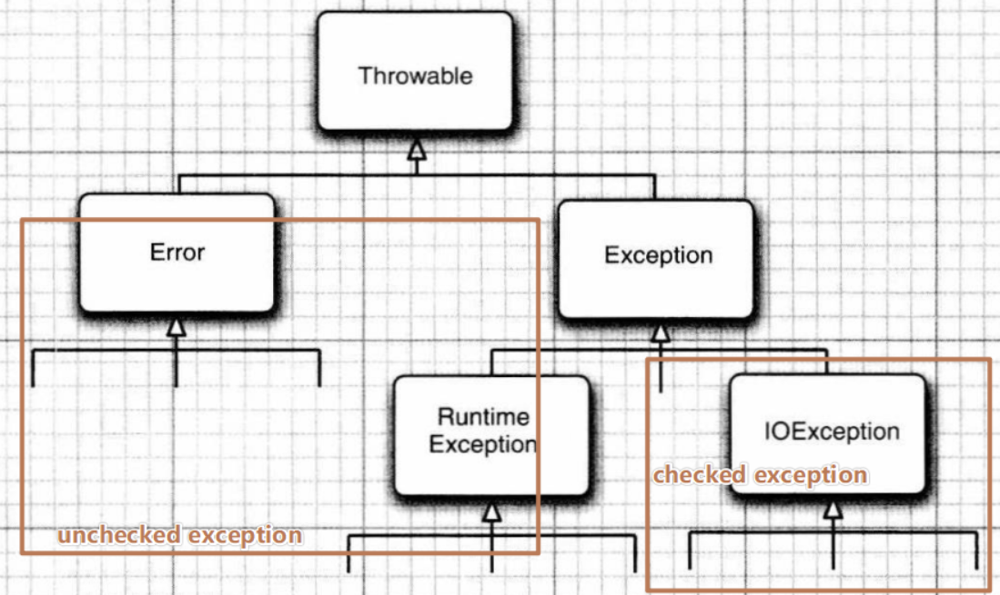

# 枚举	
+ 枚举类型（enum type）是指由一组固定的常量组成合法的类型。
+ 定义的枚举类默认继承 Enum 类
+ 方法：
    - name()和toString()	返回枚举值
    - compareTo() 比较的是 Enum 的 ordinal 顺序大小
    - values() 返回枚举类型的对象数组。该方法可以很方便地遍历所有的枚举值。
    - valueOf(String str)：把字符串转为对应的枚举类对象。字符串必须是枚举类对象的“名字”。如不是抛异常：IllegalArgumentException。
+ 不能被继承
+ Java中由关键字 enum 来定义一个枚举类型。下面就是java枚举类型的定义。
+ 可序列化，线程安全。
+ 接口返回值不允许使用枚举类型或者包含枚举类型的POJO对象。


```java
public enum Season {
    SPRING, SUMMER, AUTUMN, WINTER;
}
```

+ 枚举可以实现一个或多个接口（Interface）
+ 可以定义新的变量 
+ 可以定义新的方法

## 应用
### 常量
```java
public enum Color {  
  RED, GREEN, BLANK, YELLOW, 白色
}  


public static void main(String[] args) {
    System.out.println(Color.RED); // RED
    System.out.println(Color.白色); // 白色
}
```

### 向枚举中添加新方法、变量
```java
public enum Color {  
    RED("红色", 1), GREEN("绿色", 2);  
    // 成员变量  
    private String name;  
    private int index;  
    
    // 构造方法  
    private Color(String name, int index) {  
        this.name = name;  
        this.index = index;  
    }  
    
    // 普通方法  
    public static String getName(int index) {  
        for (Color c : Color.values()) {  
            if (c.getIndex() == index) {  
                return c.name;  
            }  
        }  
        return null;  
    }  
    
    // get set 方法  
    public String getName() {  
        return name;  
    }  
    public void setName(String name) {  
        this.name = name;  
    }  
    public int getIndex() {  
        return index;  
    }  
    public void setIndex(int index) {  
        this.index = index;  
    }  
}  

// ******************main*******************
public static void main(String[] args) {
    System.out.println(Color.RED); // RED
    System.out.println(Color.RED.getName()); // 红色
}
```

### 实现接口
```java
public interface Food {  
    enum Coffee implements Food{  
        BLACK_COFFEE,DECAF_COFFEE,LATTE,CAPPUCCINO  
    }  
    enum Dessert implements Food{  
        FRUIT, CAKE, GELATO  
    }  
}
```

# String 类
## 不可变类
+ 不可变类：是其实例不能被修改的类。每个实例中包含的所有信息都必须在创建该实例的时候就提供，并且在对象的整个生命周期内固定不变。为了使类不可变，要遵循下面五条规则：
    - 不要提供任何会修改对象状态的方法。
    - 保证类不会被扩展。 一般的做法是让这个类称为 final 的，防止子类化，破坏该类的不可变行为。
    - 使所有的域都是 final 的。
    - 使所有的域都成为私有的？ 防止客户端获得访问被域引用的可变对象的权限，并防止客户端直接修改这些对象。
    - 确保对于任何可变性组件的互斥访问。 如果类具有指向可变对象的域，则必须确保该类的客户端无法获得指向这些对象的引用。


+ 不可变类的好处
    -  不可变类比较简单。
    -  不可变对象本质上是线程安全的，它们不要求同步。不可变对象可以被自由地共享。
    -  不仅可以共享不可变对象，甚至可以共享它们的内部信息。
    -  不可变对象为其他对象提供了大量的构建。
+ 不可变类真正唯一的缺点是，对于每个不同的值都需要一个单独的对象。

+ Java中的不可变类
    - String BigInteger  BigDecimal  Integer Double ...

## String
+ `public final class String implements java.io.Serializable, Comparable<String>, CharSequence {..}`
+ 可序列化
+ 自然排序
+ `CharSequence`字符串接口
+ 底层是char[]：`private final char value[];`
    - jdk 9 开始变为来byte[]，省空间


+ 构造器
    - `public String()`
    - `public String(String string)`
    - `public String(char[] chs)`
    - `String(byte bytes[])`
    - ...

## 常见方法
+ `public int length()`
+ `public boolean isEmpty()`长度为0返回true
+ `char charAt(int index)`返回某索引处的字符 return value[index]
+ `String toLowerCase()`将 String 中的所有字符转换小写
+ `String toUpperCase()`将 String 中的所有字符转换大写
+ `String trim()`去处了空白和尾部（空格）
+ `boolean equalsIgnoreCase(String anotherString)`与equals方法类似，忽略大小写
+ `String concat(String str)`将指定字符串连接到此字符串的结尾。 等价于用“+”
+ `int compareTo(String anotherString)`比较字符串的大小
+ `String substring(int beginIndex)`返回一个新的字符串，从beginIndex开始截取到最后的一个子字符串。
+ `String substring(int beginIndex, int endIndex)`返回从beginIndex开始截取到endIndex(不包含)的一个子字符串。


+ `boolean endsWith(String suffix)`字符串是否以指定的后缀结束
+ `boolean startsWith(String prefix)`字符串是否以指定的前缀开始
+ `boolean startsWith(String prefix, int toffset)`测试此字符串从指定索引开始的子字符串是否以指定前缀开始
+ `boolean contains(CharSequence s)`当且仅当此字符串包含指定的 char 值序列时，返回 true
+ `int indexOf(String str)`返回指定子字符串在此字符串中第一次出现处的索引
+ `int indexOf(String str, int fromIndex)`返回指定（从fromIndex开始到结尾的字符串）子字符串在此字符串中第一次出现处的索引
+ `int lastIndexOf(String str)`返回指定子字符串在此字符串中最右边出现处的索引
+ `int lastIndexOf(String str, int fromIndex)`返回指定子字符串在此字符串中最后一次出现处的索引，从指定的索引开始反向搜索。注：indexOf和lastIndexOf方法未找到都返回-1


+ `String replace(char oldChar, char newChar)`返回用 newChar 替换此字符串中所有 oldChar 得到的字符串。
+ `String replace(CharSequence target, CharSequence replacement)`使用指定的字面值替换序列替换此字符串所有匹配字面值目标序列的子字符串。
+ `String replaceAll(String regex, String replacement) `使用的 replacement 替换此字符串所有匹配给定的正则表达式的子字符串。
+ `String replaceFirst(String regex, String replacement) ` 使用给定的 replacement 替换此字符串匹配给定的正则表达式的第一个子字符串。
+ `boolean matches(String regex)`判断字符串是否匹配正则表达式 regex。
+ `String[] split(String regex)`根据给定正则表达式的匹配拆分此字符串。
+ `String[] split(String regex, int limit)`根据正则表达式 regex 拆分字符串，最多不超过limit个，如果超过了，剩下的全部都放到最后一个元素中。
+ `static String join("/", "a","b","c") `返回字符串 "a/b/c"

## String转其他类型
```java
import org.junit.Test;

import java.io.UnsupportedEncodingException;
import java.util.Arrays;

/**
 * 涉及到String类与其他结构之间的转换
 */
public class StringTest1 {
    /*
        String 与 byte[]之间的转换
        编码：String --> byte[]: 调用String的getBytes()
        解码：byte[] --> String: 调用String的构造器

        编码：字符串 -->字节  (看得懂 --->看不懂的二进制数据)
        解码：编码的逆过程，字节 --> 字符串 （看不懂的二进制数据 ---> 看得懂）

        说明：解码时，要求解码使用的字符集必须与编码时使用的字符集一致，否则会出现乱码。
     */
    @Test
    public void test3() throws UnsupportedEncodingException {
        String str1 = "abc123中国";
        byte[] bytes = str1.getBytes();//使用默认的字符集，进行编码。
        System.out.println(Arrays.toString(bytes));

        byte[] gbks = str1.getBytes("gbk");//使用gbk字符集进行编码。
        System.out.println(Arrays.toString(gbks));

        System.out.println("******************");

        String str2 = new String(bytes);//使用默认的字符集，进行解码。
        System.out.println(str2);

        String str3 = new String(gbks);
        System.out.println(str3);//出现乱码。原因：编码集和解码集不一致！


        String str4 = new String(gbks, "gbk");
        System.out.println(str4);//没有出现乱码。原因：编码集和解码集一致！


    }

    /*
        String 与 char[] 之间的转换

        String --> char[]:调用String的toCharArray()
        char[] --> String:调用String的构造器
     */
    @Test
    public void test2(){
        String str1 = "abc123";  //题目： a21cb3

        char[] charArray = str1.toCharArray();
        for (int i = 0; i < charArray.length; i++) {
            System.out.println(charArray[i]);
        }

        char[] arr = new char[]{'h','e','l','l','o'};
        String str2 = new String(arr);
        System.out.println(str2);
    }

    /*
        复习：
        String 与基本数据类型、包装类之间的转换。

        String --> 基本数据类型、包装类：调用包装类的静态方法：parseXxx(str)
        基本数据类型、包装类 --> String:调用String重载的valueOf(xxx)

     */
    @Test
    public void test1(){
        String str1 = "123";
        // int num = (int)str1; // 错误的
        int num = Integer.parseInt(str1);

        String str2 = String.valueOf(num);//"123"
        String str3 = num + "";
        System.out.println(str1 == str3);
    }
}
```

## 字符串拼接
+ **StringBuilder & StringBuffer**

+ String：不可变的字符序列：**线程安全**，底层使用char[]存储.(不可变字符串优点：编译器可以让字符串共享)
+ StringBuffer：可变的字符序列：**线程安全**，效率低，底层使用char[]存储
    - `StringBuffer sb1 = new StringBuffer();  // char[] value = new char[16];`
    - ` StringBuffer sb2 = new StringBuffer("abc"); //char[] value = new char["abc.length()" + 16];`
    - 扩容问题：但添加的数据数量大于创建的数组容量，则扩容。 默认扩容为原来数组容量的2倍 + 2；并将原数组中的元素复制到新数组
+ StringBuilder：jdk 5 可变的字符序列：线程不安全，效率高，底层使用char[]存储


```latex
StringBuffer append(xxx)：提供了很多的append()方法，用于进行字符串拼接
StringBuffer delete(int start,int end)：删除指定位置的内容
StringBuffer replace(int start, int end, String str)：把[start,end)位置替换为str
StringBuffer insert(int offset, xxx)：在指定位置插入xxx
StringBuffer reverse() ：把当前字符序列逆转
public int indexOf(String str):
public String substring(int start,int end)
public int length()
public char charAt(int n ):查
public void setCharAt(int n ,char ch)：改
```

# 常用工具类
## Arrays
+ 包含用于操作数组的各种方法。


+ **static String toString(int[] a) 返回指定数组的内容字符串表示形式**
+ 
+ **static void sort(int[] a) 按照数字顺序排列指定的数组。**
+ 
+ **boolean equals(int[] a, int[] b):判断数组相等**
+ 
+ void fill(int[] a,int val): 将指定的int值分配给指定的int数组的每个元素。（存在很多重载）
+ 
+ int binarySearch(int[] a, int key): 对排序后的数组进行二分法检索指定的值
+ 
+ **static <T> List<T> asList(T... a) **
    - 返回由指定数组支持的**固定大小**（不能修改）的列表。此方法充当基于数组和基于集合的API之间的桥梁。
    - 用 ArrayList(Collection<? extends E> c) 的构造器可以将其转变成真正的 ArrayList

## Math
+ static double abs(double a)  :返回绝对值
+ 
+ static double ceil(double a) 天花板   向上取整
+ 
+ static double floor(double a)  地板  向下取整
+ 
+ static long round(double a)  四舍五入
+ 
+ static double max(double a, double b)  比交取较大值
+ 
+ static double pow(double a, double b) :返回第一个参数的第二个参数次幂
+ 
+ **static double random() :返回一个随机数，范围 [0,1)**

## UUID
+ jdk 1.5开始，UUID是由一组32位数的16进制数字所构成，一个表示不可变的通用唯一标识符（UUID）的类。 UUID表示128位值。

```java
UUID uuid = UUID.randomUUID();
String str = uuid.toString();

System.out.println(str); // e9559791-0bcd-44ed-8aa8-67ac13ed6571
System.out.println(str.replaceAll("-", "")); // e95597910bcd44ed8aa867ac13ed6571  去掉“-”
```

## System
+ static void arraycopy(Object src, int srcPos, Object dest, int destPos, int length)：将指定源数组中的数组从指定位置复制到目标数组的指定位置。
    - arraycopy(源数组, 源数组的起始索引位置, 目标数组, 目标数组的起始索引位置, 指定接受元数个数)
+ 
+ static long currentTimeMillis()：返回当前时间（以毫秒为单位）。
+ 
+ static void exit(int status)：终止当前运行的Java虚拟机。
+ 
+ static void gc() ：运行垃圾回收器。

## TimeUnit
+ `TimeUnit.MINUTES.sleep(4);`  // 睡4分钟
+ ....

# 内部类
## 成员内部类
+ 在类的成员位置，和成员变量以及成员方法所在的位置是一样的
+ 在内部类当中，可以**直接访问外部类的成员，包括私有成员和静态**
+ 访问外部类的成员：
    - 外部类.this.成员变量
    - 外部类.this.成员方法


+ 在外部类中如果要访问成员内部类的成员，必须先创建一个成员内部类的对象。要创建成员内部类的对象，前提是必须存在一个外部类的象：
    - Outter outter = new Outter();
    - Outter.Inner inner = outter.new Inner();
    
+ 

+ 内部类可以用 public、**protected**、private、static、**abstract**和final
    - 用static修饰时，内部类有一个新姓名：**嵌套类**
    
    - ```java
      public class Demo1 {
          private String name;
          public Demo1(String name) {
              this.name = name;
          }
          public static void main(String[] args) {
              Inner inner = new Demo1("jack").new Inner();
              System.out.println(inner.innerName); // jack
          }
          
          protected class Inner{
              private String innerName = Demo1.this.name;
          }
      }
      ```


## 嵌套类
+ 当内部类不需要访问外部类对象的时， 应该使用**静态内部类**。 有些程序员用嵌套类 （nested class) 表示静态内部类
+ 
+ 静态内部类是不需要依赖于外部类的，这点和类的静态成员属性有点类似，并且它不能使用外部类的非static成员变量或者方法。
+ 
+ 静态内部类的对象除了没有对生成它的外部类对象的引用特权外， 与其他所有内部类完全一样。
+ 
+ 接口中的内部类自动成为 static 和 public 类。
+ 
+ 静态内部类与非静态内部类之间存在一个最大的区别: 非静态内部类在编译完成之后会隐含地保存着一个引用，该引用是指向创建它的外围类，但是静态内部类却没有。没有这个引用就意味着：1. 它的创建是不需要依赖外围类的创建。2. 它不能使用任何外围类的非 static 成员变量和方法。  

## 局部内部类
+ 在方法内声明，出了方法之后就无法使用
+ 
+ 局部内部类类似方法里面的一个局部变量，可以用abstract和final（局部变量也可以用final修饰）修饰。
+ 
+ 在局部内部类中调用局部内部类所在方法中的局部变量，则局部变量声明为final。java 8后可省略final

## 匿名内部类
```java
new 类或接口() {
    // 重写方法
};
```

+ 有构造函数
+ 匿名构造函数是为匿名类隐式声明的

# 异常
+ Java 程序设计语言中， 异常对象都是派生于 **Throwable **类的一个实例。



## Error
+ Error表⽰系统级的错误， 是 Java 运行时系统的内部错误和资源耗尽错误， 不能指望程序来处理这样的问题， 除了退出运⾏外别⽆选择， 它是Java虚拟机抛出的。

## 异常类型
+ 将派生于 **Error **类或 **RuntimeException **类的所有异常称为**非受查(unchecked) 异常**，所有其他的异常称为**受查（checked) 异常**。编译器将核查你是否为所有的受査异常提供了异常处理器。
+ **运行时异常（RuntimeException）**：由程序错误导致的异常。 RuntimeException 及其子类表示JVM在运行期间可能出现的错误。如 NullPointerException，NumberFormatException，ClassCastException （类型转换错误）、 ArithmeticException （算术错误） 。此类异常属于不可查异常，一般是由程序逻辑错误引起的，在程序中可以选择捕获处理，可以不处理。
+ **编译异常(受检异常)**：程序本身没有问题， 但由于像 I/O 错误这类问题导致的异常。如果程序中出现此类异常，比如说IOException必须对该异常进行处理，否则编译不通过。

## 格式
```java
try {
	可能出现异常的代码；
} catch(异常类名1 变量名1) {
	异常的处理代码1;
} catch(异常类名2 | 异常类名3 变量名2 ){ // 捕获的异常类型之间不存在子类关系，同一个 catch 可捕获多个异常 jdk 7
	异常的处理代码2;
} finally {                 // 可以没有 catch 语句直接在 try 后接 fianlly
	一定会执行的代码;
}

// 同时使用catch和finally时建议使用又一种格式，解耦合 try/catch 和 try/finally 语句块：
try {
  try {
    可能出现异常的代码；
  } finally{
    一定会执行的代码;
  }
} catch(异常类名 变量名) {
  异常的处理代码;
}

// 优点：提高代码的清晰度；将会捕获 finally 子句中出现的错误。
```

+ 进行多个异常处理时：
    - 如果声明的异常没有父子关系，则无顺序；
    - **如果有父子关系，则子类异常要在父类异常的上面**
    - 捕获多个异常时， 异常变量隐含为 final 变量。
    - 父类不用throws抛异常，子类也不能，要用try...catch...
    - 当一个方法a调用中又调用了其他方法，其他方法需处理异常时使用throws，回到方法a中使用try...catch...

+ finally不执行
    - JVM 过早终止（调用 System.exit(int)）；
    - 在 finally 块中抛出一个未处理的异常；
    - 计算机断电、失火、或遭遇病毒攻击。

## 自定义异常
+ ⾃定义异常就是开发⼈员⾃⼰定义的异常， ⼀般通过继承Exception的⼦类的⽅式实现。
+ 编写⾃定义异常类实际上是继承⼀个API标准异常类， ⽤新定义的异常处理信息覆盖原有信息的过程。
+ 这种⽤法在Web开发中也⽐较常见， ⼀般可以⽤来⾃定义业务异常。 如余额不足、 重复提交等。 这种⾃定义异常有业务含义， 更容易让上层理解和处理。

```java
// 继承Exception或其子类
// 提供全局常量serialVersionUID
// 定义的类应该包含两个构造器， 空参 和 带有详细描述信息的构造器（超类 Throwable 的 toString 方法将会打印出这些详细信息)。

class ScoreException extends Exception{
	static final long serialVersionUID = -3387516993124229948L;
    	public ScoreException() {}

    	public ScoreException(String message) {
        	super(message);
    	}
}
```

## 带资源的 try 语句
+ jdk 7 新增。

+ 假设资源属于一个实现了 **AutoCloseable **接口的类，Java SE 7 为这种代码模式提供了一个很有用的快捷方式。AutoCloseable 接口有一个方法：void close() throws Exception

+ 带资源的 try 语句的形式为

  + ```java
    /**
    try (Resource2 res1 = . . .; Resource2 res2 = . . .) {
        // work with res  
    } catch (e) {
    	// xx
    } finally {
    	// xx
    }
    **/
    
    
    // try 块退出时，会自动调用 res.close() 方法。如，向一个文件中写入 hello
    try ( FileOutputStream fos = new FileOutputStream("myFile\\fos.txt") ) {
    	fos.write("hello".getBytes());
    } catch (IOException e) {
    	e.printStackTrace();
    }
    ```


## finally 与 return
+ 在try语句中执行了return语句时，finally中的语句还是会执行
+ finally语句块中对return的值的修改无效
+ 如果finally中也有return语句则于finally中的为准

# 编码方式
## 什么是ASCII码
+ ASCII（ American Standard Code for InformationInterchange， 美国信息交换标准代码） 是基于拉丁字母的⼀套电脑编码系统， 主要⽤于显⽰现代英语和其他西欧语⾔。
+ 是现今最通⽤的单字节编码系统， 并等同于国际标准ISO/IEC646。
+ 标准ASCII 码也叫基础ASCII码， 使⽤7 位⼆进制数（ 剩下的1位⼆进制为0） 来表⽰所有的⼤写和⼩写字母， 数字0 到9、 标点符号， 以及在美式英语中使⽤的特殊控制字符。
+ 其中：0～31及127(共33个)是控制字符或通信专⽤字符（ 其余为可显⽰字符） ， 如控制符： LF（ 换⾏） 、 CR（ 回车） 、 FF（ 换页） 、 DEL（ 删除） 、 BS（ 退格)、 BEL（ 响铃） 等； 通信专⽤字符： SOH（ ⽂头） 、 EOT（ ⽂尾） 、 ACK（ 确认） 等；
+ ASCII值为8、 9、 10 和13 分别转换为退格、 制表、 换⾏和回车字符。 它们并没有特定的图形显⽰， 但会依不同的应⽤程序，⽽对⽂本显⽰有不同的影响
+ 32～126(共95个)是字符(32是空格） ， 其中48～57为0到9⼗个阿拉伯数字。
+ 65～90为26个⼤写英⽂字母， 97～122号为26个⼩写英⽂字母， 其余为⼀些标点符号、 运算符号等。

## Unicode 字符集
+ ASCII码，只有256个字符，美国人倒是没啥问题了，他们用到的字符几乎都包括了，但是世界上不只有美国程序员啊，所以需要一种更加全面的字符集。
+ Unicode（中文：万国码、国际码、统一码、单一码）是计算机科学领域里的一项业界标准。它对世界上大部分的文字系统进行了整理、编码，使得计算机可以用更为简单的方式来呈现和处理文字。
+ Unicode伴随着通用字符集的标准而发展，同时也以书本的形式对外发表。Unicode至今仍在不断增修，每个新版本都加入更多新的字符。目前最新的版本为2018年6月5日公布的11.0.0，已经收录超过13万个字符（第十万个字符在2005年获采纳）。Unicode涵盖的数据除了视觉上的字形、编码方法、标准的字符编码外，还包含了字符特性，如大小写字母。
+ Unicode发展由非营利机构统一码联盟负责，该机构致力于让Unicode方案取代既有的字符编码方案。因为既有的方案往往空间非常有限，亦不适用于多语环境。
+ Unicode备受认可，并广泛地应用于计算机软件的国际化与本地化过程。有很多新科技，如可扩展置标语言（Extensible Markup Language，简称：XML）、Java编程语言以及现代的操作系统，都采用Unicode编码。
+ Unicode可以表示中文。

## UTF-8 编码规则
+ 广义的 Unicode 是一个标准，定义了一个字符集以及一系列的编码规则，即 Unicode 字符集和 UTF-8、UTF-16、UTF-32 等等编码规则。
+ unicode虽然统一了全世界字符的二进制编码，但没有规定如何存储。
+ 如果Unicode统一规定，每个符号就要用三个或四个字节表示，因为字符太多，只能用这么多字节才能表示完全。
+ 一旦这么规定，那么每个英文字母前都必然有二到三个字节是0，因为所有英文字母在ASCII中都有，都可以用一个字节表示，剩余字节位置就要补充0。
+ 如果这样，文本文件的大小会因此大出二三倍，这对于存储来说是极大的浪费。这样导致一个后果：出现了Unicode的多种存储方式。
+ UTF-8就是Unicode的一个使用方式，通过他的英文名Unicode Tranformation Format就可以知道。
+ UTF-8使用可变长度字节来储存 Unicode字符，例如ASCII字母继续使用1字节储存，重音文字、希腊字母或西里尔字母等使用2字节来储存，而常用的汉字就要使用3字节。辅助平面字符则使用4字节。
+ 一般情况下，同一个地区只会出现一种文字类型，比如中文地区一般很少出现韩文，日文等。所以使用这种编码方式可以大大节省空间。比如纯英文网站就要比纯中文网站占用的存储小一些。

## GBK 编码规则
+ 其实UTF8确实已经是国际通用的字符编码了，但是这种字符标准毕竟是外国定的，而国内也有类似的标准指定组织，也需要制定一套国内通用的标准，于是GBK就诞生了。

# 文件操作
## Path 接口
+ Path 代表目录名序列。如: D:\Develop ，当然，这个**路径在文件系统中并不一定真正存在**。

## Paths 类
+ jdk 7 操作路径工具类

```java
// 通过给定的字符串创建路径
Path path = Paths.get("D:","Develop"); // D:\Develop

// 拼接路径，传入的参数可为 String 或 Path 对象。如果参数是绝对路径，返回此绝对路径
Path work = path.resolve("work"); // D:\Develop\work

// 返回 path 路径的兄弟路径
Path path2 = path.resolveSibling("com");  // D:\com

// 返回 path 相对于 path2 的相对路径
Path path3 = path2.relativize(path); // ..\Develop

path.toAbsolutePath(); // 返path回绝对路径
path.getParent(); 返回path父路径
path.getFileName(); 返回path最后一个部件

// Path 与 File 转换
File file = path.toFile();
Path path1 = file.toPath();
```

## File 类
+ File：文件和目录路径名的表示
+ 文件和目录是可以通过File封装成对象
+ 对于file而言，封装的并不是一个正真存在的文件，仅仅是一个路径名而已。将来是要通过具体的操作把这个路径的内容转换为具体存在的

## Files 工具类
+ jdk 7 操作文件工具类

### 读写文件
```java
public static void main(String[] args) {
    Path path = Paths.get("E:\\Test1.java");
    Path path2 = Paths.get("E:\\Test2.java");
    try {
        byte[] bytes = Files.readAllBytes(path); // 读取文件为字节数组

        String str = Files.readString(path); // 读取文件为字符串，还可加参数 CharSet

        List<String> strings = Files.readAllLines(path); // 以行为单位读取文件为字符串，还可加参数 Charset
        
        // Files.write(path2, bytes); // 将 byte 数组写入文件（文件可以不存在）,返回 path2
        
        // static Path write(path2, Iterable<? extends CharSequence>,  OpenOption...opens)) 数据写入文件
        Files.write(path2, strings);
        /*
         以上的方法是用于处理中等长度文本文件，如果文件较大或是二进制文件使用数入/输出流或读入/读写器
         这些便捷操作可将我们从繁琐的 FileInputStream/FileOutputStream/BufferedReader/BufferedWriter 中解脱
         */
        
        //            InputStream is = Files.newInputStream(path); // 读文件
        //            OutputStream os = Files.newOutputStream(path2); // 写文件
        //            int len;
        //            byte[] bys = new byte[1024];
        //            while ((len = is.read(bys, 0, 1024)) != -1) {
        //                os.write(bys, 0, len);
        //            }
        //            is.close();
        //            os.close();

        BufferedReader br = Files.newBufferedReader(path); // 读文件,还可加入参数 Charset cs
        BufferedWriter bw = Files.newBufferedWriter(path2); // 写文件,还可加入参数 Charset cs
        
        br.transferTo(bw); // jdk 9
        
        br.close();
        bw.close();
    } catch (Exception e) {
        e.printStackTrace();
    }
}
```

### 创建文件和目录
```java
public static void main(String[] args) throws IOException {
    Path path = Paths.get("E:\\ClassFilesTest");
    Path path2 = Paths.get("E:\\ClassFilesTest2\\com");
    Path path3 = Paths.get("E:\\ClassFilesTest\\hello.txt");
    
    // 创建单个文件夹，返回目录 Path 对象；要求：path中的出最后一个部件，前面的路径必须存在
    // 文件夹已存在： java.nio.file.FileAlreadyExistsException
    Path directory = Files.createDirectory(path);
    
    // 创建多级目录，返回目录 Path 对象；目录已存在，不创建
    Path directories = Files.createDirectories(path2);

    // 创建文件
    // 路径不存在：java.nio.file.NoSuchFileException
    // 文件已存在：java.nio.file.FileAlreadyExistsException
    Path file = Files.createFile(path3);

    // 创建一个文件，可命名前缀与后缀，也可为 null；.tmp 为默认后缀
    Path tempFile = Files.createTempFile(path2, null, null);
    System.out.println(tempFile); // E:\ClassFilesTest2\com\9131154656307743230.tmp
    
    // 在指定目录下创建临时文件夹，可命名前缀，也可为null
    Path tempDirectory = Files.createTempDirectory(path, "abc");
    System.out.println(tempDirectory); // E:\ClassFilesTest\abc4208568461745114907
}
```

### 移动、复制删除文件
```java
public static void main(String[] args) throws IOException {
    Path path = Paths.get("E:\\ClassFilesTest\\new1.txt");
    Path path2 = Paths.get("E:\\ClassFilesTest2\\new1.txt");
    // Path path = Paths.get("E:\\ClassFilesTest");
    // Path path2 = Paths.get("E:\\ClassFilesTest3");

    // 复制文件,如果复制的是文件夹，只会复制一个空文件夹，文件夹里的文件不会被复制。
    // Path copy = Files.copy(path, path2, StandardCopyOption.REPLACE_EXISTING, StandardCopyOption.COPY_ATTRIBUTES);
    
    // 将输入流复制到文件，返回复制字节数
    long copy2 = Files.copy(Files.newInputStream(path), path2);
    
    // 将文件复制到输出流
    long copy3 = Files.copy(path, Files.newOutputStream(path2));

    // 移动文件
    // Path move = Files.move(path, path2, StandardCopyOption.REPLACE_EXISTING);

    // 删除文件
    // 当删除的是文件夹却不为空时：java.nio.file.DirectoryNotEmptyException
    // 当删除的文件不存在时：NoSuchFileException
    // Files.delete(path2);
    // 检查文件存在时才删除
    // Files.deleteIfExists(path2);
}
```

### 获取文件信息
```java
public static void main(String[] args) throws IOException {
    // 判断文件是否存在，返回 true 存在
    boolean exists = Files.exists(path);
    
    // 是否为目录
    boolean directory = Files.isDirectory(path);
    
    // boolean hidden = Files.isHidden(path); // 判断文件是否隐藏，隐藏返回 true
    // Files.isReadable(path); // 判断文件是否可读
    // Files.isWritable(path); //  判断文件是否可写
    // Files.isExecutable(path); // 文件是否可执行
    
    long size = Files.size(path); // 返回文件字节数
}

```

### 访问目录中的项（复制目录）
```java
public static void main(String[] args) throws IOException {
    Path path = Paths.get("E:\\ClassFilesTest");
    Path path2 = Paths.get("E:\\ClassFilesTest2");
    try (
        // 读取目录中的每一项，不会进入子目录
        // Stream<Path> entries = Files.list(path);
        
        // 读取目录中的每一项包括 path 目录本身，还会进入子目录
        Stream<Path> entries2 = Files.walk(path);
        
        // Stream<Path> entries3 = Files.walk(path, 2); // 加一个参数规定访问深度

    ) {
        // 使用 forEach 或 Iterator 遍历
        // entries.forEach(System.out::println);
        // entries2.forEach(System.out::println);
        // entries3.forEach(System.out::println);

        // 将目录 path 复制到 path2 此时 path2 存在会报错 FileAlreadyExistsException
        entries2.forEach(p -> // p 遍历到的每一个路径对象
                         {
                             try {
                                 Path r = path.relativize(p); // 返回 p 相对于 path 的相对路径
                                 Path q = path2.resolve(r); // 在目的路径中拼接
                                 if (Files.isDirectory(p)) { // 判断是目录，创建目录
                                     Files.createDirectory(q);
                                 } else { // 不是目录，复制
                                     Files.copy(p, q);
                                 }
                             } catch (IOException e) {
                                 e.printStackTrace();
                             }
                         });
    }
}
```

**方式2**

```java
public static void main(String[] args) throws IOException {
        String source = "D:\\Snipaste-1.16.2-x64";
        String target = "D:\\Snipaste-1.16.2-x64aaa"; // 没创建

        Files.walk(Paths.get(source)).forEach(path -> {
            try {
                String targetName = path.toString().replace(source, target);
                // 是目录
                if (Files.isDirectory(path)) {
                    Files.createDirectory(Paths.get(targetName));
                }
                // 是普通文件
                else if (Files.isRegularFile(path)) {
                    Files.copy(path, Paths.get(targetName));
                }
            } catch (IOException e) {
                e.printStackTrace();
            }
        });
    }
```

### 使用流目录（过滤文件、遍历、删除目录）

| 通配符  | 功能描述                                                 | 示例说明                                                     |
| ------- | -------------------------------------------------------- | ------------------------------------------------------------ |
| `*`     | 匹配路径组成部分中0个或多个字符                          | `*.java` 匹配当前目录中的所有 Java 文件                      |
| `**`    | 匹配跨目录边界的0个或多个字符                            | `**.java` 匹配在所有子目录中的 Java 文件                     |
| `?`     | 匹配一个字符                                             | `????.java` 匹配所有四个字符的 Java 文件                     |
| `[...]` | 匹配一个字符集合，可使用连线符 `[0-9]` 和取反符 `[^0-9]` | `Test[0-9A-F].java` 匹配 Testx.java 文件，其中 x 是一个十六进制数字 |
| `(...)` | 匹配由逗号隔开的多个可选项之一                           | `*.{java,class}` 匹配所有的 Java 文件和类文件                |
| `\`     | 转义上述任意模式中的字符以及 `\` 字符                    | `\*` 匹配所有文件名中包含 `*` 的文件                         |

+ 访问某个目录的所有子孙成员，调用 walkFileTree 方法，传递一个 FileVisitor（接口）【一般使用他的实现类 SimpleFileVisitor】类型的对象，有下列抽象方法：
    - 遇到一个目录中的文件时调用：FileVisitResult visitFile(T path, BasicFileAttributesattrs)
    - 一个目录被处理前调用：FileVisitResult preVisitDirectory(T dir, IOException ex)
    - 一个目录被处理后调用：FileVisitResult postVisitDirectory(T dir, IOException ex)
    - 试图访问文件或目录时发生错误，例如没有权限打开目录：FileVisitResult visitFileFailed(path, IOException)


+ 每一个方法都可以指定一个返回值：
    - FileVisitResult.CONTINUE		继续访问下个文件
    - FileVisitResu1t.SKIP_SUBTREE		继续访问，但不再访问这个目录下的任何项
    - FileVisitResult.SKIP_SIBLINGS	继续访问，但不再访问这个文件的兄弟文件
    - FileVisitResult.TERMINATE		终止访问
+ 当有任何方法抛出异常时，就会终止访问，而这个异常会从 walkFileTree 方法中抛出


```java
import java.io.IOException;
import java.nio.file.*;
import java.nio.file.attribute.BasicFileAttributes;

public class DirectoryStreamTest5 {
    public static void main(String[] args) {
        Path path = Paths.get("E:\\ClassFilesTest");
        try (
                // 注意： java.nio.file.DirectoryStream;
//                DirectoryStream<Path> paths = Files.newDirectoryStream(path);
                // 使用 glob 模式过滤文件
                DirectoryStream<Path> paths = Files.newDirectoryStream(path, "new[a-z|0-9].txt"); // 匹配文件
        ) {

//            for (Path item : paths) {
//                System.out.println(item);
//            }

            
            // 打印所有目录
            Files.walkFileTree(path, new SimpleFileVisitor<Path>() {
                // 访问某个文件夹之前
                @Override
                public FileVisitResult preVisitDirectory(Path dir, BasicFileAttributes attrs) throws IOException {
                    System.out.println(dir); // 打印目录
                    return FileVisitResult.CONTINUE;
                }

                // 访问文件夹出现错误
                @Override
                public FileVisitResult visitFileFailed(Path file, IOException exc) throws IOException {
                    return FileVisitResult.SKIP_SUBTREE; // 访问目录或文件错误，不再访问这个目录
                }

                // 访问某个文件夹结束
                @Override
                public FileVisitResult postVisitDirectory(Path dir, IOException exc) throws IOException {
                    return FileVisitResult.CONTINUE;
                }
            });

            
            
            // 删除某个目录
            Files.walkFileTree(path, new SimpleFileVisitor<Path>() {
                // 遇到文件删除 
                @Override
                public FileVisitResult visitFile(Path file, BasicFileAttributes attrs) throws IOException {
                    Files.deleteIfExists(file); // 遇到某个文件
                    return FileVisitResult.CONTINUE;
                }

                // 访问某个文件夹结束
                @Override
                public FileVisitResult postVisitDirectory(Path dir, IOException exc) throws IOException {
                    if (exc != null) throw exc;
                    Files.delete(dir);
                    return FileVisitResult.CONTINUE;
                }
            });
        } catch (IOException e) {
            e.printStackTrace();
        }
    }
}
```

### 用到的枚举类

| 类别                                         | 选项                   | 描述                                                         | 配合使用的方法                                               |
| -------------------------------------------- | ---------------------- | ------------------------------------------------------------ | ------------------------------------------------------------ |
| **StandardOpenOption**<br>定义标准的开放选项 | `READ`                 | 用于读取而打开                                               | `newBufferedWrite`、`newInputStream`、`newOutputStream`、`write` |
|                                              | `WRITE`                | 用于写入而打开                                               | 同上                                                         |
|                                              | `APPEND`               | 如果用于写入而打开，则在文件末尾追加                         | 同上                                                         |
|                                              | `TRUNCATE_EXISTING`    | 如果用于写入而打开，则移除已有内容                           | 同上                                                         |
|                                              | **`CREATE_NEW`**       | 创建新文件，在文件已存时会创建失败                           | 同上                                                         |
|                                              | **`CREATE`**           | 自动在文件不存在的情况下创建新文件                           | 同上                                                         |
|                                              | `DELETE_ON_CLOSE`      | 当文件被关闭时，尽"可能"地删除该文件                         | 同上                                                         |
|                                              | `SPARSE`               | 给文件系统一个提示，表示该文件是稀疏的                       | 同上                                                         |
|                                              | `DSYNC` 或 `SYNC`      | 要求对文件数据 \| 数据和元数据的每次更新都必须同步地写入到存储设备中 | 同上                                                         |
| **StandardCopyOption**<br>定义标准复制选项   | **`ATOMIC_MOVE`**      | 原子性地移动文件                                             | `copy`、`move`                                               |
|                                              | `COPY_ATTRIBUTES`      | 复制文件的属性                                               | 同上                                                         |
|                                              | **`REPLACE_EXISTING`** | 如果目标已存在，则替换                                       | 同上                                                         |
| **LinkOption**<br>定义如何处理符号链接的选项 | `NOFOLLOW_LINKS`       | 不要跟踪符号链接                                             | 上面所有方法以及 `exists`、`isDirectory`、`isRegularFile` 等 |
| **FileVisitOption**<br>定义文件树遍历选项    | `FOLLOW_LINKS`         | 跟踪符号链接                                                 | `find`、`walk`、`walkFileTree`                               |

# IO
## 字节流与字符流
+ **InputStream、OutputStream、Reader、Writer** 都实现了 **Cloaseable **接口（接口中有 **close **方法）。
+ **OutputStream、Writer** 还实现了 **Flushable **接口（接口中有 **flush **方法）
+ **Reader **还实现了 **Readable **接口（接口中有** read(CharBuffer cb)** 方法）

### 输入流，输出流
+ 输入、输出，有一个参照物，参照物就是存储数据的介质。如果是把对象读入到介质中，这就是输入。从介质中向外读数据，这就是输出。
+ 所以，输入流是把数据写入存储介质的。输出流是从存储介质中把数据读取出来。

### 字节与字符
+ Bit最小的二进制单位 ，是计算机的操作部分。取值0或者1
+ Byte（字节）是计算机操作数据的最小单位由8位bit组成 取值（-128-127）
+ Char（字符）是用户的可读写的最小单位，在Java里面由16位bit组成 取值（0-65535）

### 字节流
+ 操作byte类型数据，主要操作类是java.io.InputStream、java.io.OutputStream的子类；不用缓冲区，直接对文件本身操作。

#### 读写文件

# Java 输入输出流方法总结

### InputStream 类方法

| 方法签名                            | 返回值   | 描述                                                      | 备注                       |
| ----------------------------------- | -------- | --------------------------------------------------------- | -------------------------- |
| `abstract int read()`               | `int`    | 读取一个字节。返回读取的字节，到文件末尾返回 -1           | 所有子类都必须重写这个方法 |
| `int read(byte[] b)`                | `int`    | 读取一个字节数组。返回读取的字节数，达到文件的末尾返回 -1 |                            |
| `byte[] readAllBytes()`             | `byte[]` | 返回数组，包含从当前流读入的所有字节                      | JDK 9 新增                 |
| `long transferTo(OutputStream out)` | `long`   | 从输入流中读取所有字节传送到输出流                        | JDK 9 新增                 |
| `void close()`                      | `void`   | 关闭流                                                    |                            |

### OutputStream 类方法

| 方法签名                                 | 返回值 | 描述                                       | 备注                       |
| ---------------------------------------- | ------ | ------------------------------------------ | -------------------------- |
| `abstract void write(int n)`             | `void` | 写一个字节数据                             | 所有子类都必须重写这个方法 |
| `void write(byte[] b)`                   | `void` | 写一个字节数组数据                         |                            |
| `void write(byte[] b, int off, int len)` | `void` | 写一个字节数组的部分数据                   |                            |
| `void close()`                           | `void` | 冲刷并关闭流                               |                            |
| `void flush()`                           | `void` | 冲刷输出流，即将所有缓冲的数据发送到目的地 |                            |

### 举例

```java
public static void main(String[] args){
    // 创建字节输入流对象
    try(
        FileInputStream fis = new FileInputStream("myFile\\fis.txt");
        FileOutputStream fos = new FileOutputStream("myFile\\fos.txt")
    ) {
        // 一次 读/写 一个字节
        // int by;
        // while ((by = fis.read()) != -1) {
        //     fos.write(by);
        // }

        // 一次 读/写 一个字节数组
        int len;
        byte[] bys = new byte[1024];
        while ((len = fis.read(bys)) != -1) {
            fos.write(bys, 0, len);
        }

        // 一次 读/写 一个字节数组 jdk 9
        // byte[] bytes = fis.readAllBytes();
        // fos.write(bytes);

        // 将输入流的所有字节传送给输出流 9
        // fis.transferTo(fos);

    } catch (IOException e) {
        e.printStackTrace();
    }
}
```

#### 使用字节缓冲流读写文件
```java
try (
	BufferedInputStream bis = new BufferedInputStream(new FileInputStream("myFile\\fis.txt"));
	BufferedOutputStream bos = new BufferedOutputStream(new FileOutputStream("myFile\\fos.txt"))
) {
 int len;
 byte[] bys = new byte[1024];
 while ((len = bis.read(bys)) != -1) {
     bos.write(bys, 0, len);
 }

 // bis.transferTo(bos); // jdk 9

} catch (IOException e) {
	e.printStackTrace();
}
```

### 字符流
+ 操作字符类型数据，主要操作类是Reader、Writer的子类；使用缓冲区缓冲字符，不关闭流就不会输出任何内容。
+ 字符流处理的单元为 2 字节的 Unicode 字符，分别操作字符、字符数组或字符串。
+ 字符流是由 Java 虚拟机将字节转化 Unicode 字符为单位的字符而成的，如果是音频文件、图片，用字节流好点，如果是关系到中文（文本）的，用字符流好点。
+ 所有文件的储存是都是字节（byte）的储存，在磁盘上保留的并不是文件的字符而是先把字符编码成字节，再储存这些字节到磁盘。在读取文件（特别是文本文件）时，也是字节的形式读取以形成字节序列。
    - 字节流可用于任何类型的对象，包括二进制对象，而字符流只能处理字符或者字符串； 
    - 字节流提供了处理任何类型的 IO 操作的功能，但它不能直接处理 Unicode 字符，字符流可以。

#### 读写数据
```java
public static void main(String[] args) {
    try (
        FileReader fr = new FileReader("src/fr.txt");
        FileWriter fw = new FileWriter("src/fw.txt");
    ) {
        int len;
        char[] chs = new char[1024];
        while ((len = fr.read(chs)) != -1) {
            fw.write(chs, 0, len);
        }

    } catch (IOException e) {
        e.printStackTrace();
    }
}
```

#### 使用字符缓冲流读写文件
```java
public static void main(String[] args) {
    try (
        BufferedReader br = new BufferedReader(new FileReader("src/fr.txt"));
        BufferedWriter bw = new BufferedWriter(new FileWriter("src/fw.txt"));
    ) {
        int len;
        char[] chs = new char[1024];
        while ((len = br.read(chs)) != -1) {
            bw.write(chs, 0, len);
        }

    } catch (IOException e) {
        e.printStackTrace();
    }
}

// ************字符缓冲流的其他方法*************
// String readLine() 读一行文字。结果包含行的内容的字符串，不包含任何终止符
// void newLine() 写一行行分隔符。行分隔符由系统属性定义。

```

### 相互转换
+ 整个IO包实际上分为字节流和字符流，但是除了这两个流之外，还存在一组字节流-字符流的转换类。
+ OutputStreamWriter 是 Writer 的子类，将输出的字符流变为字节流，即将一个字符流的输出对象变为字节流输出对象。（将写入的字符编码为字节。）
+ InputStreamReader 是 Reader 的子类，将输入的字节流变为字符流，即将一个字节流的输入对象变为字符流的输入对象。（读取字节，将其解码为字符。）

```java
public static void main(String[] args) {
		try (InputStreamReader isr = new InputStreamReader(new FileInputStream("E:\\test\\fis.txt"), "UTF-8");
             // 读入字节流
             FileWriter fw = new FileWriter("E:\\test\\fr.txt"); // 字符输出流
             // （fos.txt的中文会乱码显示，编解码方式不同）
             OutputStreamWriter osw = new OutputStreamWriter(new FileOutputStream("E:\\test\\fos.txt"), "GBK"); // 输出字符流
		) {
			int len;
			char[] chs = new char[1];
			while ((len = isr.read(chs)) != -1) { // 读入字符
				System.out.println(Arrays.toString(chs));
				osw.write(chs, 0, len); // 写出字节

				fw.write(chs, 0, len); // 写出字节
			}

		} catch (IOException e) {
			e.printStackTrace();
		}
	}
```

## 随机存取文件流
+ RandomAccessFile 直接继承于 java.lang.Object 类，实现了 DataInput 和 DataOutput 接口
    - 既可作为输入流，也可作为输出流
    - RandomAccessFile(File file, String mode)
    - RandomAccessFile(String name, String mode)
    - 指定 mode参数以指定 RandomAccessFile 的访问方式：
        * r：以只读方式打开
        * rw：以读取和写入方式打开
        * rwd：以读取和写入方式打开；同步文件内容的更新
        * rws：以读取和写入方式打开；同步文件内容和元数据更新


+ 输出流：写出的文件不存在则生成文件；若有文件则对文件中若有内容这对原有文件内容进行覆盖

```java
import org.junit.Test;

import java.io.File;
import java.io.FileNotFoundException;
import java.io.IOException;
import java.io.RandomAccessFile;

public class RandomAccessFileDemo {
    @Test
    public void test1() {
        RandomAccessFile raf1 = null;
        RandomAccessFile raf2 = null;
        try {

            raf1 = new RandomAccessFile(new File("jp.jpg"), "r");
            raf2 = new RandomAccessFile(new File("h.jpg"), "rw");

            byte[] buffer = new byte[1024];
            int len;
            while ((len = raf1.read(buffer)) != -1) {
                raf2.write(buffer, 0, len);
            }
        } catch (IOException e) {
            e.printStackTrace();
        } finally {
            if (raf1 != null) {
                try {
                    raf1.close();
                } catch (IOException e) {
                    e.printStackTrace();
                }
            }
            if (raf2 != null) {
                try {
                    raf2.close();
                } catch (IOException e) {
                    e.printStackTrace();
                }
            }
        }
    }

    @Test
    public void test2() throws IOException {
        RandomAccessFile raf1 = new RandomAccessFile("hello.txt", "rw");
	   //Seek() 覆盖设置文件指针偏移，从该文件的开头测量，发生下一次读取或写入。
        raf1.seek(3);//将角标移到 3  
        raf1.write("xyz".getBytes());
        raf1.close();
    }

    //RandomAccessFile 实现数据插入效果
    @Test
    public void test3() throws IOException {
        RandomAccessFile raf1 = new RandomAccessFile("hello.txt", "rw");
        raf1.seek(3);//将角标移到3覆盖
        //将指针3以后的数据存到StringBuilder中
        StringBuilder sb = new StringBuilder((int) new File("hello.txt").length());
        byte[] bys = new byte[20];
        int len;
        while((len = raf1.read(bys))!= -1){
            sb.append(new String(bys,0,len));
        }
        //调回指针，写入文件
        raf1.seek(3);
        raf1.write("xyz".getBytes());

        //将StringBuilder中的数据写入到文件
        raf1.write(sb.toString().getBytes());
        raf1.close();
    }
}
```

# 序列化
+ 序列化是将对象转换为可传输格式的过程。 是一种数据的持久化手段。一般广泛应用于网络传输，RMI和RPC等场景中。
+ 反序列化是序列化的逆操作。
+ 一般是以字节码或XML格式传输。而字节码或XML编码格式可以还原为完全相等的对象。这个相反的过程称为反序列化。

## Java 中的序列化与反序列化
+ 在 Java 中，我们可以通过多种方式来创建对象，并且只要对象没有被回收我们都可以复用该对象。但是，我们创建出来的这些 Java 对象都是存在于 JVM 的堆内存中的。只有 JVM 处于运行状态的时候，这些对象才可能存在。一旦 JVM 停止运行，这些对象的状态也就随之而丢失了。
+ 但是在真实的应用场景中，我们需要将这些对象持久化下来，并且能够在需要的时候把对象重新读取出来。Java的对象序列化可以帮助我们实现该功能。
+ 对象序列化机制（object serialization）是Java语言内建的一种对象持久化方式，通过对象序列化，可以把对象的状态保存为字节数组，并且可以在有需要的时候将这个字节数组通过反序列化的方式再转换成对象。对象序列化可以很容易的在JVM中的活动对象和字节数组（流）之间进行转换。
+ 在Java中，对象的序列化与反序列化被广泛应用到RMI(远程方法调用)及网络传输中。
+ 某个对象的属性不被序列化，用 transient 修饰

## 相关类及接口
+ **java.io.Serializable**
+ java.io.Externalizable
+ ObjectOutput
+ ObjectInput
+ **ObjectOutputStream**
+ **ObjectInputStream**

## Serializable 接口
+ 类通过实现 java.io.Serializable 接口以启用其序列化功能。未实现此接口的类将无法使其任何状态序列化或反序列化。可序列化类的所有子类型本身都是可序列化的。序列化接口没有方法或字段，仅用于标识可序列化的语义。
+ 当试图对一个对象进行序列化的时候，如果遇到不支持 Serializable 接口的对象。在此情况下，将抛出 NotSerializableException
+ 如果要序列化的类有父类，要想同时将在父类中定义过的变量持久化下来，那么父类也应该集成 java.io.Serializable 接口。

### 序列化过程（写入对象）
```java
ObjectOutputStream oos = new ObjectOutputStream(new FileOutputStream("data.obj"));
oos.writeObject(obj);  // 将对象序列化到文件
```

### 反序列化过程（读取对象）
```java
ObjectInputStream ois = new ObjectInputStream(new FileInputStream("data.obj"));
Object obj = ois.readObject();  // 从文件反序列化对象
```
