# Docker
[Docker](https://www.docker.com/)

[Docker Hub](https://hub.docker.com/)

开源的应用**容器**引擎，将<u>应用及应用运行的环境</u>打包到一个轻量级、可移植的镜像中，然后发布到Linux、Windows上。

Docker原本是由一个 PaaS提供商 dotCloud 公司的创始人 Solomon Hykes 发起的一个内部项目，用Go 语言开发。2013年3月开源，并在GitHub上进行维护。2013年底，dotCloud 公司更名为Docker。

**加快构建、共享和运行现代应用程序的速度。**

+ 生产环境中，开发、测试及上线环境都不一样，从而导致项目(Java的war或jar）在不同阶段出现很多其它阶段所不存在的奇怪的问题。Docker容器除了可以提供相同的应用外，还提供了该应用的**统一运行环境**，确保在任何宿主机HOST上都可以跑出相同的结果。即 Dogker = jar/war+环境。
+ 由于Docker确保了统一的运行环境，使得应用的**迁移更加便捷**。无论是物理机、虚拟机、云，Docker镜像的运行结果都是相同的。能很方便地将一个平台上运行的应用，迁移到另一个平台上。
+ 传统的虚拟机技术启动应用一般需要数分钟：首先需要启动虚拟机，然后再加载虚拟机操作系统，最后还需要再手工启动应用。而 Docker容器应用，由于直接运行于宿主机系统中，无需启动操作系统，能做到**秒级、甚至毫秒级的启动**。

**容器与虚拟机：**Docker容器的本质就是通过容器虚拟技术虚拟出的一台主机，就像虚拟机一样。可以将应用及其运行环境部署在这台虚拟出的主机上运行。但容器与虚拟机又有着本质的不同。

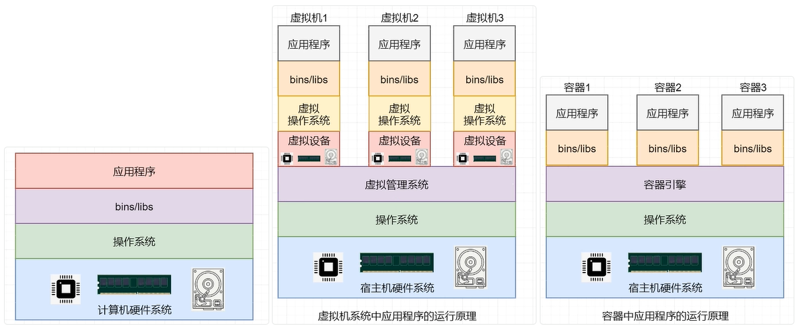


# 开始


## 概念
### Docker daemon
Docker守护进程(`dockerd`)监听 Docker API 请求，管理Docker对象，如镜像、容器、网络和卷。守护进程还可以与其他守护进程通信以管理Docker服务。

### Docker registries 
Docker 仓库，存储Docker镜像。当你使用docker pull或docker run命令时，docker从仓库中提取所需的镜像。使用docker push命令时，docker将你的镜像推送到你配置的仓库。

### Tag
通过`<repository>:<tag>`定位一个镜像。比如`nginx:1.29.3`, `nginx:latest`

### Images
镜像是一个只读模板，包含创建 Docker 容器的说明。Docker 镜像是用于创建 Docker Container的模板。就像面向对象编程中的Class。

### Containers
container是镜像的可运行实例。使用 Docker API 或 CLI 创建、启动、停止、移动或删除容器。可以将容器连接到一个或多个网络，为其附加存储，甚至可以根据其当前状态创建一个新Image。就像面向对象编程中类的实例。

默认情况下，容器与其他容器及其主机相对较好地隔离。也可以控制容器的网络、存储或其他底层子系统与其他容器或主机的隔离程度。

### Docker client 
Docker客户端，Docker用户与Docker交互的主要方式。使用docker run之类的命令时，客户端将这些命令发送给dockerd，dockerd执行命令。docker命令使用docker API。Docker客户端可以与多个dockerd通信。

## 安装
安装[Install Docker Engine](https://docs.docker.com/engine/install/)

目前国内镜像不可用。

```shell
sudo yum install -y yum-utils
sudo yum-config-manager --add-repo https://download.docker.com/linux/centos/docker-ce.repo
# 或使用阿里云源：http://mirrors.aliyun.com/docker-ce/linux/centos/docker-ce.repo

sudo yum install docker-ce docker-ce-cli containerd.io docker-buildx-plugin docker-compose-plugin
```

启动：`systemctl start docker`

测试：`sudo docker run hello-world`


配置镜像加速器：[阿里云登录 - 欢迎登录阿里云，安全稳定的云计算服务平台](https://cr.console.aliyun.com/cn-hangzhou/instances/mirrors)

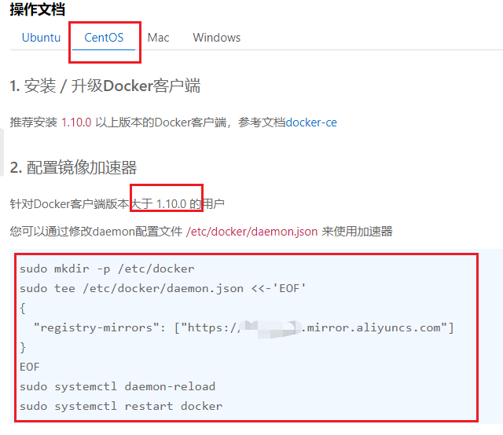

# images 镜像
- 拉取`docker pull [OPTIONS] NAME[:TAG|@DIGEST]`
  - `docker pull nginx:latest`
  - `OPTIONS`	
      - `docker pull -a nginx `拉取所有 nginx 版本
      - `-q`简化拉取信息


- 查看image信息`docker images [OPTIONS] [NAME]`
  - 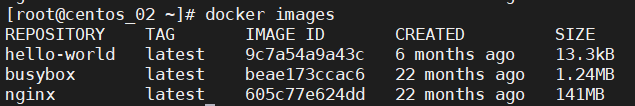

+ `OPTIONS` 
  + `-q`  只显示 images id 列表


## docker rmi
`docker rmi [repository:tag ...] | [imageId ...]` 移除镜像

+ `-f`强制移除
+ `docker rmi -f $(docker images -q)` 强制移除所有镜像

## 镜像导出
导出（将多个镜像打包）`docker save -o name.tar nginx:latest hello-world:latest`

导入（从tar包中导入）`docker load -i name.tar`

## 悬虚镜像
既没有 Repository 又没有 Tag 的镜像

删除`docker image prune`或`docker rmi <imageID>`

#  docker 容器
## docker ps
`docker ps`查看所有up的容器

+ `-a`查看所有容器，包括已退出的
+ `-n`显示最后n个
+ `-l`显示最后一个
+ `-q` 显示container id，比如删除所有容器时使用`docker rm -f $(docker ps -aq)`

## docker run
`docker run image_name` 运行镜像。如果本地没有，则拉取`imagename:latest`，创建并启动镜像容器

+ `--name` 指明名称`docker run --name mynginx nginx`
+ `-it` 以交互形式运行容器。比如运行ubuntu时使用
+ `-p`端口映射
+ `-d`以分离（后台）的模式运行容器


`docker run --name myubuntu -it ubuntu:latest /bin/bash`

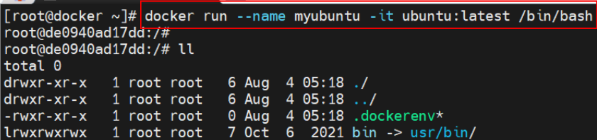

指定容器启动后运行的命令`/bin/bash`命令，这个指令是可选的。在dockerfile中的cmd就是docker启动后自动运行的命令

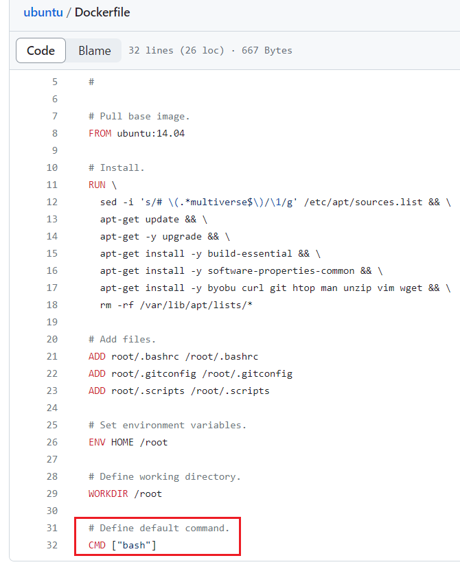

`Ctrl + P + Q`退出不停止容器或`exit`指令


`docker run --name mytom1 -dp 8081:8080 tomcat:8.5.32` 以分离的方式运行tomcat，端口映射为`8081:8080`，将docker中的8080映射到实际机器的8081

## docker create
与docker run类似，<u>创建但不启动</u>容器，没有-d命令

## docker exec
`docker exec`在运行中的容器中执行命令

- **`-i`** = **I**nteractive（交互）→ 可以**输入**
- **`-t`** = **T**erminal（终端）→ 提供**终端功能**

+ 如`docker exec -it mynginx1 /bin/bash` 进入mynginx1（容器已启动）容器
+ 如`docker exec -it mynginx1 ls -a`执行容器内的`ls -a`命令
+ 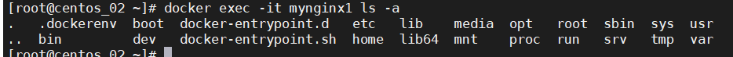

## docker top

查看container中启动的进程。类似于linux的top指令，linux中top指令都可以使用。

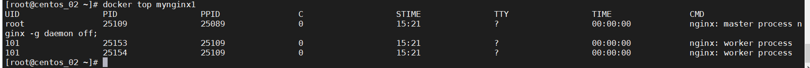

## container 启停
`docker start|restart|stop|kill name|containerids`

## container 暂停
`docker pause|unpause`暂停/取消暂停容器对外服务，容器并未停止。


## docker logs
`docker logs name` container 日志 

+ `--details` 的额外详细信息
+ `-f` follow跟踪日志输出
+ `--since string` 显示从时间戳开始的日志(如:“2013-01-02T13:23:37Z”)或相对(例如:“42m”(42分钟)
+ `-n string` 从日志末尾显示的行数(默认"all")
+ `-t`显示时间戳之前的日志(例如:“2013-01-02T13:23:37Z”)或相对的(例如:“42m”(42分钟)

## docker cp

复制文件或目录

`docker cp my.config mynginx:/etc` 将本地文件copy到mynginx的/etc目录，反过来也是一样

## docker rm
删除容器。`-f`强制删除，rim是删除images

## docker commit
将当前容器的状态保存为一个**新的镜像**`docker commit [OPTIONS] CONTAINER [REPOSITORY[:TAG]]` 

如`docker commit -a 'auther' -m 'message' mycontainer myrepository:mytag `

## docker export|import
容器导出为tar包`docker export [OPTIONS] CONTAINER`

- `docker export -o mynginx.tar mynginx1`

导入为镜像`docker import mynginx.tar repositoryname:tagname`

### export 与 save
+ export 作用于容器，save 作用于镜像，导出的结果都为 tar 文件
+ export 对一个容器进行导出，save 一次可以对多个镜像进行导出
+ export 对当前容器的文件系统快照进行导出，其会丢弃原镜像的所有历史记录与元数据信息，save 则是保存了原镜像的完整记录

### import 与 load

+ import 导入的是容器包，load 加载的是镜像包，但最终都会恢复为镜像
+ import 恢复为的镜像只包含当前镜像一层，load 恢复的镜像与原镜像的分层是完全相同
+ import 恢复的镜像就是新构建的镜像，与原镜像的 ImageID 不同；load 恢复的镜像与原镜像是同一个镜像，即 ImageID 相同
+ import 可以为导入的镜像指定`<repository>`与`<tag>`，load 加载的镜像不能指定`<repository>`与`<tag>`，与原镜像的相同

## docker system
`docker system `

+ `df` 查看 docker中 数据状态
+ `prune` 移除docker中不使用的数据（停止的container，悬虚镜像...）

# dockerfile
+ 指令是大小不敏感的，惯例全大写
+ 指令后至少会携带一个参数

## MAINTAINER
`MAINTAINER <name ...>`一般是维护者姓名，信箱。官方建议使用 LABEL 指令代替。

## LABEL
`LABEL <key>=<value> <key>=<value> ....`包含镜像任意的元数据信息，替代 MAINTAINER 指令。通过 docker inspect 可查看到 LABEL 与MAINTAINER 的内容。

## scratch
scratch 镜像是一个空镜像，是所有镜像的 Base Image。scratch 镜像只能在 Dockerfile 中被继承，不能 pull，不能 run，没有 tag。

在 Docker 中，scratch 是一个保留字，用户不能作为自己的镜像名。

一般配合`FROM`使用

## FROM
`FROM <image>[:<tag>]`指定基础镜像，是<u>第一条指令</u>；tag默认为 latest。

## ADD
`ADD ["<src>", "<dest>"]`复制宿主机中 src 到容器中的指定目录 dest 中。src 可以是绝对路径，或相对路径（相对于 docker build 命令所指定的

路径）

- src 可以是一个压缩文件，压缩文件复制到容器后会自动解压为目录； 
- src 可以是一个 URL，此时的 ADD 指令相当于 wget 命令；
- src 最好不要是目录，会将该目录中所有内容复制到容器的指定目录中；
- dest 是绝对路径，最后面必须加上斜杠，否则系统会将最后的目录名称当做是文件名的；

## COPY
与 ADD 指令相同，只不过 src 不能是 URL。若 src 为压缩文件，复制到容器后不会自动解压。

## ENV
`ENV <key> <value> `不推荐

`<key1>=<value1> <key2>=<value2> ...`环境变量，可以被 RUN 指令使用，容器运行后，也可以在容器中获取。

## WORKDIR
`WORKDIR path`容器打开后默认进入的目录，一般会在 RUN、CMD、ENTRYPOINT、ADD 等指令中会引用该目录。

可多次声明，后续的 WORKDIR 指令若使用相对路径， 则会基于之前 WORKDIR 指令指定的路径。

使用 docker run 运行容器时，可通过`-w`参数覆盖构建时所设置的工作目录。

## RUN
+ `RUN <command>` 其中`<command>`就是 shell 命令。docker build 执行时，会使用 shell 运行指定的 command。**不推荐**
+ `RUN ["EXECUTABLE","PARAM1","PARAM2", ...]` docker build 执行时，调用第一个参数"EXECUTABLE"指定的应用程序运行，并使用后面的参数作为应用程序的运行参数。
+ 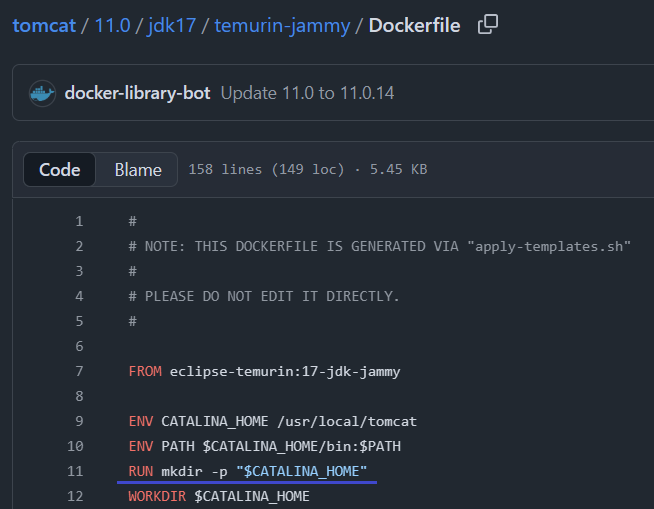

## CMD & ENTRYPOINT
`CMD ["EXECUTABLE","PARAM1","PARAM2", ...]`指定容器**默认**的运行命令。容器启动后，执行"EXECUTABLE"指定的可执行文件，并使用后面参数作为程序的运行参数。如`CMD ["java", "-jar", "/app/app.jar"]`

- 允许**覆盖**
- `CMD command param1 param2, ...` shell写法，不推荐


`ENTRYPOINT ["EXECUTABLE","PARAM1","PARAM2", ...]` 指定容器启动时的**主要执行程序**。容器启动后，执行"EXECUTABLE"指定的可执行文件，并使用后面参数作为程序的运行参数。

- **不易覆盖**：在 `docker run` 时通常不会被完全覆盖
- **与 CMD 配合**：通常与 CMD 配合使用，CMD 作为参数

- `ENTRYPOINT command param1 param2, ...` shell写法，不推荐


CMD & ENTRYPOINT 同时使用时，相当于将执行文件和参数分离，ENTRYPOINT中指定的时可执行文件，CMD中指明的时参数。

+ 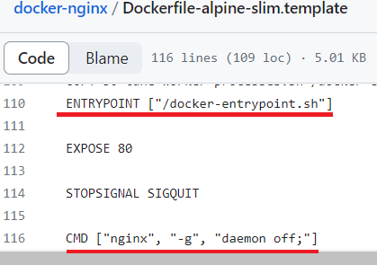

+ ```
  # 实际执行的命令：
  /docker-entrypoint.sh nginx -g "daemon off;"
  
  # 如果运行容器时指定参数：
  docker run myimage -t
  # 实际执行：
  /docker-entrypoint.sh -t
  ```

## ARG
`ARG <varname>[=<default value>]`定义变量，镜像构建运（build）行时可使用。

## 应用发布

+ SpringBoot打成jar，`hello-docker-0.0.1-SNAPSHOT.jar`
+ 在`/root/hello-docker`创建dockerfile

```dockerfile
# 使用轻量级 JRE 作为运行环境，镜像体积远小于 openjdk:8u102
FROM eclipse-temurin:17-jre-alpine

# 镜像维护者信息
LABEL maintainer="zhangsan <zs@163.com>"
LABEL version="1.0" description="Spring Boot Demo Service"

# 设置工作目录，防止文件散落在根目录
WORKDIR /app

# 将构建出的 Spring Boot 可执行 JAR 复制到容器内
COPY hello-docker-0.0.1-SNAPSHOT.jar hd.jar

# ================= 可运行性增强 =================

# 默认 JVM 参数（可在 docker run -e 覆盖）
ENV JAVA_OPTS=""

# 默认应用运行参数（例如 --spring.profiles.active=prod 等，可覆盖）
ENV APP_OPTS=""

# 暴露服务端口（仅声明用途，端口开放由运行参数决定）
EXPOSE 9000

# ================= 健康检查（可选但推荐） =================
# 若启用了 Spring Boot Actuator，健康探针会提升可观察性（Kubernetes / Docker Swarm有用）
# 若未启用 /actuator/health 可将此段删除
HEALTHCHECK --interval=30s --timeout=5s --retries=3 \
  CMD wget -qO- http://localhost:9000/actuator/health | grep '"status":"UP"' || exit 1

# ================= 安全增强 =================
# 创建独立的非 root 用户运行应用，提高安全性
RUN addgroup -S app && adduser -S -G app app
USER app

# ================= 启动命令 =================
# 使用 "sh -c" 形式的入口点，让 JAVA_OPTS 与 APP_OPTS 可动态扩展
# "$@" 允许接收 docker run 传入的额外参数，实现灵活启动
ENTRYPOINT ["sh", "-c", "java $JAVA_OPTS -jar hd.jar $APP_OPTS \"$@\""]

```

+ 构建镜像`docker build -t spring-demo:1.0 .`
    - `-f path/filename`指定dockerfile，默认当前目录下的dockerfile
    - 之后的`.`指的是目录，Dockerfile中指定的文件将回到这目录中查找
+ 运行`docker run --name springdemo1 -dp 9000:9000 spring-demo:1.0`

# 数据卷持久化
+ 数据卷是宿主机中的一个特殊的文件/目录，这个文件/目录与容器中的另一个文件/目录进行了直接关联，在任何一端对文件/目录的写操作，在另一端都会同时发生相应变化。在宿主中的这个文件/目录就称为数据卷，而容器中的这个关联文件/目录则称为该数据卷在该容器中的挂载点。
+ 数据卷的设计目的就是为了实现数据持久化，其完全独立于容器的生命周期，属于宿主机文件系统，但不属于 UnionFS。因此，<u>容器被删除时，不会删除其挂载的数据卷。</u>


通过命令指定语法： `docker run –it **–v** /宿主机目录绝对路径:/容器内目录绝对路径 镜像` 目录不存在自动创建

+ eg: `docker run --name myubuntu1 -it -v /root/xxx:/usr/local/yyy ubuntu:latest`
+ 创建只读数据卷（指容器对挂载点的权限是只读的）`docker run –it –v /宿主机目录绝对路径:/容器内目录绝对路径**:ro** 镜像` 那么容器的·`usr/local/yyy`目录就是只读的，在宿主机的`/root/xxx`目录中时可读写的。


通过`docker inspect [容器]`的Munts属性可查看具体细节。

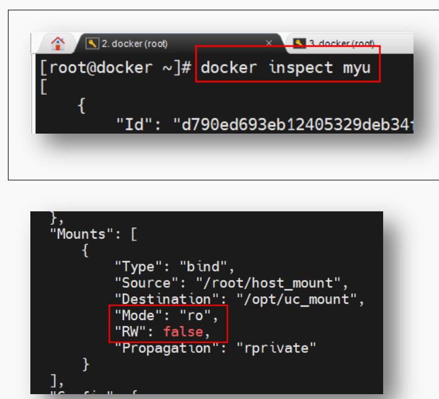

## 共享数据卷
`docker run --name mycentos1 --volumes-from myubuntu1 -it centos:latest /bin/bash`

那么mycentos1容器中也同样出现了挂载点目录`/usr/local/yyy`

## 通过Dockerfile指定数据卷
`VOLUME` 指令。在容器中创建可以挂载数据卷的挂载点。语法`VOLUME ["/var/www", "/etc/apache"]` 或`VOLUME /var/www /etc/apache`，指定挂载点，那么容器中会自动创建对应的目录

```dockerfile
FROM centos:7
VOLUME /opt/xxx /opt/ooo
CMD /bin/bash
```

build：`docker build -t mycentos .`

run：`docker run --name mycent1 -it mycentos /bin/bash`

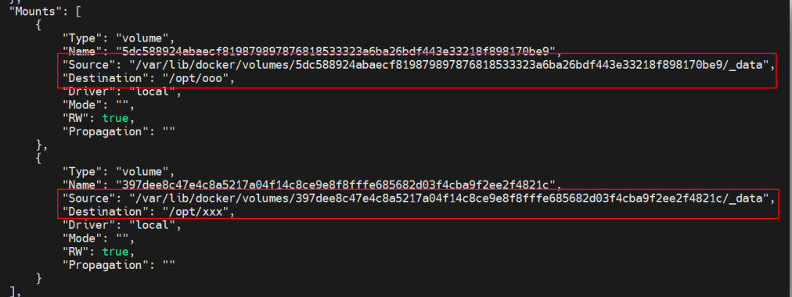

<u>通过Dockerfile指定数据卷后，也能使用</u>`<u>-v</u>`<u>添加更多的数据卷。</u>

## MySQL 安装
[https://hub.docker.com/_/mysql](https://hub.docker.com/_/mysql)

1. pull `docker mysql:5.7`
2. run 

```shell
docker run \
--name mysql \
-e MYSQL_ROOT_PASSWORD=root \
-v /root/mysql/data:/var/lib/mysql \ # 数据
-v /root/mysql/log:/var/log/mysql \ # 日志
-v /root/mysql/conf:/etc/mysql/conf.d \ # 配置
-dp 3306:3306 \
-d mysql:5.7
```

在conf/my.cnf配置（处理乱码问题）

```nginx
[client]
default_character_set=utf8

[mysql]
default_character_set=utf8

[mysqld]
default_character_server=utf8
```

3. 重启

# Docker Compose

Docker Compose 是一个需要在 Docker 主机上进行安装的 Docker 容器编排外部工具。通过一个声明式的配置文件描述整个应用，然后通过一条命令完成应用部署。部署成功后，还可通过一系列简单命令实现对其完整生命周期的管理。

Docker Compose 使用 YAML 文件来定义服务。默认文件 `compose.yml`， 同时支持 docker-compose.yml。 由于一个 compose 文件中定义的为一个项目的所有服务，所以一般为在创建 compose 文件之前先新建一个目录，目录名称一般为项目名称，然后再将项目所需的所有镜像、微服务的 Dockerfile 放入该目录，并在该目录中新建 compose 文件。

## Compose v1

- 命令：`docker-compose`
- 是一个 Python 程序
- docs：[Overview](https://docs.docker.com/compose/compose-file/)
- 安装：[Install Compose standalone](https://docs.docker.com/compose/install/standalone/)
- 为docker-compose添加可执行属性 `chmod +x /usr/local/bin/docker-compose`
- 测试 `docker-compose version`

## **现在（Compose v2）**

- 安装 https://docs.docker.com/compose/install/linux/
- 不再是独立程序
- 是 Docker CLI 的官方插件
- 使用命令：`docker compose`
- 随 Docker Desktop（Windows / macOS）默认包含
- **Linux 上不一定自动安装**

## 属性
### version
`version` 已过时。

### networks
`networks` 定义和创建应用中所使用到的所有网络。

```yaml
services:
 app:
	networks:
 		- app_bridge: #使用的网络，必须是已经存在的，或通过顶级属性 networks 创建的网络
networks:
 app_bridge:
  name: appBGnet # 这才是网络名称
  driver: bridge # 网络驱动，默认 Bridge
  attachable: false # 默认false，置为 true，则除了当前 compose 中定义的服务外，其它独立容器也可以连接到此网络，并能与该网络中的服务及也连接到该网络的其它独立容器通信
```

### volumes
`volumes`定义和创建应用中所使用到的所有 volume。其下包含的第一级属性即为 volume 的卷标，这个卷标所代表的是当前 Docker 主机中的目录，该目录的位置由系统自动分配。

### serivces
`serivces`定义一个应用中所包含的服务。Docker Compose 会将每个服务部署在各自的容器中。

```yaml
serivces:
	myservice: 
	  build:
  	  context: ./ # Dockerfile 所在目录
  	  dockerfile: myDockerfile # 指定Dockerfile，默认DOckerfile
    image: mysql:5.7 # 使用的镜像，（如果设置了build，会build得到mysql:5.7）
    container_name: mysql1 # 容器名称，默认：当前目录名_ 服务名称
    ports: 
  	  - 9000:80 # 绑定容器的 80 端口到主机的 9000 端口
  	  - 443 # 绑定容器的 443 端口到主机的任意端口，容器启动时随机分配绑定的主机端口号
    volumes:  # 数据卷
      - /etc/mysql:/var/lib/mysql
    command: xxx # 用于覆盖 Dockerfile 中的 CMD 指令内容，即启动该服务容器后立即运行的命令。
    depends_on:  #用于指定当前服务的启动所依赖的应用名称。
      - xxx
      - yyy
    networks: xxx # 指定当前服务容器要连接到的网络
```

## 命令
+ `docker-compose pull`拉取 compose 中服务依赖的全部镜像或指定镜像
+ `docker-compose config`检查 compose 文件是否正确。选项`-q`，只有存在问题时才有输出。
+ `docker-compose up`启动 compose 中的所有容器。`-d` 选项表示后台启动，`-f`指定配置文件
+ `docker-compose logs`查看 comopse 中所有服务或指定服务的运行日志。通过在命令后添加服务名称来指定。
+ `docker-compose ps`列出 compose 中所有服务或指定服务。
+ `docker-compose top`列出 compose 中当前正在运行的所有服务或指定服务。
+ `docker-compose images`列出 compose 中所有服务或指定服务对应的镜像。
+ `docker-compose port`列出指定服务容器的指定端口所映射的宿主机端口。
+ `docker-compose port`列出指定服务容器的指定端口所映射的宿主机端口。
+ `docker-compose run`指定服务上执行一条命令
+ `docker-compose exec`进入指定服务容器。
+ `docker-compose pause/unpause`恢复 compose 中处于暂停状态的所有服务容器或指定服务容器。
+ `docker-compose start/stop/restart/kill`
+ `docker-compose rm`删除 compose 中的、处于停止状态的所有服务容器或指定服务容器。

## 使用
现在有一个appDemo项目，使用SpringBoot、MySQL、Redis。需要三个容器tomcat:8.5.32、mysql:5.7，redis:7.0

1. 构建tomcat

```dockerfile
FROM openjdk:8u102
MAINTAINER zhangsan zs@163.com
LABEL version="1.0" description="spring demo"
COPY hello-docker-0.0.1-SNAPSHOT.jar hd.jar
ENTRYPOINT ["java", "-jar", "hd.jar"]
EXPOSE 9000
```

`docker build -t app-demo:1.0 .`构建镜像

2. 启动mysql

```shell
docker run \
--name mysql \
-e MYSQL_ROOT_PASSWORD=root \
-v /root/mysql/data:/var/lib/mysql \ # 数据
-v /root/mysql/log:/var/log/mysql \ # 日志
-v /root/mysql/conf:/etc/mysql/conf.d \ # 配置
-dp 3306:3306 \
-d mysql:5.7
```

3. 启动redis

```shell
docker run --name redis \
-v /root/redis.conf:/etc/redis/redis.conf \
-v /root/redis/data:/data \
-dp 6379:6379 redis:7.0 \
redis-server /etc/redis/redis.conf
```

4. 启动应用

```shell
docker run --name myapp \
-v /root/demo/log/:var/applogs \ # 指定日志文件
-dp 9000:8080 \
app-demo:1.0
```

### 启动appDemo存在的问题。

1. 麻烦。
2. 如下是springboot的yaml文件，需要在其中写死ip，所以这个配置只能在当前环境中使用。

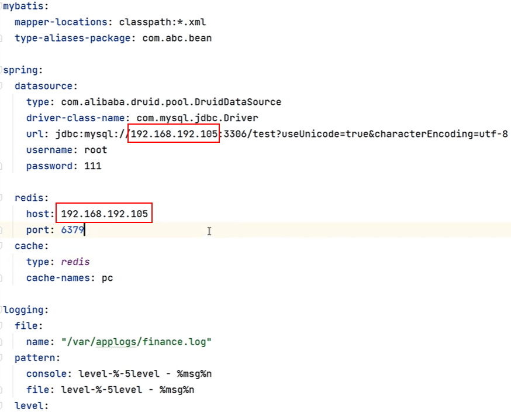

### 使用 Docker Compose
1. 新建目录 `mkdir app-demp`
2. 新建文件`compose.yml`配置：

```yaml
services:
  myapp: # 主应用服务（如 Spring Boot）
    build: ./  # 从当前目录中的 Dockerfile 构建镜像
    container_name: myapp1  # 容器命名为 myapp1
    restart: unless-stopped  # 除非手动停止，否则自动重启（比 always 更安全）
    ports:
      - "9000:8080"  # 宿主机9000端口映射到容器8080端口（应用监听端口）
    volumes:
      - ./logs:/var/applogs  # 应用日志持久化到宿主机当前目录
    environment:
      TZ: Asia/Shanghai  # 设置时区为上海，确保日志时间准确
      SPRING_DATASOURCE_URL: jdbc:mysql://mysql:3306/mydb?useSSL=false&characterEncoding=utf-8&serverTimezone=Asia/Shanghai
      SPRING_DATASOURCE_USERNAME: myuser  # DB用户名（避免使用root）
      SPRING_DATASOURCE_PASSWORD: ${MYSQL_PASSWORD}  # 从 .env 文件读取密码
      REDIS_HOST: myredis  # Redis 主机名（容器网络内部解析）
      REDIS_PASSWORD: ${REDIS_PASS}  # Redis 密码从 .env 文件读取
    deploy:
      resources:
        limits:  # 资源使用上限，防止单容器占用过多资源
          cpus: '2'  # 最多使用2核CPU
          memory: 2G  # 最多使用2GB内存
        reservations:  # 资源预留，确保最低可用资源
          cpus: '0.5'  # 预留0.5核CPU
          memory: 512M  # 预留512MB内存
    logging:
      driver: "json-file"  # 使用 JSON 格式日志
      options:
        max-size: "10m"  # 单个日志文件最大10MB
        max-file: "3"  # 最多保留3个日志文件（自动轮转）
    healthcheck:  # 应用健康检查，确保服务真正可用
      test: ["CMD", "curl", "-f", "http://localhost:8080/actuator/health"]  # 调用健康检查接口
      interval: 30s  # 每30秒检查一次
      timeout: 10s  # 检查超时时间10秒
      retries: 3  # 连续失败3次才判定为不健康
      start_period: 40s  # 启动后等待40秒再开始检查（给应用启动时间）
    depends_on:  # 依赖关系配置
      mysql:
        condition: service_healthy  # 只有当 MySQL 健康检查通过后才启动 myapp
      myredis:
        condition: service_healthy  # 只有当 Redis 健康检查通过后才启动 myapp

  mysql:
    image: mysql:5.7  # 使用 MySQL 5.7 官方镜像
    restart: always  # 总是自动重启，提升数据库稳定性
    environment:
      TZ: Asia/Shanghai  # 设置时区为上海
      MYSQL_ROOT_PASSWORD: ${MYSQL_ROOT_PASSWORD}  # root 密码从 .env 读取
      MYSQL_DATABASE: mydb  # 启动时自动创建数据库
      MYSQL_USER: myuser  # 创建非 root 用户（安全最佳实践）
      MYSQL_PASSWORD: ${MYSQL_PASSWORD}  # 非 root 用户密码
    # ports:  # 端口映射（生产环境建议注释掉，仅内部网络访问以增强安全性）
    #   - "3306:3306"
    volumes:
      - /docker/mysql/data:/var/lib/mysql  # 数据持久化（定期备份此目录）
      - /docker/mysql/conf:/etc/mysql/conf.d  # 自定义配置文件存放处
      - /docker/mysql/init:/docker-entrypoint-initdb.d  # SQL 初始化脚本目录（首次启动时执行）
    deploy:
      resources:
        limits:
          memory: 1G  # 限制 MySQL 最多使用1GB内存
    logging:
      driver: "json-file"
      options:
        max-size: "10m"  # 单个日志文件最大10MB
        max-file: "3"  # 最多保留3个日志文件
    healthcheck:  # MySQL 健康检查
      test: ["CMD", "mysqladmin", "ping", "-h", "localhost", "-u", "root", "-p${MYSQL_ROOT_PASSWORD}"]
      interval: 10s  # 每10秒检查一次
      timeout: 5s  # 检查超时5秒
      retries: 5  # 连续失败5次才判定为不健康

  myredis:
    image: redis:7.0  # 使用 Redis 7.0 官方镜像
    restart: always  # 总是自动重启
    environment:
      TZ: Asia/Shanghai  # 设置时区为上海
    # ports:  # 端口映射（生产环境建议注释掉，仅内部网络访问）
    #   - "6379:6379"
    command: redis-server /etc/redis/redis.conf --requirepass ${REDIS_PASS}  # 启动 Redis 并启用密码认证
    volumes:
      - /docker/redis/conf/redis.conf:/etc/redis/redis.conf  # Redis 配置文件（建议配置 AOF 持久化）
      - /docker/redis/data:/data  # 数据持久化目录
    deploy:
      resources:
        limits:
          memory: 512M  # 限制 Redis 最多使用512MB内存
    logging:
      driver: "json-file"
      options:
        max-size: "10m"  # 单个日志文件最大10MB
        max-file: "3"  # 最多保留3个日志文件
    healthcheck:  # Redis 健康检查（验证密码认证成功）
      test: ["CMD", "redis-cli", "-a", "${REDIS_PASS}", "ping"]
      interval: 10s  # 每10秒检查一次
      timeout: 5s  # 检查超时5秒
      retries: 5  # 连续失败5次才判定为不健康

networks:
  default:
    name: internal-network  # 给网络明确命名（便于维护和识别）

# 配置说明：
# 1. 创建 .env 文件并添加以下内容：
#    MYSQL_ROOT_PASSWORD=your_root_password
#    MYSQL_PASSWORD=your_user_password
#    REDIS_PASS=your_redis_password
#
# 2. 确保 /docker/mysql/init 目录下有初始化 SQL 脚本（可选）
#
# 3. Redis 配置文件建议添加：
#    appendonly yes
#    appendfsync everysec
#
# 4. 生产环境建议：
#    - 注释掉 MySQL 和 Redis 的 ports 映射
#    - 定期备份 /docker/mysql/data 和 /docker/redis/data
#    - 使用更强的密码
#    - 考虑添加数据库备份定时任务
```

将springboot中的的配置文件中的呢ip改为compose.yml中的服务名，然后重新打包

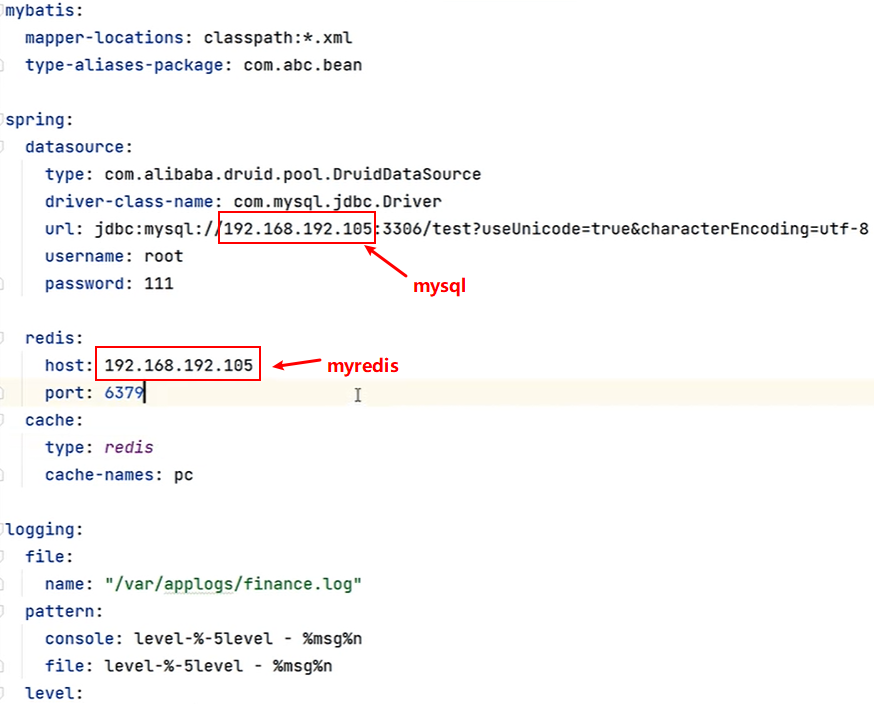

3. 启动`docker-compose up -d`成功如下：

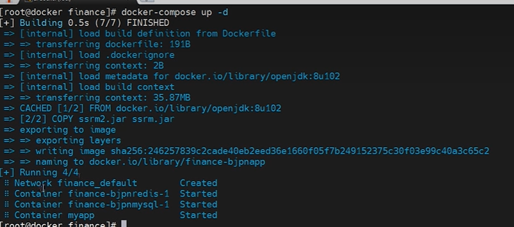

# 重启策略
docker 容器启动后并不会永远处于运行状态，各种意外都可能会导致容器退出。在生产环境下容器退出后采用手动重启方式肯定是非常低效或不可行的。而 Docker 引擎提供了容器的重启策略，通过在容器创建时指定`--restart=xxx` 或 compose.yml中指明`restart`。

+ `no`默认策略，在容器退出时不重启容器
+ `on-failure[:n]`在容器非正常退出时，即退出状态码非 0 的情况下才会重启容器。后可跟整型数，表示重启的次数。
+ `always`只要容器退出就会重启容器。
+ `unless-stopped`只要容器退出就会重启容器，除非通过 docker stop 或 docker kill 命令停止容器。


# Docker network
docker中的网络：

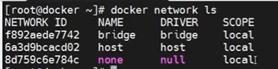

## docker0 网桥
+ bridge 网络，也称为单机桥接网络，是 Docker 默认的网络模式。该网络模式只能存在于单个 Docker 主机上，其只能用于连接所在 Docker 主机上的容器。
+ bridge 网络模式中具有一个默认的虚拟网桥 docker0，通过 ip a 或 ifconfig 命令都可查看

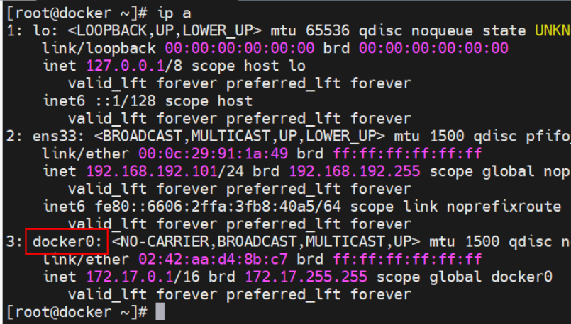


`docker network inspect bridge` 查看

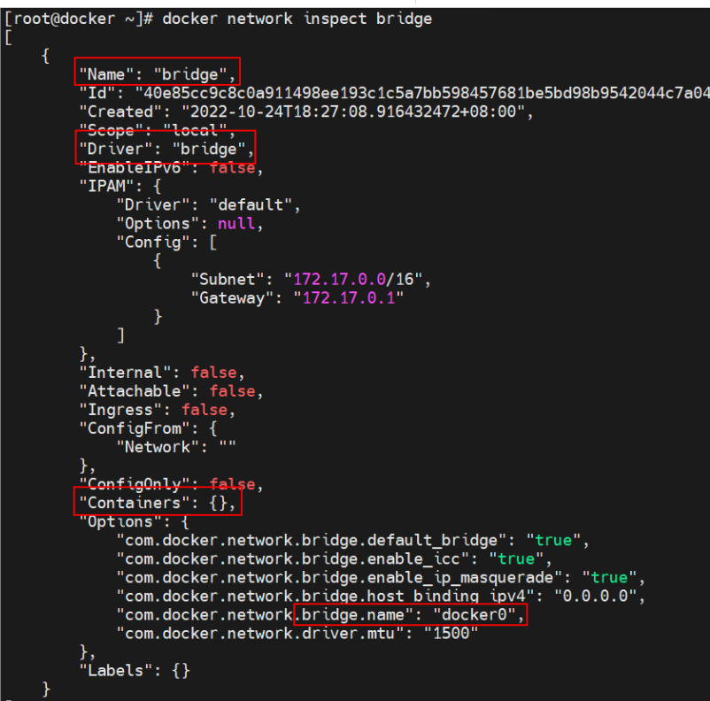

## docker network create
`docker network create`创建网络

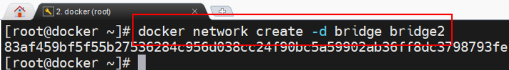

`docker network ls` 查看

## 创建容器指定网络
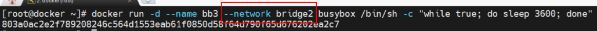

`--network`不指定，默认连接到默认的bridge 网络


