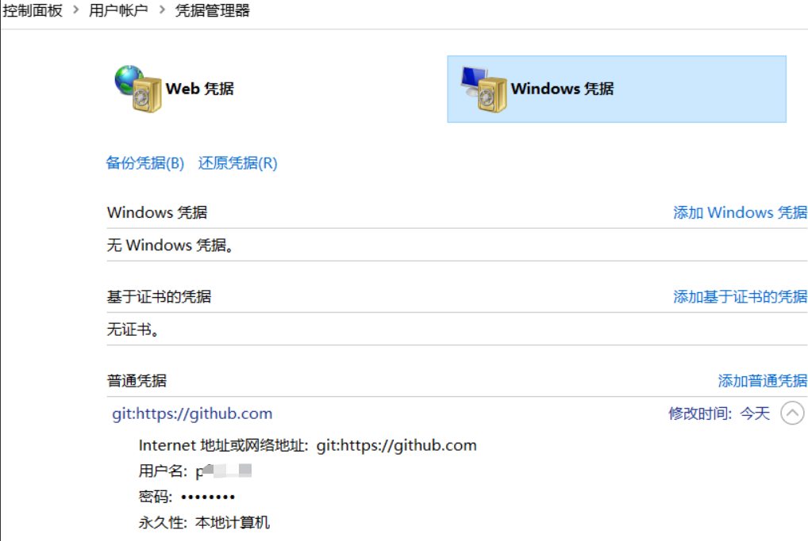
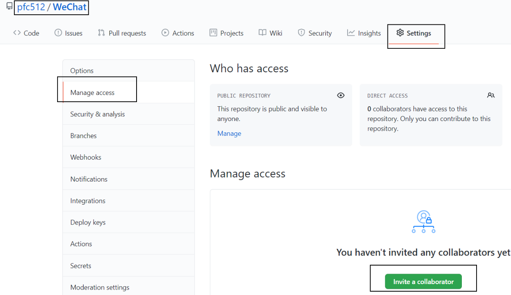
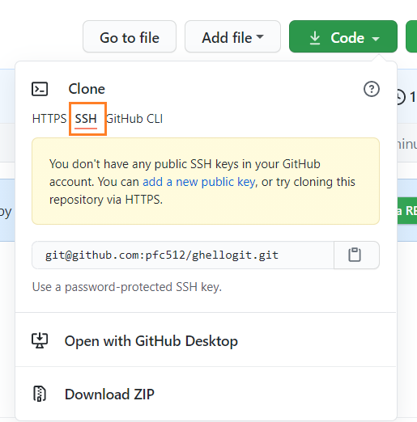
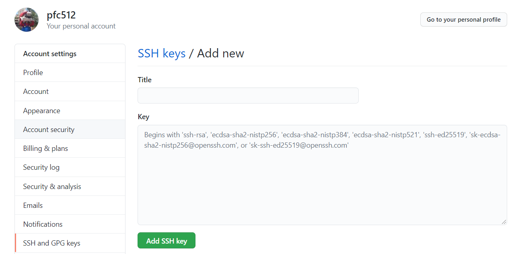
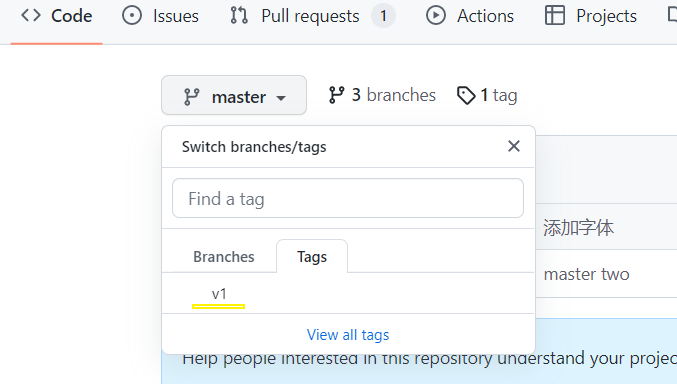

# Git

[Git](https://git-scm.com/)

```text
远程库
├── git push
↑
本地库
├── git commit
↑
暂存区
├── git add
↑
工作区(code)
```

## 本地库初始化

### 初始化
`git init`

### 设置签名
提交代码到仓库时显示的提交人姓名和邮箱。

- **仓库级别**：仅在当前本地库范围内有效，记录在 `.git/config`
  - `git config user.name youname`
  - `git config user.email youemail`

- **系统用户级别**：签名在登录当前操作系统的用户范围有效，记录在 `~/.gitconfig`
  - `git config --global user.name jiaming_glb`
  - `git config --global user.email hello_glb@atname.com`

- **查看**：`git [--global] config user.name|user.email`

## 基本操作

`git status` 查看工作区、暂存区状态

`git add [file name]` 将工作区的"新建/修改"添加到暂存区，对"未追踪"的文件进行追踪

`git commit -m "commit message" [file name]` 将暂存区的内容提交到本地库

- 不执行 add，直接执行 commit：
  - 新建的文件尚未纳入版本控制体系：必须先add纳入版本控制体系后才可以commit
  - 已纳入版本控制体系的文件被修改：可以不add直接commit，Git自动执行了add

`git checkout .|filename` 放弃工作区文件的更改

`git reset .|filename` 暂存区文件回退到工作区

`git clean -f|fd` 删除新增未跟踪文件目录

`git log` commit记录

- `--all` 所有记录
- `--graph` 图形化
- `-n5` 显示5条记录
- `--oneline` 简单信息
- `filename` 指定文件log

`git reflog` 操作记录，每一步操作都会记录，如切换分支，提交...

### 版本选择

1. `git reset --hard ba9839b` **(推荐)**

2. `git reset --hard HEAD^`
   - 回退一个版本，多个 `^` 回退多行
   - `git reset --hard HEAD~3` 回退3行
   - `git reset --hard HEAD` 根据HEAD指针指的版本重置

3. **reset的三个参数**
   - `--soft` 在本地库移动HEAD指针
   - `--mixed` 在本地库移动HEAD指针；清空暂存区
   - `--hard` 在本地库移动HEAD指针；清空暂存区和工作区

### 文件比较

- `git diff hello.txt`
- `git diff HEAD hello.txt`
- `git diff HEAD` 不带文件名，比较所有文件
- `git diff --stat` 显示修改文件简要信息

## stash
- `git stash`
- `git stash list`
- `git stash pop` 弹出
- `git stash apply` 应用，stash记录还在
- git drop 

## revert 
+ `git revert -n commit`只会反做commit-id对应的内容（撤销commit中对文件的修改），然后重新commit一个信息，不会影响其他的commit内容
+ `git revert -n commit-idA..commit-idB`反做commit-idA到commit-idB之间的所有commit

- - 使用`-n`是因为revert后，需要重新提交一个commit信息，然后在推送。如果不使用-n，指令后会弹出编辑器用于编辑提交信息

- `git revert --abort` 取消合并冲突并退出

## rebase 合并多次 commit
合并最新的n条记录：`git rebase -i n+1_commit_id|HEAD~n`

查看commit历史`git log --oneline --graph`

```text
* d4e5f6g (HEAD -> main) 添加注释
* c3d4e5f 代码格式化  
* b2c3d4e 修复 typo
* a1b2c3d 功能开发完成
* 987xyz0 之前的提交
* 654abc1 更早的提交
```

合并前4条`git rebase -i HEAD~4`

```text
pick a1b2c3d 功能开发完成
pick b2c3d4e 修复 typo
pick c3d4e5f 代码格式化
pick d4e5f6g 添加注释

# 变基 987xyz0..d4e5f6g 到 987xyz0（4个提交）
#
# 命令:
# p, pick <提交> = 使用提交
# r, reword <提交> = 使用提交，但修改提交信息
# e, edit <提交> = 使用提交，但停止以便修改提交
# s, squash <提交> = 使用提交，但合并到前一个提交
# f, fixup <提交> = 类似于 "squash"，但丢弃提交信息
# d, drop <提交> = 删除提交
```

使用`s, squash`，修改后得到

```text
pick a1b2c3d 功能开发完成
s b2c3d4e 修复 typo
s c3d4e5f 代码格式化
s d4e5f6g 添加注释
```

编辑合并后的提交信息

```text
/////////////////////////编辑前/////////////////////////
# 这是一个 4 个提交的组合。
# 这是第一个提交信息：

功能开发完成

# 这是提交信息 #2：

修复 typo

# 这是提交信息 #3：

代码格式化

# 这是提交信息 #4：

添加注释


/////////////////////////编辑后/////////////////////////
完成用户登录功能开发
```

合并成功

## reset 合并多个 commit
将前3提交全部取消，将文件全部放到暂存区`git reset --soft HEAD~3`

```text
# 查看当前状态
git log --oneline -4

# 输出类似：
# d4e5f6g 添加注释
# c3d4e5f 代码格式化  
# b2c3d4e 修复 typo
# a1b2c3d 功能开发完成

# 重置到第4个提交之前（保留所有更改在暂存区）
git reset --soft HEAD~3

# 查看状态，会发现所有更改都在暂存区
git status

# 创建新的合并提交
git commit -m "完成用户登录功能开发"
```


## merge基本步骤
1. 拉取最新的master`git fetch`

2. 如果 master 没有新的commit，直接merge

   1. ```text
      feature: A --- B   	# feature 有新的开发
      master:  A			# master 停留在原来的位置
      ```

   2. ```text
      git checkout master
      git merge feature
      
      
      ////////////////////////结果////////////////////////
      master:  A --- B
      ```

   3. 

3. 如果有在feature上rebase master，即`git rebase master`，再merge

   1. ```text
      feature: A --- C 		# feature 有新的开发
      master:  A --- B 		# master 有新的提交 B (团队中其他人先一步提交)
      ```

   2. ```text
      # 切换到 feature 分支
      git checkout feature
      
      # 执行 rebase
      git rebase master
      
      
      ////////////////////////结果////////////////////////
      feature: A --- B --- C'
      master:  A --- B
      ```

   3. ```text
      # 切换回 master
      git checkout master
      
      # 合并 feature
      git merge feature
      
      
      ////////////////////////结果////////////////////////
      master: A --- B --- C'
      ```

# 分支
## 分支操作
+ 创建分支`git branch branch_name  `
+ 查看分支`git branch -va`
+ 切换分支`git checkout branch_name`
+ 创建并切换 `git checkout -b branch_name/commit_id`
+ merge分支。将`feat-1` merge 到`master`:  在`master`执行 `git merge feat-1`
+ 合并冲突：
    - 原因：合并分支时，两个分支对同一个文件的有两套不同的修改。Git 无法替我们决定使用哪一个。必须人为决定新代码内容。
    - **步骤：**
        - `git merge feat-1`
        - `vim hello.txt ` （修改冲突的文件）
        - `git add hello.txt`
        - `git commit -m "resolve conflict" `
+ 删除分支`git branch -d/-D branch_name`
    - `-D` 强制删除
    - 删除**远程**分支`git push origin --delete feature-xyz`


### 取消merge
合并后发现有问题取消`git reset --merge ORIG_HEAD`

注意，如果合并后已经有了其他提交，其他提交也会被取消；如果想要仅回退此次merge而其他条保留，可能就要用到reset，cherry-pick等，或者干脆来一个新的merge删除上次merge的内容😂

## cherry-pick
将提交从一个分支或指定的commit复制到另一个分支

`git cherry-pick branch_name/commit1 commit2...` 

**代码冲突**

如果操作过程中发生代码冲突，Cherry pick 会停下来，让用户决定如何继续操作。

+ `--continue` 用户解决代码冲突后，第一步将修改的文件重新加入暂存区（git add .），
+ 第二步`git cherry-pick --continue`命令，让 Cherry pick 过程继续执行。
+ `--abort` 发生代码冲突后，放弃合并，回到操作前的样子。
+ `--quit` 发生代码冲突后，退出 Cherry pick，但是不回到操作前的样子。

# GitHub
## 推送 push
设置地址`git remote add origin https://github.com/xxx/x.git` github中的一个空仓库地址。地址设别名为origin 
查看地址`git remote -v` 
推送`git push origin master`



## 拉取 pull
别人写了代码推送到了远程库，我来拉取。

+ `git fetch [远程库地址别名(通常省略)] [branch_name]` 取得远程库最新状态
+ git merge [远程库地址别名/branch_name]`    将本地库与远程库合并

+ **pull=fetch+merge**
+ `git pull [远程库地址别名(通常省略)] [branch_name]`

## 邀请加入团队



输入被邀请人的 username 或 full name 或 email，复制得到链接，发给被邀请人。

## ssh免密登录


**配置：**

1. 在本机`C:\Users\username`下打开git，输入指令：
    1. ssh-keygen -t rsa -b 4096 -C "email@example.com" 
    2. `-C "email@example.com"` 在key中添加的注释 可选

2. 进入生成`.ssh`文件夹，找到`id_rsa.pub`
3. 在github中添加本机的公钥，之后本机连接github就不需要密码

### 配置多个ssh
+ 如github和gitee配置不同的ssh

+ 执行`ssh-keygen -t rsa -b 4096 -f C:\Users\username\.ssh\id_rsa_gitee`生成公钥`id_rsa_gitee.pub`&密钥`id_rsa_gitee`

+ 在gitee中配置公钥

+ 同时在.ssh目录中添加`config`文件
    
    + ```text
        Host gitee.com
            IdentityFile C:\Users\username\.ssh\id_rsa_gitee
        ```
    
+ 此时github使用的默认的`id_rsa`，gitee使用的是`id_rsa_gitee`

# 版本号
添加版本号`git tag -a v1 -m '1-version'`

推送`git push --tags`



## 排除忽略的文件
### 配置全局忽略文件（推荐）
配置xxx.ignore（推荐`git.ignore`）

1. 在本机`C:\Users\username`目录下创建 git.ignore 配置

2. 在家目录的 **.gitconfig 文件（不存在就创建）中引用才创建的文件**

3. ```text
   [core]
   excludesfile = C:/Users/username/git.ignore
   ```


# 推送到指定仓库
1. 找到 server 仓库中的git config文件，配置

```shell
[receive]
denyCurrentBranch = ignore
```

2. 在server添加hook文件post-receive

```shell
#!/bin/bash

target_branch="develop"
working_tree="/usr/local/xuecheng"
app="/xuecheng-app"

while read oldrev newrev refname
do
        branch=$(git rev-parse --symbolic --abbrev-ref $refname)
        if [ -n "$branch" ] && [ "$target_branch" == "$branch" ]; then
        GIT_WORK_TREE=$working_tree git checkout $target_branch -f

        cd "$working_tree$app" && yarn && yarn build:dev

        NOW=$(date +"%Y%m%d-%H%M")
        echo "   /==============================="
        echo "   | DEPLOYMENT COMPLETED"
        echo "   | Target branch: $target_branch"
        echo "   | Target folder: $working_tree"
        echo "   \=============================="
         fi
done
```

3. 本地库配置`git remote add server ip:repo_dir`
4. `git push server` 自动触发post-receive

#  git-update-index
[https://git-scm.com/docs/git-update-index](https://git-scm.com/docs/git-update-index)

忽略文件修改（即使文件已被跟踪）`git update-index --assume-unchanged <file>`

+ 查看被忽略的文件`git ls-files -v | grep '^h'`
+ 取消忽略`git update-index --no-assume-unchanged hello.txt`

# update-index 

为文件添加可执行权限 `git update-index --chmod=+x filename`


