# 概述
20 世纪 60 年代，美国国防部高等研究计划署（ARPA）建立了 ARPA 网，它有四个分布在各地的节点，被认为是互联网的“始祖”。70 年代，基于对 ARPA 网的实践和思考，研究人员发明了的 TCP/IP 协议。

1989 年，任职于欧洲核子研究中心（CERN）的蒂姆 · 伯纳斯 - 李（Tim Berners-Lee）发表篇论文，提出了在互联网上构建超链接文档系统的构想。这篇论文中他确立了三项关键技术：

1. URI：即统一资源标识符，作为互联网上资源的唯一身份
2. HTML：即超文本标记语言，描述超文本文档
3. **HTTP：即超文本传输协议，用来传输超文本**


20 世纪 90 年代初，这一时期的 **HTTP 被定义为 0.9** 版，结构简单，采用了纯文本格式。系统里的文档都是只读的，只允许用“GET”动作从服务器上获取 HTML 文档，并且在响应请求之后立即关闭连接，功能有限。

**HTTP/1.0** 在 1996 年正式发布。在多方面增强了 0.9 版，已经和现在的 HTTP 差别不大了，如：

1. 增加 HEAD、POST 等方法
2. 增加响应状态码，标记可能的错误原因
3. 引入协议版本号概念
4. 引入 HTTP Header（头部）概念，让 HTTP 处理请求和响应更加灵活
5. 传输的数据不再仅限于文本

但 HTTP/1.0 并不是一个“标准”，只是记录已有实践和模式的一份参考文档，不具有实际的约束力，相当于一个“备忘录”。


1999 年，**HTTP/1.1** 发布了 RFC 文档，编号为 2616，HTTP/1.1 是对 HTTP/1.0  的小幅度修正。它是一个“正式的标准”，而不是一份“参考文档”。意味着今后用到  HTTP 协议，就必须遵守这个标准。

HTTP/1.1 主要的变更点有：

1. 增加 PUT、DELETE 等方法；
2. 增加缓存管理和控制；
3. 明确连接管理，允许持久连接；
4. 允许响应数据分块（chunked），利于传输大文件；
5. 强制要求 Host 头，让互联网主机托管成为可能。


Google 推出了新的 SPDY 协议，并在 Chrome 里应用于自家的服务器，借此顺势把 SPDY  推上了标准的宝座，互联网标准化组织以 SPDY 为基础开始制定新版本的 HTTP 协议，最终在 2015 年发布了 **HTTP/2**，RFC 编号 7540。主要特点有：

1. 二进制协议，不再是纯文本；
2. 可发起多个请求，废弃了 1.1 里的管道；
3. 使用专用算法压缩头部，减少数据传输量；
4. 允许服务器主动向客户端推送数据；
5. 增强了安全性，“事实上”要求加密通信。
6. 注重性能改善，但还未普及。

在 HTTP/2 还处于草案之时，Google 又发明了一个新的协议，叫 QUIC，而且还是相同的套路，继续在 Chrome 和自家服务器里试验着“玩”，依托它的庞大用户量和数据量，持续地推动 QUIC 协议成为互联网上的“既成事实”。

2018 年，互联网标准化组织 IETF 提议将“HTTP over QUIC”更名为“HTTP/3”并获得批准，HTTP/3  正式进入了标准化制订阶段。

## 是什么
HTTP 是一个在计算机世界里专门在两点之间传输文字、图片、音频、视频等超文本数据的约定和规范。

HTTP协议是Hyper Text Transfer Protocol（超文本传输协议）的缩写，是用于从万维网（WWW：World Wide Web ）服务器传输超文本到本地浏览器的传送协议。

HTTP是一个基于TCP/IP通信协议来传递数据（HTML 文件, 图片文件, 查询结果等）。

## 浏览器
常见的浏览器有 Google 的 Chrome、Mozilla 的 Firefox、Apple 的 Safari、Microsoft 的 Edge。

浏览器叫**Web Browser**，Web实际上指的就是“World Wide Web”，也就是万维网。

浏览器本质上是一个 HTTP 协议中的**请求方**，使用 HTTP 协议获取网络上的各种资源。

HTTP 协议中，浏览器的角色被称为“User Agent”即“用户代理”，意思是作为访问者的“代理”来发起 HTTP 请求。通常称之为“客户端”。

## Web 服务器
**应答方**（响应方）就是**服务器**，**Web Server**。Web 服务器是 HTTP 协议里响应请求的主体，通常也把控着绝大多数的网络资源。当我们谈到“Web 服务器”时有两个层面的含义：硬件和软件。

**硬件**含义就是物理形式或“云”形式的机器，在大多数情况下它可能不是一台服务器，而是利用反向代理、负载均衡等技术组成的庞大集群。但从外界看来，它仍然表现为一台机器。

**软件**含义的  Web 服务器可能我们更为关心，它就是提供 Web 服务的应用程序，通常会运行在硬件含义的服务器上。它利用强大的硬件能力响应海量的客户端  HTTP 请求，处理磁盘上的网页、图片等静态文件，或者把请求转发给后面的 Tomcat、Node.js 等业务应用，返回动态的信息。

## CDN
CDN（Content Delivery Network）位于浏览器和服务器之间，主要起到缓存加速的作用。

DNS 的核心系统是一个三层的树状、分布式服务，基本对应域名的结构：

1. 根域名服务器（Root DNS Server）：管理顶级域名服务器，返回“com” “net” “cn”等顶级域名服务器的 IP 地址；
2. 顶级域名服务器（Top-level DNS Server）：管理各自域名下的权威域名服务器，比如com 顶级域名服务器可以返回 apple.com 域名服务器的IP 地址；
3. 权威域名服务器（Authoritative DNS Server）：管理自己域名下主机的 IP 地址，比如apple.com 权威域名服务器可以返回 www.apple.com 的 IP 地址。


网络运行商都建立自己的 DNS 服务器，作为用户 DNS 查询的代理，代替用户访问核心 DNS 系统。这些服务器被称为“非权威域名服务器”，可以缓存之前的查询结果，如果已经有了记录，就无需再向根服务器发起查询，直接返回对应的 IP 地址。

## TCP/IP
TCP/IP 协议实际上是一系列网络通信协议的统称，其中最核心的两个协议是**TCP**和**IP**，其他的还有 UDP、ICMP、ARP 等，共同构成。

TCP 属于“传输层”，IP 属于“网际层”

IP （**I**nternet **P**rotocol）主要是解决寻址和路由问题，以及如何在两点间传送数据包。IP 协议使用“**IP 地址**”的概念来定位互联网上的每一台计算机。

TCP（**T**ransmission **C**ontrol **P**rotocol）传输控制协议，它位于 IP 协议之上，基于 IP 协议提供可靠的、字节流形式的通信，是 HTTP 协议得以实现的基础。

+ “可靠”是指保证数据不丢失，“字节流”是指保证数据完整，所以在 TCP 协议的两端可以如同操作文件一样访问传输的数据，就像是读写在一个密闭的管道里“流动”的字节。
+ HTTP 也可以更准确地称为“**HTTP over TCP/IP**”。

## DNS
域名系统（Domain Name System）出现了，用有意义的名字来作为 IP 地址的等价替代。

域名级别从左到右逐级升高，最右边的称为“顶级域名”。顶级域名如表示商业公司的“com”、表示教育机构的“edu”，表示国家的“cn”等。

TCP/IP 协议来通信仍然要使用 IP 地址，所以需要把域名做一个转换，“映射”到它的真实 IP，这就是所谓的“**域名解析**”。

HTTP 协议中并没有明确要求必须使用 DNS，为了方便访问互联网上的 Web 服务器，通常都会使用 DNS 来定位或标记主机名，间接地把 DNS 与 HTTP 绑在了一起。

比较知名的 DNS 有 Google 的“8.8.8.8”，Microsoft 的“4.2.2.1”，还有 CloudFlare 的“1.1.1.1”。

DNS 是一个树状的分布式查询系统，但为了提高查询效率，外围有多级的缓存 

## URI/URL
URI，名称"统一资源标识符"，唯一地标记互联网上资源。

URI 另一个更常用的表现形式是URL"统一资源定位符"，俗称的“网址”，它是 URI 的子集，不过差异不大，通常不会做严格的区分。（如http://nginx.org/en/download.html  协议名http，主机名nginx.org，路径en/download）

## HTTPS
全称“HTTP over SSL/TLS”，相当于“HTTP+SSL/TLS+TCP/IP”，也就是运行在 SSL/TLS 协议上的 HTTP。

SSL/TLS，是一个负责加密通信的安全协议，建立在 TCP/IP 之上，是个可靠的传输协议，可以被用作 HTTP 的下层。SSL 使用了许多密码学最先进的研究成果，能够在不安全的环境中为通信的双方创建出一个秘密的、安全的传输通道。

SSL 的全称是“**S**ecure **S**ocket **L**ayer”，由网景公司发明，在 3.0 时被标准化，改名为 TLS，即“**T**ransport **L**ayer **S**ecurity”，但由于历史的原因还是有很多人称之为 SSL/TLS，或者直接简称为 SSL。

## 代理
代理（Proxy）是 HTTP 协议中请求方和应答方中间的一个环节，作为“中转站”，既可以转发客户端的请求，也可以转发服务器的应答。

1. 匿名代理：完全“隐匿”了被代理的机器，外界看到的只是代理服务器
2. 透明代理：顾名思义，它在传输过程中是“透明开放”的，外界既知道代理，也知道客户端；
3. 正向代理：靠近客户端，代表客户端向服务器发送请求；
4. 反向代理：靠近服务器端，代表服务器响应客户端的请求；


CDN，实际上就是一种代理，它代替源站服务器响应客户端的请求，通常扮演着透明代理和反向代理的角色。

由于代理在传输过程中插入了一个“中间层”，所以可以在这个环节做很多事情，如：

1. 负载均衡：把访问请求均匀分散到多台机器，实现访问集群化；
2. 内容缓存：暂存上下行的数据，减轻后端的压力；
3. 安全防护：隐匿 IP, 使用 WAF 等工具抵御网络攻击，保护被代理的机器；
4. 数据处理：提供压缩、加密等额外的功能。

# HTTP

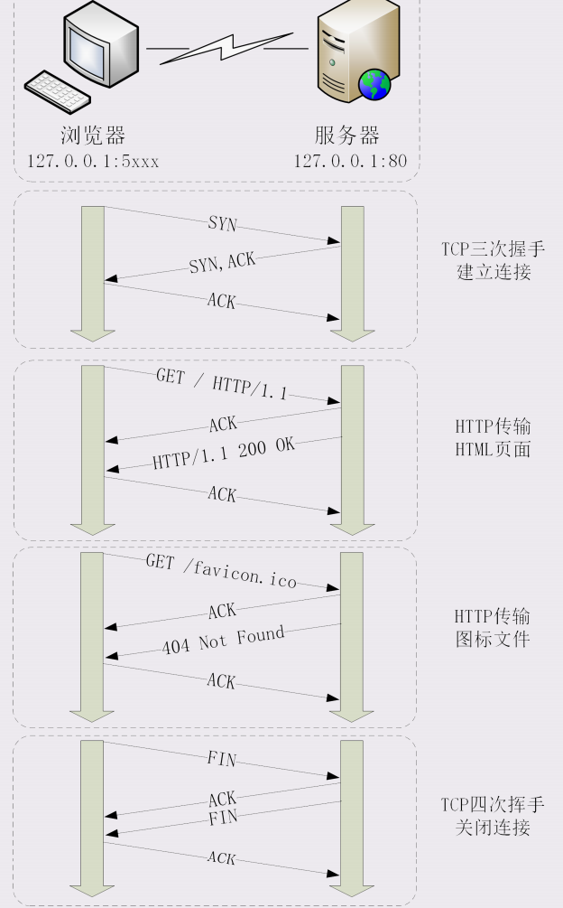

## 抓包分析
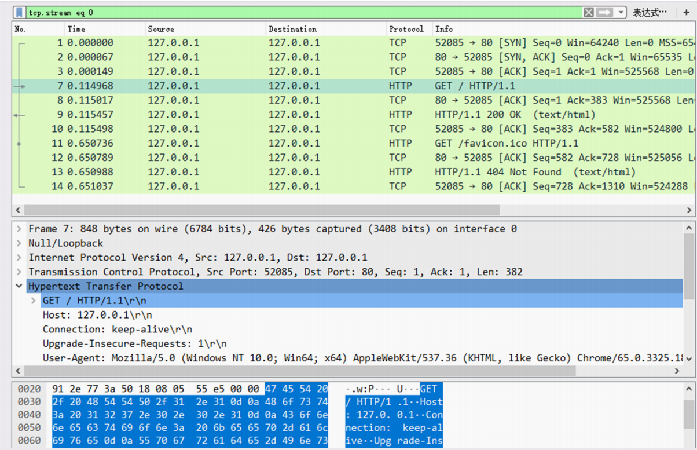

1. 建立tcp连接，依照 TCP 协议，使用“三次握手”建立与 Web 服务器的连接，开始的三个包，浏览器使用的端口是 52085【随机】，服务器使用的端口是 80，经过 SYN、SYN/ACK、ACK 的三个包后，浏览器与服务器的 TCP 连接就建立了。
2. HTTP 协议开始工作。浏览器按照 HTTP 协议规定的格式，通过 TCP 发送了一个“GET / HTTP/1.1”请求报文，也就是第四个包。
3. Web 服务器回复了第五个包，在 TCP 协议层面确认：“刚才的报文已经收到”，不过这个 TCP 包 HTTP 协议是看不见的。
4. Web 服务器收到报文后在内部处理。是依据 HTTP 协议的规定，解析报文。它一看，原来是要求获取根目录下的默认文件，那就从磁盘上把那个文件全读出来，再拼成符合 HTTP 格式的报文，发回去。这就是第六个包“HTTP/1.1 200 OK”，底层还是 TCP 协议。
5. 浏览器也要给服务器回复一个 TCP 的 ACK 确认，“你的响应报文收到了。”，即第七个包。
6. 这之后共四个包，重复了相同的步骤。浏览器自动请求了作为网站图标的 “favicon.ico” 文件。因为的实验环境没有这个文件，所以服务器在硬盘上找不到，返回了一个“404 Not Found”。
7. TCP 关闭连接的“四次挥手”在抓包里没有出现，因为 HTTP/1.1 长连接特性，默认不会立即关闭连接。


另外，浏览器看到了网址里的“www.xxx.com”，发现不是数字形式的 IP 地址，那就是域名了，于是就会发起域名解析动作，通过访问一系列的域名解析服务器，试图把这个域名翻译成 TCP/IP 协议里的 IP 地址。在域名解析的过程中会有多级的缓存，浏览器首先看一下自己的缓存里有没有，如果没有就向操作系统的缓存要，还没有就检查本机域名解析文件 hosts`C:\WINDOWS\system32\drivers\etc\hosts`

### 实际场景
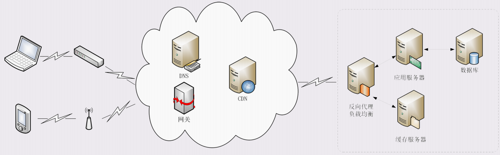

+ 在浏览器里只能使用域名“www.apple.com”访问，接下来域名解析。用 DNS 协议开始从操作系统、本地 DNS、根 DNS、顶级 DNS、权威 DNS 的层层解析，当然这中间有缓存，很快就能拿到结果。
+ 别忘了 CDN，它也会在 DNS 的解析过程中“插上一 脚”。DNS 解析可能会给出 CDN 服务器的 IP 地址，这样拿到 CDN 服务器而不是目标网站的实际地址。 因为 CDN 会缓存网站的部分资源，比如图片、CSS 样式表，所以有的 HTTP 请求就不需要再发到 Apple，CDN 可以直接响应请求。
+ CDN 无法缓存的，只能从目标网站获取。发出 HTTP 请求。 目标网站的服务器对外表现的是一个 IP 地址，但为了能扛住高并发，内部也是一套复杂的架构。通常在入口是负载均衡设备，如四层的 LVS 或者七层的 Nginx，在后面是许多的服务器，构成集群。 负载均衡设备会先访问系统里的缓存，通常有 memory 级缓存 Redis 和 disk 级缓存 Varnish，它们的作用与 CDN 类似，把频繁访问的数据缓存几秒或几分钟，减轻后端应用服务器的压力。
+ 如果缓存服务器里也没有，那么负载均衡设备就要把请求转发给应用服务器了。如 Java 的Tomcat，Python 的 Django，Node.js等。它们又会再访问数据库服务， 然后把结果返回给负载均衡设备，同时也可能给缓存服务器里也放一份。 应用服务器的输出到了负载均衡设备这里，请求的处理就算是完成了，就要按照原路再走回去。如果这个资源允许缓存，经过 CDN 的时它也会做缓存，这样下次同样的请求就不会到达源站。 最后网站的响应数据回到设备，可能是 HTML、JSON、图片或者其他格式的数据，需要由浏览器解析处理才能显示，如果数据里面还有超链接，指向别的资源，那么就又要重走一遍整个流程，直到所有的资源都下载完。

## Http报文结构
HTTP 协议的请求报文和响应报文的结构基本相同，由三大部分组成：

1. **起始行（start line）**：描述请求或响应的基本信息；
2. **头部字段集合（header）**：使用 key-value 形式更详细 地说明报文；
3. **消息正文（entity）**：也称“实体”。实际传输的数据。是纯文本，图片、视频等二进制数据或为空。

起始行和头部字段又合称为“请求头”或“响应头”，在 header 之后必须要有一个“空行”，也就是“CRLF”，十六进制的“0D0A”。

HTTP没有限制请求头的大小，但一些服务器中会有限制（Nginx里限制头不超过4k）

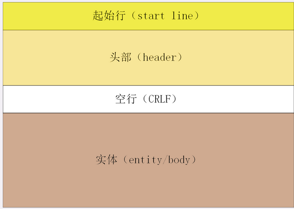

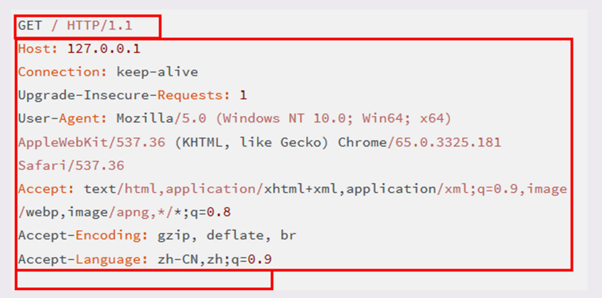

### 请求行
请求头的第一行。描述了客户端想要如何操作服务器端的资源

1. 请求方法：如 GET/POST
2. 请求目标：通常是一个 URI
3. 版本号： HTTP 协议版本。

三个部分通常使用空格（space）分隔，最后用 CRLF 换行表示结束。

如：`GET / HTTP/1.1`

+ `GET` 请求方法
+ `/` 请求目标
+ `HTTP/1.1`版本号。

### 状态行
响应头的第一行。由三部分构成：

1. 版本号：报文使用的 HTTP 协议版本；
2. 状态码：表示处理的结果，如 200 是成功，500 是服务器错误；
3. 原因：作为数字状态码补充，是更详细的解释文字。

如：`HTTP/1.1 200 OK` 或 `HTTP/1.1 404 Not Found`

### 头部字段
头部字段是 `key:value` 的形式，如`Host: 127.0.0.1`，最后用 `CRLF` 换行表示字段结束。

可添加自定义头：

- 不区分大小写，一般首字母大写
- 不允许空格、下划线（原则上）
- `:`，前面不能有空格，后面可以出现空格

一般分为四类：

1. 通用字段：请求头和响应头里都可以出现；
2. 请求字段：仅能出现在请求头里。
3. 响应字段：仅能出现在响应头里
4. 实体字段：它实际上属于通用字段，专门描述 body 的额外信息。


+ `Host`，请求字段，唯一一个 HTTP/1.1 规范里要求必须出现的字段。告诉服务器这个请求应该由哪个主机来处理，当一台计算机上托管了多个虚拟主机的时，服务器端用 Host 字段来选择。
+ `User-Agent`，请求字段，使用一个字符串来描述发起 HTTP 请求的客户端，服务器可以依据它来返回最合适此浏览器显示的页面。由于历史的原因，User-Agent 非常混乱，每个浏览器都自称是Mozilla、Chrome、Safari，使用这个字段来互相“伪装”，最终变得毫无意义。
+ `Date`，通用字段，通常出现在响应头里，表示 HTTP 报文创建的时间，客户端可以使用这个时间再搭配其他字段决定缓存策略。
+ `Server`，响应字段，当前正在提供 Web 服务的软件名称和版本号。
+ `Content-Length`，实体字段，表示报文里 body 的长度，也就是请求头或响应头空行后面数据的长度。服务器看到这个字段，就知道了后续有多少数据，可以直接接收。如果没有这个字段，那么 body 就是不定长的，需要使用 chunked 方式分段传输。

## 请求方法
HTTP/1.1 规定了八种方法：

+ GET：获取资源；
+ HEAD：获取资源的元信息；
+ POST：向资源提交数据；
+ PUT：类似 POST；
+ DELETE：删除资源；
+ CONNECT：建立特殊的连接隧道；
+ OPTIONS：列出可对资源实行的方法；
+ TRACE：追踪请求 - 响应的传输路径。

#### HEAD
与 GET 类似，也是请求从服务器获取资源，服务器的处理机制也是一样的，但服务器<u>只会传回响应头</u>，也就是资源的“元信息”。

响应头与 GET 完全相同，可以用在很多并不真正需要资源的场合，避免传输 body 数据的浪费。

比如，想要检查一个文件是否存在，只要发个 HEAD 请求就可以了，没有必要用 GET 把整个文件都取下来。

#### POST/PUT

- 向服务器发送数据，用的大多数都是 POST。
- PUT 的作用与 POST 类似，也可以向服务器提交数据，通常 POST 表示 create，而 PUT 是update。实际中，PUT 用到的较少。而且与 POST 的语义、功能相似，有的服务器禁止 PUT 方法。

#### 其他方法
+ DELETE 删除资源，很多多的时候服务器就直接不处理 DELETE 请求。
+ CONNECT  要求服务器为客户端和另一台远程服务器建立一条特殊的连接隧道，这时 Web 服务器在中间充当了代理的角色。
+ OPTIONS 要求服务器列出可对资源实行的操作方法，在响应头的 Allow 字段里返回。用处不大，有的服务器（Nginx）没有实现对它的支持。
+ TRACE 多用于对 HTTP 链路的测试或诊断，可以显示出请求 - 响应的传输路径。本意是好的，但存在漏洞，会泄漏网站的信息，所以 Web 服务器通常禁止。

## 安全与幂等
在 HTTP 里，所谓的“安全”是指请求方法不会“破坏”服务器上的资源，即不会对服务器上的资源造成实质的修改。

按照这个定义，只有 GET 和 HEAD 方法是“安全”的，因为它们是“只读”操作。而 POST/PUT/DELETE 操作会修改服务器上的资源，增加或删除数据，是“不安全”的。

“幂等”实际上是一个数学用语，是多次执行相同的操作，结果也都是相同的，即多次“幂”后结果“相等”。GET 和 HEAD 既是安全的也是幂等的，DELETE 可以多次删除同一个资源，效果都是“资源不存在”，也是幂等的。

按照 RFC 里的语义，POST 是“新增或提交数据”，多次提交数据会创建多个资源，所以不是幂等的；而 PUT 是“替换或更新数据”，多次更新一个资源，资源还是会第一次更新的状态，所以是幂等的。

## 网址组成


+ - 如：`http://www.chrono.com:8080/11-1?uid=1234&name=mario&referer=xxx`
    
      `scheme`**协议名**
    
      `http`，表示 HTTP 协议。另外还有https，表示使用加密、安全的 HTTPS 协议。其他的 scheme： ftp、ldap、file、news 等。
    
       `scheme` 之后，是三个特定的字符`://`。这个设计非常的怪异，URI 的创造者蒂姆·伯纳斯- 李也私下承认`://`并非必要，当初过于草率。
    
      在`://`之后，是被称为“**authority**”的部分，表示**资源所在的主机名**，通常的形式是“host:port”。
    
      端口号有时可以省略，浏览器等客户端会依据 scheme 使用默认的端口号，HTTP 的默认是 80，HTTPS 的默认是 443。
    
      ## 状态码
    
      目前 RFC 标准里规定的状态码是三位数。分成了五类，用数字的第一位表示分类
    
      - 1××：提示信息，目前是协议处理的中间状态，还需要后续的操作；
      - 2××：成功；
      
      - - `200 OK`最常见的成功状态码，如果是非 HEAD 请求，通常在响应头后都会有 body 数据。
        - `206 Partial Content`是 HTTP 分块下载或断点续传的基础，在客户端发送“范围请求”、要求获取资源的部分数据时出现，与 200 一样，也是服务器成功处理了请求，但 body 里的数据不是资源的全部，而是其中的一部分。
      
      - 3××：重定向，资源位置发生变动，需要客户端重新发送请求；
      
      - - `301 Moved Permanently`俗称“永久重定向”，含义是此次请求的资源已经不存在了，改用改用新的 URI 再次访问。
        - `302 Found`俗称“临时重定向”，请求的资源还在，但需要暂时用另一个 URI 来访问。301 和 302 都会在响应头里使用字段**Location**指明后续要跳转的 URI
        - `304 Not Modified` 表示资源未修改，用于缓存控制。
      
      - 4××：客户端错误，请求报文有误，服务器无法处理；
      
      - - `400 Bad Request`表示请求报文有错误，但具体是数据格式错误、缺少请求头还是 URI 超长没有明确说，是一个笼统的错误。
        - `403 Forbidden`实际上不是客户端的请求出错，表示服务器禁止访问资源。原因可能是信息敏感、法律禁止等。
        - `404 Not Found`原意是资源在本服务器上未找到。但现在已经被滥用，只要服务器“不高兴”就可以给出个 404，而我们也无从得知后面到底是真的未找到，还是有什么别的原因。
        - `405 Method Not Allowed`不允许使用某些方法操作资源，例如不允许 POST 只能 GET；
        - `408 Request Timeout`请求超时；
      
      - 5××：服务器错误，服务器在处理请求时内部发生了错误。
      
      - - `500 Internal Server Error`服务器错误；
        - `502 Bad Gateway`通常是服务器作为网关或者代理时返回的错误码；
        - `503 Service Unavailable`服务器当前很忙，暂时无法响应；

##  HTTP特点
+ **灵活可扩展**
+ **可靠传输** 基于 TCP/IP 的，TCP 本身是一个“可靠”的传输协议。

- **应用层协议**

- **无状态**

- - “状态”指是客户端或者服务器里保存的一些数据或者标志，记录了通信过程中的一些变化信息。TCP 协议是有状态的，开始处于 CLOSED 状态，连接成功后是 ESTABLISHED 状态，断开连接后是 FIN-WAIT 状态，最后又是 CLOSED 状态。
  - HTTP没有“状态”，客户端和服务器永建立连接前两者互不知情，每次收发的报文也都是互相独立的，没有任何的联系。收发报文也不会对客户端或服务器产生任何影响，连接后也不会要求保存任何信息。

- **明文**

- - 协议里的报文（准确地说是 header 部分）不使用二进制数据，而是用简单可阅读的文本形式。

- **不安全**

- - 与“明文”缺点相关但不完全等同的另一个缺点是“不安全”。
  - 明文只是“机密”方面的一个缺点，在“身份认证”和“完整性校验”这两方面 HTTP 也是欠缺的。

- **性能**

- - 不算差，不够好。
  - 基于 TCP/IP，并且使用了“请求 - 应答”的通信模式，TCP 的性能不算差。但现在互联网的特点是移动和高并发，不能保证稳定的连接质量，所以在 TCP 层面上 HTTP 协议有时候就会表现的不够好。而“请求 - 应答”模式则加剧了 HTTP 的性能问题，著名的“队头阻塞”（Head-of-line blocking），当顺序发送的请求序列中的一个请求因为某种原因被阻塞时，在后面排队的所有请求也一并被阻塞，会导致客户端迟迟收不到数据。不过现在已经有了解决方案：HTTP/2 和 HTTP/3。

## HTTP的实体数据

### 数据类型与编码

在 HTTP 协议诞生之前的电子邮件系统里的，让电子邮件可以发送 ASCII 码以外的任意数据，方案的名字叫做“**多用途互联网邮件扩展**”（Multipurpose Internet Mail Extensions），简称为 MIME。

MIME 是一个很大的标准规范，HTTP 只取了其中的一部分，用来标记 body 的数据类型（**MIME type**）。

MIME 把数据分成了八大类，每个大类下再细分出多个子类，形式是“type/subtype”：

1. `text`文本格式的可读数据，text/html 表示超文本文档，此外还有纯文本 text/plain、样式表 text/css 等。
2. `image`图像文件，有 image/gif、image/jpeg、image/png 等。
3. `audio/video`音频和视频数据，如 audio/mpeg、video/mp4 等。
4. `application`数据格式不固定，可能是文本也可能是二进制，由上层应用程序解释。常见 `application/json`，`application/javascript`、`application/pdf` 等，另外，如果是不知道的类型，是 `application/octet-stream`，即不透明的二进制数据。


仅有 MIME type 还不够，HTTP 在传输时为了节约带宽，有时候还会压缩数据，有一个`Encoding type`，说明数据用的什么编码格式，才能正确解压缩。

比起 MIME type 来说，Encoding type 常用的只有下面三种：

1. `gzip`GNU zip 压缩格式，互联网上最流行的压缩格式；
2. `deflate`zlib 压缩格式，流行仅次于 gzip；
3. `br`一种专门为 HTTP 优化的新压缩算法（Brotli）。

### 数据类型使用的头字段

HTTP 定义了 `Accept` 请求头和两个 `Content` 实体头，用于客户端和服务器进行“**内容协商**”。客户端用 Accept 头告诉服务器希望接收什么样的数据，而服务器用 Content 头告诉客户端实际发送了什么样的数据。

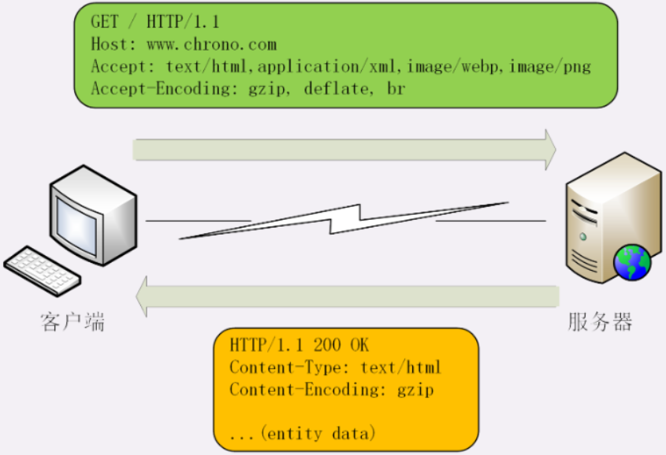

+ `Accept`标记的是客户端可理解的 MIME type，可列出多个类型，让服务器选择。如`Accept: text/html,application/xml,image/webp,image/png`
+ 服务器会在响应报文里用头字段`Content-Type`告诉实体数据的真实类型，如`Content-Type: text/html`
+ `Accept-Encoding`标记的是客户端支持的压缩格式，服务器选择其中一种来压缩数据，实际使用的压缩格式放在响应头`Content-Encoding`。

如果请求报文里没有 Accept-Encoding 字段，	表示客户端不支持压缩数据；如果响应报文里没有 Content-Encoding 字段，表示响应数据没有被压缩。

### 语言类型与编码
HTTP 采用与数据类型相似的解决方案，又引入了两个概念：语言类型与字符集。

- `Accept-Language`字段标记了客户端可理解的自然语言如：`Accept-Language: zh-CN, zh, en`
- 服务器在响应报文里用头字段`Content-Language`数据使用的实际语言类型：`Content-Language: zh-CN`


字符集在 HTTP 里使用的请求头字段是`Accept-Charset`，响应头里没有对应的 Content-Charset，而是在**Content-Type**字段的数据类型后面用`charset=xxx`表示。

- 如，浏览器请求 GBK 或 UTF-8 的字符集：`Accept-Charset: gbk, utf-8`，服务器返回 UTF-8 编码：`Content-Type: text/html; charset=utf-8`

现在的浏览器都支持多种字符集，通常不会发送 Accept-Charset，而服务器也不会发送 Content-Language，因为使用的语言完全可以由字符集推断出来，所以在请求头里一般只会有 Accept-Language 字段，响应头里只会有 Content-Type 字段。

### 内容协商的质量值

HTTP 协议里用 Accept、Accept-Encoding、Accept-Language 等请求头进行内容协商的时，可以用`q`（quality factor）表示权重来设定优先级。

`q`最大值 1，最小值 0.01，默认是1，0 表示拒绝。具体的形式是在数据类型或语言代码后面加`;`，然后是`q=value`。

这里要注意`;`的用法，多数编程语言里`;`的断句语气要强于`,`，而在 HTTP 的内容协商里却恰好反了过来，`;`的意义是小于`,`的。

- 如`Accept: text/html,application/xml;q=0.9,*/*;q=0.8`

- - 表示浏览器最希望的是 HTML 文件，权重（默认）是 1，其次是 XML 文件，权重是 0.9，最后是任意数据类型，权重是 0.8。

### 内容协商的结果
内容协商的过程是不透明的，每个 Web 服务器使用的算法都不一样。有时，服务器会在响应头里多加一个`Vary`字段，记录服务器在内容协商时参考的请求头字段，如：`Vary: Accept-Encoding,User-Agent,Accept`表示服务器依据了 Accept-Encoding、User-Agent 和 Accept 这三个头字段，然后决定了发回的响应报文。

Vary 字段可以认为是响应报文的一个特殊的“版本标记”。每当 Accept 等请求头变化时，Vary 也会随着响应报文一起变化。同一个 URI 可能会有多个不同的“版本”，主要用在传输链路中间的代理服务器实现缓存服务。


## HTTP传输大文件的方法

### 数据压缩

前面提到。请求带着“Accept-Encoding”，里面是支持的压缩格式列表，服务器选择一种压缩算法，放进“Content-Encoding”里，再把数据压缩后发送。

gzip 等压缩算法通常对文本文件有较好的压缩率，而图片、音频视频等数据本身就已经是高度压缩的，再用 gzip 处理也不会变小（甚至可能会增大）。

在 Nginx 里会使用“gzip on”指令，只压缩文本数据，不压缩视频，图片等。

### 分块传输

响应`Transfer-Encoding: chunked`，表示报文里的 body 部分不是一次性发过来的，分成了许多的块（chunk）逐个发送。

`Transfer-Encoding: chunked`和`Content-Length`是**互斥的**。

分块传输的编码规则：

1. 每块包含两个部分，长度头和数据块；
2. 长度头以 CRLF（回车换行，即\r\n）结尾的一行明文，用 16 进制数字表示长度；
3. 数据块紧跟在长度头后，最后也用 CRLF 结尾，但数据不包含 CRLF；
4. 最后用一个长度为 0 的块表示结束，即“0\r\n\r\n”。

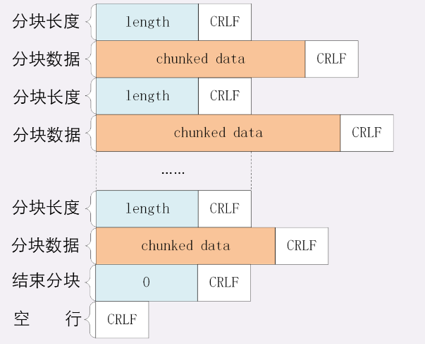

### 范围请求
允许客户端在请求头里使用专用字段来表示只获取文件的一部分。响应头里使用字段`Accept-Ranges: bytes`告知客户端支持范围请求。

请求头Range是 HTTP 范围请求的专用字段，格式是`bytes=x-y`，其中的 x 和 y 是以字节为单位的数据范围。如前 10 个字节表示为“0-9”


服务器收到 Range 字段后

1. 检查范围是否合法，如果越界。返回416
2. 读取文件的片段，返回状态码“206 Partial Content”。
3. 添加响应头字段`Content-Range`，格式`bytes x-y/length`，如，对于`0-10`的范围请求，值就是`bytes 0-10/100`


看视频的拖拽进度需要范围请求、常用的下载工具里的多段下载、断点续传也是基于它实现的。

+ 先发个 HEAD，服务器是否支持范围请求，同时获取文件的大小；
+ 开 N 个线程，每个线程使用 Range 字段划分出各自负责下载的片段，发请求传输数据；
+ 下载意外中断也不怕，只要根据上次的下载记录，用 Range 请求剩下的部分。

### 多段数据
在 Range 头里使用多个x-y，一次获取多个片段数据。这种情况需要用 MIME 类型：`multipart/byteranges`，表示报文的 body 是由多段字节序列组成的，用参数`boundary=xxx`给出段之间的分隔标记。用分隔标记 boundary 来区分不同的片段。

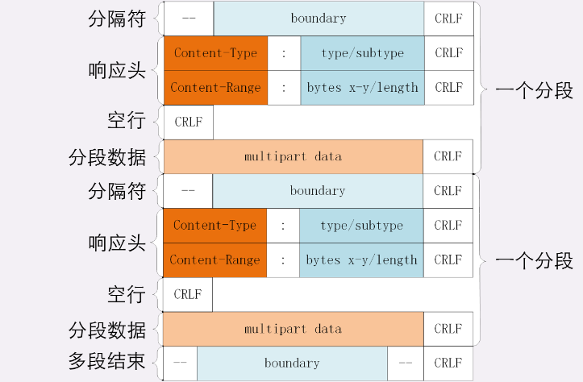

每一个分段必须以`--boundary`开始，之后要用“Content-Type”和“Content-Range”标记这段数据的类型和所在范围，然后就像普通的响应头一样以回车换行结束，再加上分段数据，最后用一个`--boundary--`表示所有的分段结束。

如，发出有两个范围的请求：

```plain
GET /16-2 HTTP/1.1
Host: www.xxxx.com
Range: bytes=0-50, 100-150
```

```latex
HTTP/1.1 206 Partial Content
Content-Type: multipart/byteranges; boundary=3d6b6a416f9b5
Content-Length: 282

--3d6b6a416f9b5
Content-Type: text/html
Content-Range: bytes 0-50/1270

<!doctype html>
<html>
<head>
    <title>Example Do
--3d6b6a416f9b5
Content-Type: text/html
Content-Range: bytes 100-150/1270

eta http-equiv="Content-type" content="text/html; c
--3d6b6a416f9b5--
```

## HTTP的连接
### 短连接
因为客户端与服务器的整个连接过程很短暂，所以被称为“短连接”（short-lived connections）。

在 TCP 协议里，建立连接和关闭连接都是非常“昂贵”的操作。TCP 建立连接要有“三次握手”，发送 3 个数据包，需要 1 个 RTT；关闭连接是“四次挥手”，4 个数据包需要 2 个 RTT。

HTTP 的一次简单“请求 - 响应”通常只需要 4 个包，如果不算服务器内部的处理时间，最多是 2 个 RTT。这么算下来，浪费的时间就是“3÷5=60%”，有三分之二的时间被浪费掉了。

### 长连接
HTTP 提出了“**长连接**”的通信方式，也叫“持久连接”（persistent connections）、“连接保活”（keep alive）、“连接复用”（connection reuse）。


1. HTTP/1.1 中的连接都会默认启用长连接。只要向服务器发送了第一次请求，后续的请求都会重复利用第一次打开的 TCP 连接，在这个连接上收发数据。

   也可以在请求头里明确地要求使用长连接机制，使用`Connection: keep-alive`。

   如果服务器支持长连接，会在响应头有`Connection: keep-alive**`。

   请求头加上`Connection: close`，服务器这次通信后就关闭连接。会在在响应报文里也加上这个字段，发送之后调用 Socket API 关闭 TCP 连接。

   

   服务器端通常不会主动关闭连接。拿 Nginx 来举例，它有两种方式：

   1. “keepalive_timeout”，设置长连接的超时时间，一段时间内连接上没有任何数据收发就主动断开连接，避免占用资源。
   2. “keepalive_requests”，设置长连接上可发送的最大请求次数。如 1000，连接上处理了 1000 个请求后，主动断开连接。

### 队头阻塞
队头阻塞是由 HTTP 基本的“请求 - 应答”模型所导致的。

HTTP 规定报文是“一发一收”，形成了一个先进先出的“串行”队列。如果队首的请求因为处理的太慢，那么队列里后面的所有请求也跟着一起等。

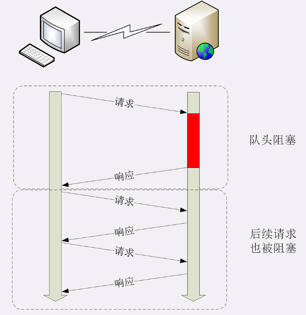

### 性能优化
1. **并发连接**（concurrent connections），对一个域名发起多个长连接，用数量来缓解“队头阻塞”的的问题（在 HTTP/1.1 里无法解决，只能缓解）。
每个客户端都想自己快，建立很多个连接。服务器扛不住，或者服务器认为是恶意攻击，“拒绝服务”。HTTP 协议建议客户端使用并发，但不能滥用并发。RFC2616 最开始限制每个客户端最多并发 2 个连接。太小了，浏览器“无视”标准，把这个上限提高到了 6~8。后来修订的 RFC7230 取消了2个的限制。

1. **域名分片**”（domain sharding），还是用数量来解决质量的思路。多开几个域名，比如 shard1.chrono.com、shard2.chrono.com，而这些域名都指向同一台服务器 www.chrono.com，这样实际长连接的数量就又上去了。

## HTTP的重定向

访问`/login.html`，响应头设置`Location: /index.html`，Code为 `301/302` 重定向到`/index.html`

## HTTP的Cookie机制
HTTP 是“无状态”的，是优点也是缺点。优点是服务器没有状态差异，容易地组成集群，缺点就是无法支持需要记录状态的事务操作。后来发明的 Cookie 技术，给 HTTP 增加了“记忆能力”。

Cookie 并不属于 HTTP 标准（属于RFC6265，而不是 RFC2616/7230）

### Cookie 的工作过程
响应头字段`Set-Cookie`和请求头字段`Cookie`。

+ 当用户通过浏览器第一次访问服务器的时候，创建一个独特的身份标识数据`key=value`，放进 `Set-Cookie` 字段里，随着响应报文一同发给浏览器。
+ 浏览器保存 Set-Cookie，之后的请求自动带 Cookie 字段。
+ 服务器收到Cookie。识别出用户的身份。
+ 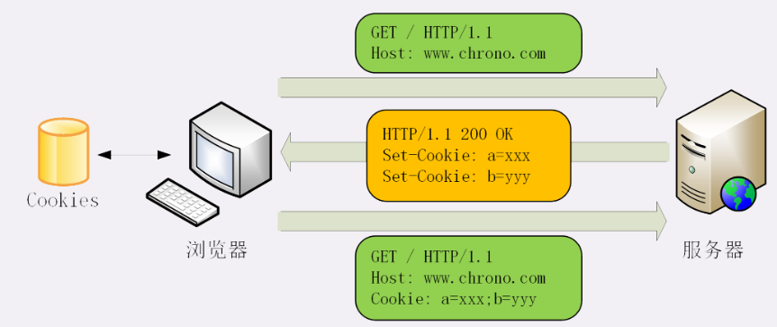

+ Cookie 的有效期使用 `Expires` 和 `Max-Age` 设置。
  - **Expires** 过期时间。
  - **Max-Age** 相对时间，单位秒，浏览器用收到报文的时间点再加上 Max-Age，就可以得到失效的绝对时间。
  - Expires 和 Max-Age 同时出现，浏览器优先采用 Max-Age。
+ 设置 Cookie 的作用域，让浏览器仅发送给特定的服务器和 URI，避免被其他网站盗用。
  + `Domain`和`Path`指定了 Cookie 所属的域名和路径，浏览器在发送 Cookie 前会从 URI 中提取出 host 和 path 部分，对比 Cookie 的属性。如果不满足条件，就不会发送 Cookie。

+ JS 中可以用 document.cookie 读写 Cookie，可能导致“跨站脚本”（XSS）攻击窃取数据。
  - `HttpOnly`，Cookie 只能通过浏览器 HTTP 协议传输，浏览器会禁用 document.cookie 等 API。
  - `SameSite`防范“跨站请求伪造”（XSRF）攻击，设置成“SameSite=Strict”可以严格限定 Cookie 不能随着跳转链接跨站发送，而“SameSite=Lax”略宽松一点，允许 GET/HEAD 等方法，禁止 POST 跨站发送。
  - `Secure`，表示 Cookie 仅能用 HTTPS 协议加密传输。但 Cookie 本身不是加密的，浏览器里还是以明文的形式存在。

## HTTP的缓存控制
### 服务器的缓存控制

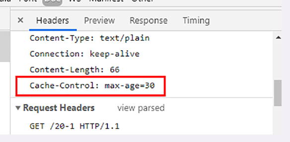

+ `Cache-Control: max-age=30` 缓存 30 秒。时间的计算起点是响应报文的创建时刻（即 Date 字段，也是离开服务器的时刻）
  + `max-age`最常用的属性
  + `no_store` 不允许缓存；
  + `no_cache`可以缓存，但在使用之前要去服务器验证是否过期；
  + `must-revalidate`如果缓存不过期就可以继续使用，过期了还想用就必须去服务器验证；


### 客户端的缓存控制

浏览器也可以发`Cache-Control`双方都可以用这个字段进行缓存控制，互相协商缓存的使用策略。

如果请求设置**Cache-Control: max-age=0**或**Cache-Control: no-cache** 。浏览器就不会使用缓存。

### 条件请求

在使用缓存前还必须要去服务器验证是否是最新版。浏览器可以用两个连续的请求组成“验证动作”：先是一个 HEAD，获取资源的修改时间等元信息，然后与缓存数据比较，如果没有改动就使用缓存，节省网络流量。否则就再发一个 GET 请求，获取最新的版本。但两个请求网络成本太高了，

所以 HTTP 协议就定义了一系列`If`开头的**条件请求**字段，专门检查验证资源是否过期，把两个请求合并为一个请求。比如：

- 第一次的响应提供`Last-modified: Tue, 04 Nov 2025 10:00:00 GMT`（文件最后修改时间）和`ETag: 5cc168c7-3e`
- 第二次请求带上`If-None-Match: 5cc168c7-3e`
- 如果资源没有变，服务器就回应一个“**304 Not Modified**”，表示缓存依然有效，浏览器就可以更新一下有效期，使用缓存。

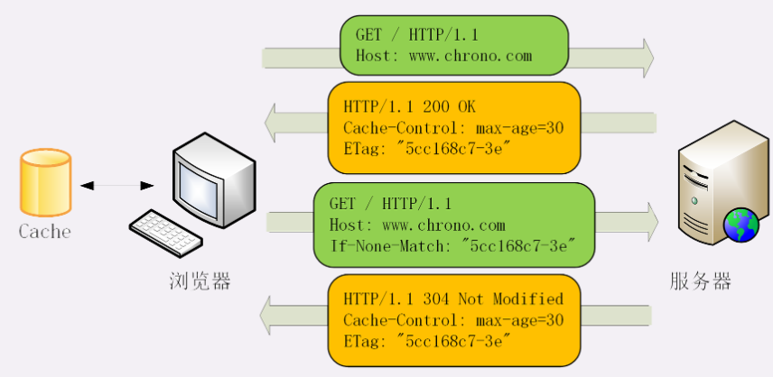

**ETag** 是“实体标签”（Entity Tag）是资源的一个唯一标识，主要是用来解决修改时间无法准确区分文件变化的问题。（如文件在1秒内修改多次，这1秒内的新版本无法区分。）

使用 ETag 就可以精确地识别资源的变动情况，让浏览器能够更有效地利用缓存。

ETag 有“强”“弱”之分。强 ETag 要求资源在字节级别必须完全相符。

弱 ETag 在值前有个“W/”标记，只要求资源在语义上没有变化，但内部可能会有部分发生了改变（如 HTML 里的标签顺序调整，或多了空格）。


## HTTP代理服务

代理最基本的功能是负载均衡。在面向客户端时屏蔽了源服务器，客户端看到的只是代理服务器，源服务器究竟有多少台、IP 地址都不知道。代理服务器就能掌握请求分发的大权。

更多的功能：

- **健康检查**：使用“心跳”等机制监控后端服务器，发现有故障就“踢出”集群，保证服务高可用；
- **安全防护**：保护被代理的后端服务器，限制 IP 地址或流量，抵御网络攻击和过载；
- **加密卸载**：对外网使用 SSL/TLS 加密通信认证，而在安全的内网不加密，消除加解密成本；
- **数据过滤**：拦截上下行的数据，任意指定策略修改请求或者响应；
- **内容缓存**：暂存、复用服务器响应。


代理服务器用字段`Via`标明。通用字段，请求头或响应头里都可以出现。每当报文经过一个代理节点，代理服务器就会把自身的信息追加到字段的末尾。

如果通信链路中有很多中间代理，就会在 Via 里形成一个链表。

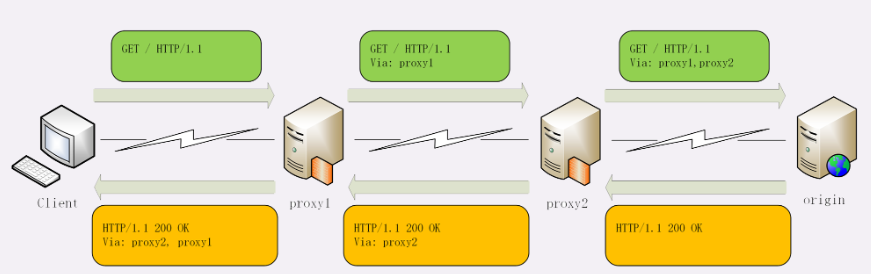

通常服务器需要知道客户端的真实 IP 地址，方便做访问控制、用户画像、统计分析。常用的自定义请求头：

- `X-Forwarded-For` 为谁而转发，形式上和`Via`类似，也是每经过一个代理节点就会在字段里追加请求方的 IP 地址。所以，在字段里最左边的 IP 地址就客户端的地址。
- `X-Real-IP`是记录客户端 IP 地址，相当于“X-Forwarded-For”的简化版。

## HTTP 缓存代理

之前提到都是缓存客户端（浏览器）。服务器上的缓存也是非常有价值的，可以让请求不必走完整个后续处理流程。

HTTP 的服务器缓存功能主要由代理服务器来实现（即缓存代理）。

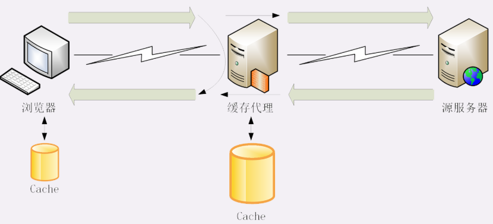

代理服务收到源服务器发来的响应数据后：

- 把数据转发给客户端
- 把数据存入自己的 Cache 里
- ...

## HTTPS
HTTP 是明文，可以在链路中截获、修改或者伪造请求 / 响应报文，数据不具有可信性。

如代理服务。它作为 HTTP 通信的中间人，在数据上下行的时候可以添加或删除部分头字段，也可以使用黑白名单过滤 body 里的关键字，甚至直接发送虚假的请求、响应，而浏览器和源服务器都没有办法判断报文的真伪。

通常认为，如果通信过程具备了四个特性，认为是“安全”的：

- **机密性**（Secrecy/Confidentiality）对数据的“保密”
- **完整性**（Integrity，也叫一致性）是指数据在传输过程中没有被窜改。
- **身份认证**（Authentication）是指确认对方的真实身份。
- **不可否认**（Non-repudiation/Undeniable），也叫不可抵赖，不能否认已经发生过的行为。


HTTPS 协议，规定**新的协议名 https，默认端口号 443**，至于其他的完全沿用 HTTP，没有任何新的东西。

同时 HTTPS 把 HTTP 下层的传输协议由 TCP/IP 换成了 SSL/TLS，由“**HTTP over TCP/IP**”变成“**HTTP over SSL/TLS**”，让 HTTP 运行在了安全的 SSL/TLS 协议上，收发报文不再使用 Socket API，而是调用专门的安全接口。

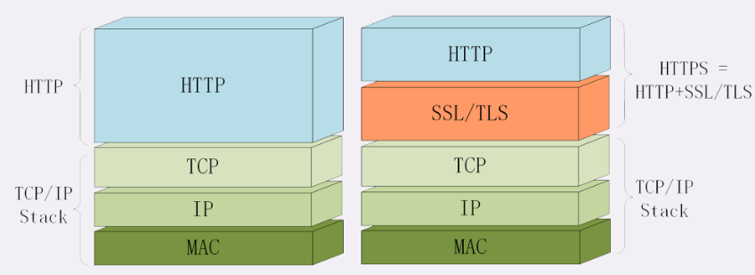

### SSL/TLS
SSL 即安全套接层（Secure Sockets Layer），在 OSI 模型中处于第 5 层（会话层），由网景公司于 1994 年发明，有 v2 和 v3 两个版本，而 v1 因为有缺陷从未公开过。

互联网工程组 IETF 在 1999 年把它改名为 TLS（传输层安全，Transport Layer Security），正式标准化，版本号从 1.0 重新算起，所以 TLS1.0 实际上就是 SSLv3.1。

到今天 TLS 已经发展出了三个版本，分别是 2006 年的 1.1、2008 年的 1.2 和2018的 1.3，每个新版本都紧跟密码学的发展和互联网的现状，持续强化安全和性能，已经成为了信息安全领域中的权威标准。

目前应用的最广泛的 TLS 是 1.2，而之前的协议（TLS1.1/1.0、SSLv3/v2）都已经被认为是不安全的，各大浏览器在 2020 年左右停止支持，所以接下来的讲解都针对的是 TLS1.2。

TLS 由记录协议、握手协议、警告协议、变更密码规范协议、扩展协议等几个子协议组成，综合使用了对称加密、非对称加密、身份认证等许多密码学前沿技术。

浏览器和服务器在使用 TLS 建立连接时需要选择一组恰当的加密算法来实现安全通信，这些算法的组合被称为“密码套件”（cipher suite，也叫加密套件）。

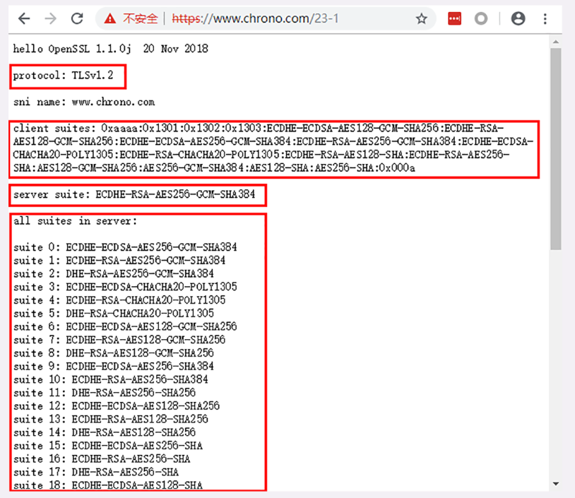

如图，使用的 TLS 是 1.2，客户端和服务器都支持非常多的密码套件，而最后协商选定的是ECDHE-RSA-AES256-GCM-SHA384

ECDHE-RSA-AES256-GCM-SHA384 格式形式是“密钥交换算法 + 签名算法 + 对称加密算法 + 摘要算法”

即握手时使用 ECDHE 算法进行密钥交换，用 RSA 签名和身份认证，握手后的通信使用 AES 对称算法，密钥长度 256 位，分组模式是 GCM，摘要算法 SHA384 用于消息认证和产生随机数。

### OpenSSL

著名的开源密码学程序库和工具包，几乎支持所有公开的加密算法和协议，已经成为了事实上的标准，许多应用软件都会使用它作为底层库来实现 TLS 功能，包括常用的 Web 服务器 Apache、Nginx 等。

## 对称加密与非对称加密

### 对称加密

指加密和解密时使用的密钥都是同一个，是“对称”的。只要保证了密钥的安全，那整个通信过程就可以说具有了机密性。

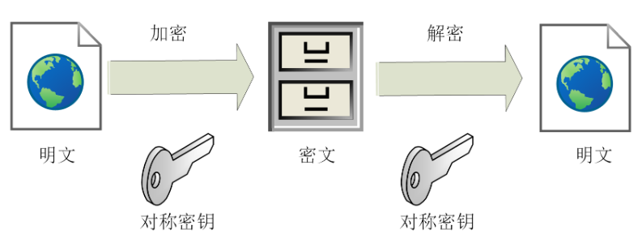

TLS 里有非常多的对称加密算法可供选择，如 RC4、DES、3DES、AES、ChaCha20 等，但前三种算法都被认为是不安全的，通常都禁止使用，目前常用的只有 AES 和 ChaCha20。

对称算法还有一个“**分组模式**”的概念，它可以让算法用固定长度的密钥加密任意长度的明文，把小秘密（即密钥）转化为大秘密（即密文）。

最早有 ECB、CBC、CFB、OFB 等几种分组模式，但都陆续被发现有安全漏洞，所以现在基本都不怎么用了。最新的分组模式被称为 AEAD（Authenticated Encryption with Associated Data），在加密的同时增加了认证的功能，常用的是 GCM、CCM 和 Poly1305。

这些组合起来，就可以得到 TLS 密码套件中定义的对称加密算法。

如，AES128-GCM，意思是密钥长度为 128 位的 AES 算法，使用的分组模式是 GCM；ChaCha20-Poly1305 的意思是 ChaCha20 算法，使用的分组模式是 Poly1305。

### 非对称加密

对称加密有一个问题：如何把密钥安全地传递给对方，即“**密钥交换**”。

所以，就出现了非对称加密（也叫公钥加密算法）。一个叫“**公钥**”（public key），一个叫“**私钥**”（private key）。两个密钥是不同的，“不对称”，公钥可以公开的，而私钥须保密。

公钥和私钥都是的“**单向**”，都可以用来加密解密，但公钥加密后只能用私钥解密，反过来，私钥加密后也只能用公钥解密。

非对称加密可以解决“密钥交换”的问题。网站秘密保管私钥，在网上任意分发公钥，你想要登录网站只要用公钥加密就行了，密文只能由私钥持有者才能解密。而黑客因为没有私钥，所以就无法破解密文。

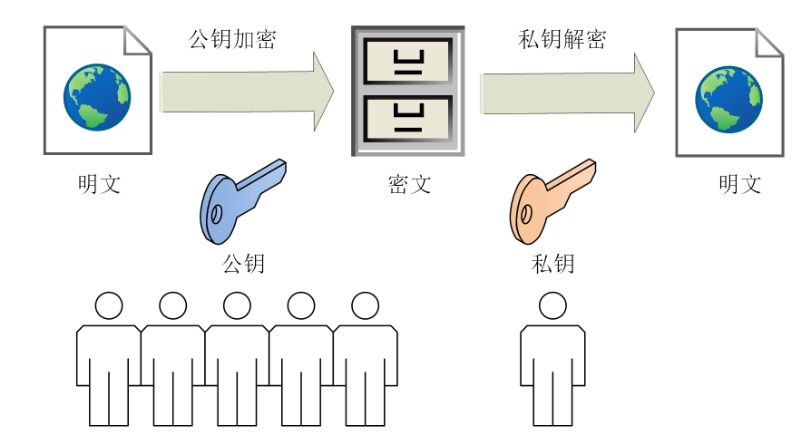

在 TLS 里只有很少的几种，比如 DH、DSA、RSA、ECC 等。


RSA 可能是其中最著名的一个，几乎可以说是非对称加密的代名词，它的安全性基于“**整数分解**”的数学难题，使用两个超大素数的乘积作为生成密钥的材料，想要从公钥推算出私钥是非常困难的。10 年前 RSA 密钥的推荐长度是 1024，但随着计算机运算能力的提高，现在 1024 已经不安全，普遍认为至少要 2048 位。

ECC（Elliptic Curve Cryptography）是非对称加密里的“后起之秀”，它基于“**椭圆曲线离散对数**”的数学难题，使用特定的曲线方程和基点生成公钥和私钥，子算法 ECDHE 用于密钥交换，ECDSA 用于数字签名。

目前比较常用的两个曲线是 P-256（secp256r1，在 OpenSSL 称为 prime256v1）和 x25519。P-256 是 NIST（美国国家标准技术研究所）和 NSA（美国国家安全局）推荐使用的曲线，而 x25519 被认为是最安全、最快速的曲线。

ECC 名字里的“椭圆”经常会引起误解，其实它的曲线并不是椭圆形，只是因为方程很类似计算椭圆周长的公式，实际的形状更像抛物线，比如下面的图就展示了两个简单的椭圆曲线。

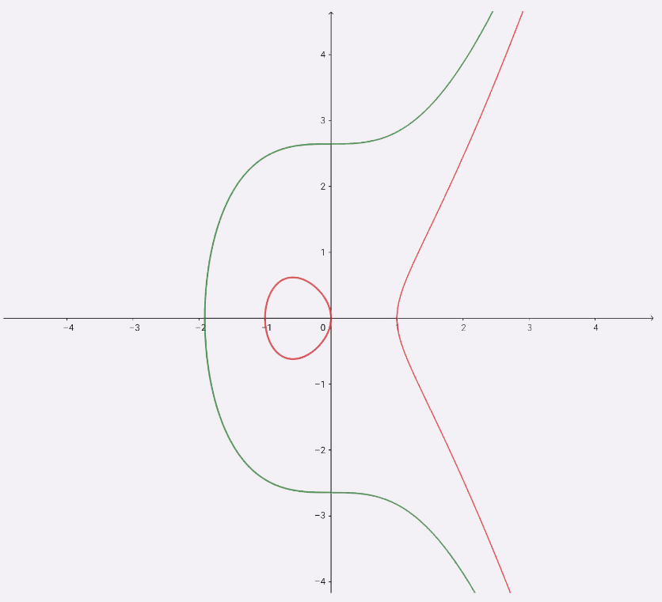

### 混合加密

虽然非对称加密没有“密钥交换”的问题，但因为它们都是基于复杂的数学难题，运算速度很慢，即使是 ECC 也要比 AES 差上好几个数量级。

在通信刚开始的时候使用非对称算法，比如 RSA、ECDHE，首先解决密钥交换的问题。

然后用随机数产生对称算法使用的“**会话密钥**”（session key），再用公钥加密。

对方拿到密文后用私钥解密，取出会话密钥。就实现了对称密钥的安全交换，后续就不再使用非对称加密。

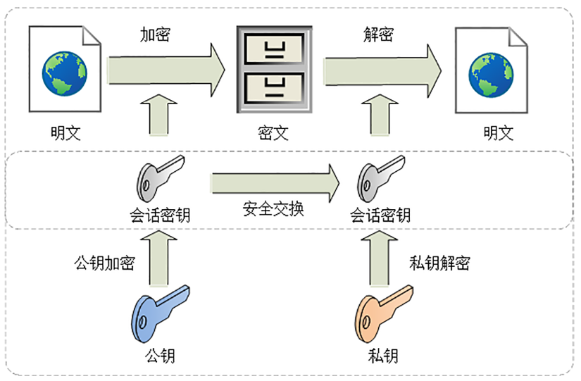

这这样混合加密就解决了对称加密算法的密钥交换问题，而且安全和性能兼顾，完美地实现了**机密性**。

## 数字签名与证书

黑客虽然拿不到会话密钥，但可以通过窃听收集到足够多的密文，再尝试着修改、重组后发给网站。如果不保证完整性，服务器只能“照单全收”，他还能通过服务器的响应获取进一步的线索，最终就会破解出明文。另外，也可以伪造身份发布公钥。如果你拿到了假的公钥，混合加密就完全失效了。所以，在机密性的基础上还必须加上完整性、身份认证等特性。

### 摘要算法

实现完整性的手段主要是**摘要算法**（Digest Algorithm），也就是常说的散列函数、哈希函数（Hash Function）。

近似地理解成一种特殊的压缩算法，它能够把任意长度的数据“压缩”成固定长度、而且独一无二的“摘要”字符串，就好像是给这段数据生成了一个数字“指纹”。

如常见的 MD5（Message-Digest 5）、SHA-1（Secure Hash Algorithm 1），能够生成 16 字节和 20 字节长度的数字摘要。两个算法的安全强度比较低，在 TLS 里已经被禁止使用了。目前 TLS 推荐使用的是 SHA-1 的后继者：SHA-2。

SHA-2 是一系列摘要算法的统称，总共有 6 种，常用的有 SHA224、SHA256、SHA384，分别能够生成 28 字节、32 字节、48 字节的摘要。

### 完整性

在混合加密系统里**用会话密钥加密消息和摘要**。如果黑客在中间改动了一个标点符号，摘要也会完全不同，网站计算比对就会发现消息被窜改，是不可信的。

这有个术语，叫哈希消息认证码（HMAC）。

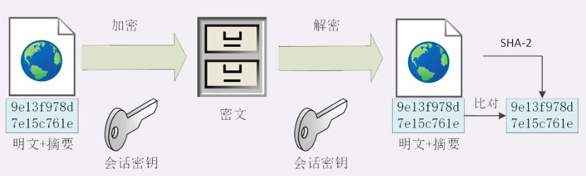

### 数字签名

假如伪装成用户，向网站发送支付、转账等消息，网站没有办法确认你的身份，钱可能就这么被偷走了。使用对称加密里的私钥，使用私钥再加上摘要算法，就能够实现**数字签名**，同时实现“身份认证”和“不可否认”。

数字签名的原理其实很简单，就是把公钥私钥的用法反过来，之前是公钥加密、私钥解密，现在是私钥加密、公钥解密。

但非对称加密效率太低，所以私钥只加密原文的摘要，这样运算量就小的多，而且得到的数字签名也很小，方便保管和传输。

签名和公钥一样完全公开，任何人都可以获取。但这个签名只有用私钥对应的公钥才能解开，拿到摘要后，使用公钥解密成功，再比对原文验证完整性，就可以像签署文件一样证明消息确实是你发的。

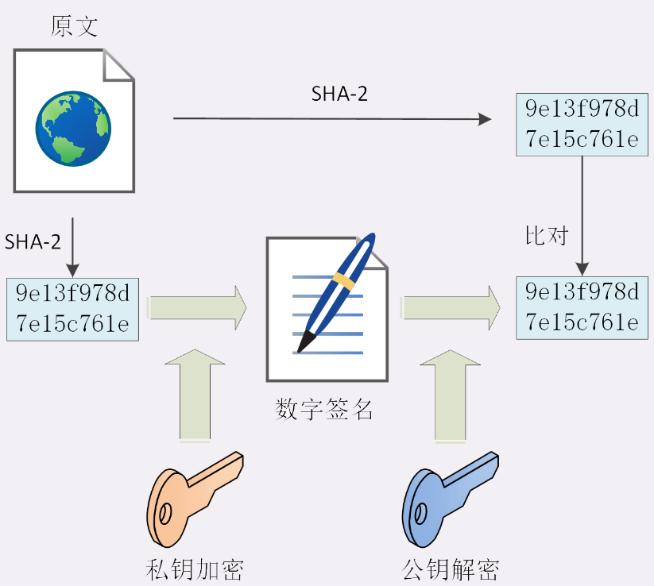

- 刚才的这两个行为也有专用术语，叫做“**签名**”和“**验签**”。只要你和网站互相交换公钥，就可以用“签名”和“验签”来确认消息的真实性，因为私钥保密，黑客不能伪造签名，就能够保证通信双方的身份。

### 数字证书和 CA

这里还有一个“**公钥的信任**”问题。谁都可以发布公钥，还缺少防止黑客伪造公钥的手段，也就是说，怎么来判断这个公钥就是你或者某宝的公钥呢？

我们可以用类似密钥交换的方法来解决公钥认证问题，用别的私钥来给公钥签名，显然，这又会陷入“无穷递归”。

但这次实在是“没招”了，要终结这个“死循环”，就必须引入“外力”，找一个公认的可信第三方，让它作为“信任的起点，递归的终点”，构建起公钥的信任链。

这个“第三方”就是我们常说的**CA**（Certificate Authority，证书认证机构）。它就像网络世界里的公安局、教育部、公证中心，具有极高的可信度，由它来给各个公钥签名，用自身的信誉来保证公钥无法伪造，是可信的。

CA 对公钥的签名认证也是有格式的，不是简单地把公钥绑定在持有者身份上就完事了，还要包含序列号、用途、颁发者、有效时间等等，把这些打成一个包再签名，完整地证明公钥关联的各种信息，形成“**数字证书**”（Certificate）。

知名的 CA ，如 DigiCert、VeriSign、Entrust、Let’s Encrypt（免费） 等，它们签发的证书分 DV、OV、EV 三种，区别在于可信程度。

DV 是最低的，只是域名级别的可信，背后是谁不知道。EV 是最高的，经过了法律和审计的严格核查，可以证明网站拥有者的身份（在浏览器地址栏会显示出公司的名字，例如 Apple、GitHub 的网站）。

不过，CA 怎么证明自己呢？

这还是信任链的问题。小一点的 CA 可以让大 CA 签名认证，但链条的最后，也就是**Root CA**，就只能自己证明自己了，这个就叫“**自签名证书**”（Self-Signed Certificate）或者“**根证书**”（Root Certificate）。你必须相信，否则整个证书信任链就走不下去了。

有了这个证书体系，操作系统和浏览器都内置了各大 CA 的根证书，上网的时候只要服务器发过来它的证书，就可以验证证书里的签名，顺着证书链（Certificate Chain）一层层地验证，直到找到根证书，就能够确定证书是可信的，从而里面的公钥也是可信的。

### 证书体系的弱点

- 如果 CA 失误或者被欺骗，签发了错误的证书，虽然证书是真的，可它代表的网站却是假的。开发出了 CRL（证书吊销列表，Certificate revocation list）和 OCSP（在线证书状态协议，Online Certificate Status Protocol），及时废止有问题的证书。
- 如果CA 被黑客攻陷，或者 CA 有恶意，因为它（即根证书）是信任的源头，整个信任链里的所有证书也就都不可信了。因为涉及的证书太多，就只能操作系统或者浏览器从根上“下狠手”了，撤销对 CA 的信任，列入“黑名单”，这样它颁发的所有证书就都会被认为是不安全的。

## TLS1.2连接过程
### HTTPS 建立连接

 在浏览器键入“**https**”开头的 URI，按下回车：

 浏览器首先要从 URI 里提取出协议名和域名。因为协议名是“https”，所以浏览器就知道了端口号是默认的 443，再用 DNS 解析域名，得到 IP 地址，然后就可以使用三次握手与网站建立 TCP 连接了。

  在 HTTP 协议里，建立连接后，浏览器会立即发送请求报文。但现在是 HTTPS 协议，它需要再用另外一个“握手”过程，在 TCP 上建立安全连接，之后才是收发 HTTP 报文。

  

  TLS 包含几个子协议，可以理解为它是由几个不同职责的模块组成，比较常用的有:

  - **记录协议**（Record Protocol）规定了 TLS 收发数据的基本单位：记录（record）。它有点像是 TCP 里的 segment，所有的其他子协议都需要通过记录协议发出。但多个记录数据可以在一个 TCP 包里一次性发出，也并不需要像 TCP 那样返回 ACK。
  - **警报协议**（Alert Protocol）的职责是向对方发出警报信息，有点像是 HTTP 协议里的状态码。比如，protocol_version 就是不支持旧版本，bad_certificate 就是证书有问题，收到警报后另一方可以选择继续，也可以立即终止连接。
  - **握手协议**（Handshake Protocol）是 TLS 里最复杂的子协议，要比 TCP 的 SYN/ACK 复杂的多，浏览器和服务器会在握手过程中协商 TLS 版本号、随机数、密码套件等信息，然后交换证书和密钥参数，最终双方协商得到会话密钥，用于后续的混合加密系统。
  - **变更密码规范协议**（Change Cipher Spec Protocol），它非常简单，就是一个“通知”，告诉对方，后续的数据都将使用加密保护。在它之前，数据都是明文的。

### ECDHE 握手过程
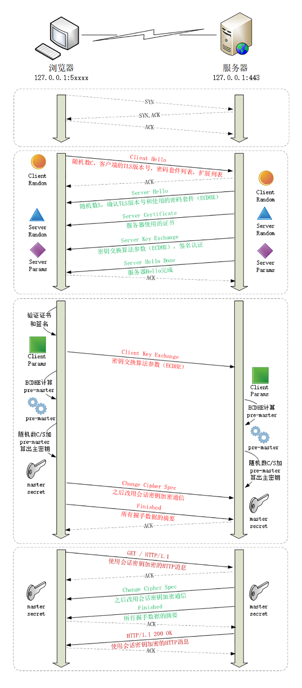

+ 在 TCP 建立连接之后，浏览器会首先发一个“Client Hello”消息，跟服务器“打招呼”。里面有客户端的版本号、支持的密码套件、随机数（Client Random），用于后续生成会话密钥。服务器收到“Client Hello”后，会返回一个“Server Hello”消息。把版本号对一下，也给出一个随机数（Server Random）。然后从客户端的列表里选一个作为本次通信使用的密码套件（ECDHE）。服务器为了证明自己的身份，就把证书也发给了客户端（Server Certificate）。因为服务器选择了 ECDHE 算法，所以它会在证书后发送“Server Key Exchange”消息，里面是椭圆曲线的公钥（Server Params），用来实现密钥交换算法，再加上自己的私钥签名认证。

## HTTPS 配置

...

## HTTP/2

...

## HTTP/3

...